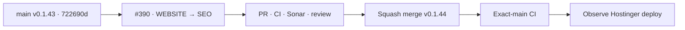

# BRVTAL — Último deploy

  
  
  

> **Development dashboard** · snapshot de **solo el deploy actual** para Issue #390.

## Progress convention

- ✅ ~~Struck through~~ = completed and verified through the required delivery gates.
- 🚧 Normal text = pending or currently in progress.

## Estado del deploy

| Señal | Estado | Evidencia |
| --- | --- | --- |
| Work line | 🚧 **#390 · WEBSITE → SEO workspace canónico** | rama reservada `work/issue-390` |
| Base exacta | ✅ ~~main v0.1.43 exact-main CI/deploy/performance verde~~ | `722690d2fc9feeb1cfa21ead9b8f85c9555f00f5` |
| Versión | 🚧 **0.1.44 candidate** | centralized server-rendered SEO authority |
| Producción | 🚧 pendiente PR + merge + exact-main + observación Hostinger | **sin migraciones ni mutaciones manuales de SEO real** |

## Huella del cambio

<!-- brvtal:git-delta -->

| Archivos | Inserciones | Eliminaciones | Neto |
| ---: | ---: | ---: | ---: |
| **24** | **+1660** | **−127** | **+1533** |

## Calidad y entrega

<!-- brvtal:gate-plan -->

| Control | Estado / contrato |
| --- | --- |
| Gates | **preflight · coordination · fast[PHP+JS] · database · chromium · real-stack · webkit** |
| PR integrity | **PR + snapshot exacto** · Issue #390 · `work/issue-390` · UUID `74a6178a-25bf-4c36-9278-e3d1ce1f8fe1` |
| Single authority | 🚧 Home/Contact + seis familias de entidades editan la misma metadata que usa el renderer público |
| Static routes | 🚧 allowlist cerrada `home` / `contact` dentro de `settings.seo.routes`; sin tabla ni migración nueva |
| Entity routes | 🚧 Events, Artists, Sets, Releases, Blog y Pages reutilizan `seo_title` / `seo_description` y el persistence boundary auditado |
| AUTO semantics | 🚧 fallback efectivo visible; limpiar override vuelve a AUTO sin materializar el valor derivado |
| Social/canonical | 🚧 canonical derivado/read-only; OG/Twitter heredan título, descripción e imagen efectivos del renderer |
| Settings | 🚧 Settings → SEO deriva al workspace y conserva IndexNow; deja de ser un segundo editor Home |
| Durable coverage | 🚧 contratos PHP + MariaDB para rutas estáticas + browser desktop/mobile + integración IA/Settings |
| Sonar | 🚧 stable-head analysis |
| CodeRabbit | 🚧 stable-head review |
| CI del SHA exacto de main | 🚧 después del squash merge |

## Flujo de entrega

## Qué se hizo

- Se crea un único workspace **WEBSITE → SEO** dentro del shell canónico de DISCADMIN.
- El inventario compacto cubre Home, Contact, Pages, Events, Artists, Sets, Releases y Blog con búsqueda/filtros por tipo, publicación, modo y health.
- Home y Contact usan un registro de rutas estáticas allowlisted dentro del setting SEO existente; Home mantiene compatibilidad con los valores flat previos.
- Los seis tipos de entidad reutilizan el registro público, sus columnas SEO actuales y la misma transacción/auditoría ya usada por los editores.
- AUTO / MANUAL / MIXED se basa en overrides almacenados; preview, canonical, OG y Twitter muestran/usan el valor efectivo server-rendered.
- Reset por campo limpia el override. Las fallas de escritura mantienen el editor y el input para retry.
- Settings deja de escribir metadata Home directamente y enlaza al workspace; IndexNow sigue siendo infraestructura tipada.
- Contact pasa a consumir su metadata desde la misma fuente estática server-side sin perder `ContactPage` JSON-LD.
- Se agrega cobertura MariaDB para compatibilidad legacy, preservación de siblings, Home AUTO y Contact MANUAL→AUTO; browser cubre filtros, edición, retry y 390px.

## Archivos modificados en este deploy

- `README.md`
- `api/seo-metadata.php`
- `api/seo-workspace.php`
- `config/public_contact_page.php`
- `config/public_seo.php`
- `config/seo_workspace.php`
- `config/version.php`
- `discadmin/admin-information-architecture.js`
- `discadmin/admin-modules.js`
- `discadmin/seo-workspace.css`
- `discadmin/seo-workspace.js`
- `discadmin/seo-workspace.php`
- `discadmin/settings-v2.js`
- `docs/BRVTAL-SPEC.md`
- `index.php`
- `package.json`
- `tests/e2e/discadmin-information-architecture.spec.mjs`
- `tests/e2e/discadmin-seo-workspace.spec.mjs`
- `tests/e2e/discadmin-settings-v2.spec.mjs`
- `tests/integration/seo-workspace.php`
- `tests/public-contact-contract.php`
- `tests/seo-contract.php`
- `tests/seo-defaults-contract.php`
- `tests/seo-workspace-contract.php`

## Validación

- Base exacta `722690d2fc9feeb1cfa21ead9b8f85c9555f00f5`: BRVTAL CI/`validate`, Sonar, Production Deploy Observer y Production Performance verdes para v0.1.43.
- #390 tiene reserva canónica activa en `work/issue-390` desde la base exacta.
- Pendiente: PR, gates del HEAD estable, Sonar, revisión, squash merge, exact-main y observación de deploy.

## Qué sigue

| Lane | Trabajo |
| --- | --- |
| **NOW** | 🚧 [#390](https://github.com/pl0n3r/brvtal/issues/390) · cerrar el workspace SEO centralizado y su entrega v0.1.44. |
| **NEXT** | 🚧 [#528](https://github.com/pl0n3r/brvtal/issues/528) · autosave/recovery del editor. |
| **LATER** | 🚧 [#530](https://github.com/pl0n3r/brvtal/issues/530) · recycle bin; backlog explícito restante según coordinador/roadmap. |
| **BLOCKED / EXTERNAL** | 🚧 cualquier migración o mutación manual de datos SEO en producción requiere autorización explícita. |
