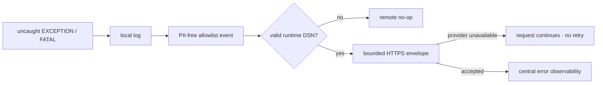

# BRVTAL — Último deploy

  
  
  

> Snapshot de **solo el deploy actual**: #651 añade reporte de EXCEPTION/FATAL de producción hacia Sentry sin SDK Composer y con un evento remoto deliberadamente libre de PII. Base exacta `main 969dcef8d7595ad0fedf98eb63cbd8eec0aeebcd` / v0.1.56 GREEN.

## Progress convention

- ✅ ~~Struck through~~ = completed and verified through the required delivery gates.
- 🚧 Normal text = pending or currently in progress.

## Estado del deploy

| Señal | Estado | Evidencia |
| --- | --- | --- |
| Work line | 🚧 **#651 · production error observability** | `work/issue-651`; reserva `2d507a05-8a19-4c09-afd5-b47489f4b7fa` |
| Base exacta | ✅ ~~main v0.1.56 GREEN~~ | `969dcef8d7595ad0fedf98eb63cbd8eec0aeebcd` |
| Versión producto | 🚧 **v0.1.57 deploy-bound** | patch 0.1.56 → 0.1.57 |
| Local logging | ✅ ~~preservado~~ | mismos handlers y respuestas existentes |
| Remote error event | 🚧 **allowlist mínima** | clase/tipo, archivo relativo, línea, stack acotado, release |
| PII remoto | ✅ ~~excluido por diseño~~ | sin request, identidad, body, cookies ni argumentos |
| Producción | 🚧 **requiere DSN runtime** | no se versiona una credencial/DSN real en Git |

## Huella del cambio

<!-- brvtal:git-delta -->

| Archivos | Inserciones | Eliminaciones | Neto |
| ---: | ---: | ---: | ---: |
| **8** | **+512** | **−53** | **+459** |

## Calidad y entrega

<!-- brvtal:gate-plan -->

| Control | Estado / contrato |
| --- | --- |
| Gates esperados | **preflight · coordination · fast[PHP+JS] · database · chromium · real-stack · webkit** |
| PR + snapshot exacto | Issue #651 · reserva `2d507a05-8a19-4c09-afd5-b47489f4b7fa` |
| Roles | Infrastructure · SRE · Security · QA |
| DSN | HTTPS, host DNS, clave pública, project id numérico; password/query/fragment rechazados |
| Transporte | best-effort · 1.2 s máximo · sin redirects · sin retry loop |
| Payload | allowlist; mensaje raw y argumentos nunca salen del servidor |
| Review | BRVTAL CI + Factory Policy + Privacy + Sonar/CodeQL/CodeRabbit sobre HEAD estable |
| CI del SHA exacto de main | 🚧 después del merge |

## Flujo de entrega

## Qué se hizo

- Añade un transport PHP pequeño en `config/sentry.php`; no incorpora Composer ni SDK externo.
- El DSN se lee primero desde `BRVTAL_SENTRY_DSN` y opcionalmente desde la configuración privada persistente.
- El parser falla cerrado ante esquema no HTTPS, host inválido, password, query/fragment o project id no numérico.
- Los handlers existentes conservan el log local y añaden reporte remoto solo para excepción no capturada y fatal.
- Los fallos durante carga de configuración también generan un evento mínimo cuando el DSN está disponible por entorno.
- El evento remoto no incluye mensaje original, superglobals, request, identidad, variables locales ni argumentos.
- Los paths se reducen a rutas relativas de la aplicación; paths externos se sustituyen por `[external]`.
- El transporte usa timeout corto, TLS verificado, cero redirects y cero reintentos.
- El contrato usa sender falso: CI nunca contacta al proveedor.

## Archivos modificados en este deploy

- `README.md` — snapshot operacional de #651.
- `config/bootstrap.php` — captura fallos severos de carga sin alterar la respuesta.
- `config/config.example.php` — documenta DSN runtime opcional sin valor real.
- `config/logger.php` — conecta exception/fatal con el transport remoto.
- `config/sentry.php` — parser, evento allowlisted, envelope y envío best-effort.
- `config/version.php` — versión de producto 0.1.57.
- `package.json` — sincroniza versión 0.1.57.
- `tests/sentry-contract.php` — DSN, PII, envelope, no-op y handlers deterministas.

## Validación

- 🚧 PHP 8.5 debe lintar y ejecutar el contrato Sentry sin warnings/deprecations.
- 🚧 Privacy debe confirmar que el código no introduce señales personales ni un provider asociado a tratamiento personal.
- 🚧 Factory Policy, Sonar, CodeQL y CodeRabbit deben revisar el HEAD estable.
- 🚧 Producción debe conservar health/login/home sin 5xx tras el deploy.
- 🚧 Para cerrar la observabilidad end-to-end falta provisionar el DSN privado y observar un evento sintético controlado.

## Qué sigue

| Lane | Trabajo |
| --- | --- |
| **NOW** | 🚧 [#651](https://github.com/pl0n3r/brvtal/issues/651): integrar transporte y validar configuración runtime. |
| **NEXT** | 🚧 [#630](https://github.com/pl0n3r/brvtal/issues/630): publicar/adoptar Factory v1.0.3 y continuar TANDA 2. |
| **LATER** | 🚧 [#653](https://github.com/pl0n3r/brvtal/issues/653): PHPStan + Rector en CI. |
| **BLOCKED / EXTERNAL** | 🚧 [#627](https://github.com/pl0n3r/brvtal/issues/627): espera publicación del canal Factory v1.0.3. |

## Panorama general pendiente

- 🚧 **NOW**: [#651](https://github.com/pl0n3r/brvtal/issues/651) cerrar código + DSN + evidencia de evento sin PII.
- 🚧 **NEXT**: [#630](https://github.com/pl0n3r/brvtal/issues/630) retomar adopción central tras la puerta de release Factory.
- 🚧 **LATER**: [#653](https://github.com/pl0n3r/brvtal/issues/653) elevar análisis estático PHP sin ruido legacy.
- 🚧 **BLOCKED / EXTERNAL**: [#627](https://github.com/pl0n3r/brvtal/issues/627) no duplica lifecycle de labels mientras `v1` siga atrás.
