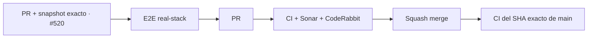

# BRVTAL — Último deploy

  
  
  

> **Development dashboard** · snapshot profesional de **solo el deploy actual**.

## Estado del deploy

| Señal | Estado actual | Evidencia |
| --- | --- | --- |
| Work line | 🟢 **#520 Events workspace** | elimina el listado duplicado sin duplicar lógica editorial |
| Base exacta | ✅ **VALIDATED IN CODE** | `main` `37de68940ba466b8c6b1790ae2213240e9ec6299` · exact-main BRVTAL CI verde |
| Fase | ⚡ **Phase 1 / quick wins** | roadmap maestro [#533](https://github.com/pl0n3r/brvtal/issues/533) |
| Versión producto | 🧪 **pre-1.0** | versión humana pendiente en [#517](https://github.com/pl0n3r/brvtal/issues/517) |
| Lead time CI | 📉 **123 s → 84 s** | mejora medida tras [#535](https://github.com/pl0n3r/brvtal/pull/535) |
| Producción | 🔎 **observación separada** | latencia/auto-deploy Hostinger se sigue en [#534](https://github.com/pl0n3r/brvtal/issues/534) |

## Huella del cambio

<!-- brvtal:git-delta -->

| Archivos | Inserciones | Eliminaciones | Neto |
| ---: | ---: | ---: | ---: |
| **4** | **+57** | **−70** | **-13** |

La huella se calcula con `git diff --numstat` y CI rechaza el README si queda desactualizada.

## Calidad y entrega

<!-- brvtal:gate-plan -->

| Control | Estado / contrato |
| --- | --- |
| Gates seleccionados | **preflight · fast[JS] · chromium · real-stack** |
| BRVTAL CI | `validate` agrega todas las capas aplicables |
| Sonar | Clean-as-You-Code, sin inventar resultados |
| CodeRabbit | full review sobre el head estable, en paralelo con CI/Sonar |
| Exact-main | se valida otra vez después del squash merge |
| Producción | deploy marker y validación funcional siguen siendo evidencias distintas |

## Flujo de entrega

## Qué se hizo

- Conserva el **workspace superior** de Events como única búsqueda/lista visible.
- Mantiene Content Core montado como motor interno del editor, pero oculta su segundo listado.
- Preserva New/Edit, tickets, lineup, lifecycle y SEO dentro del mismo editor avanzado.
- Añade regresión real-stack: una sola búsqueda de Events visible y apertura del editor desde la lista canónica.

## Archivos modificados en este deploy

- `discadmin/admin-information-architecture.js` — oculta el workspace interno duplicado de Content Core en contexto Events.
- `tests/e2e/content-core-real-stack.spec.mjs` — valida ruta canónica Events, listado único y editor real.
- `tests/e2e/discadmin-information-architecture.spec.mjs` — protege que el listado interno permanezca oculto en el shell canónico.
- `README.md` — dashboard exacto del deploy #520.

## Validación

- El E2E usa el admin descartable y el stack PHP/MariaDB real.
- El harness Chromium verifica que el Content Core interno no vuelva a exponer una segunda lista.
- Debe existir exactamente **un** `Search events` visible.
- Content Core continúa montado y su modal Event continúa disponible.
- El flujo completo de creación/persistencia del Event sigue cubierto por el mismo E2E.
- CI, Sonar y CodeRabbit se evalúan sobre el mismo head estable.

## Qué sigue

| Lane | Trabajo |
| --- | --- |
| **NOW** | Cerrar [#520](https://github.com/pl0n3r/brvtal/issues/520). |
| **NEXT** | [#521](https://github.com/pl0n3r/brvtal/issues/521) color picker → [#526](https://github.com/pl0n3r/brvtal/issues/526) Blog taxonomy → [#522](https://github.com/pl0n3r/brvtal/issues/522) Media navigation. |
| **BLOCKED / EXTERNAL** | [#534](https://github.com/pl0n3r/brvtal/issues/534) si Hostinger no expone el SHA dentro de la ventana calibrada. |
| **LATER** | Continuar [#533](https://github.com/pl0n3r/brvtal/issues/533) de bajo riesgo → arquitectura más compleja. |

## Panorama general pendiente

| Lane | Frente | Issues |
| --- | --- | --- |
| **NOW** | Admin friction | [#520](https://github.com/pl0n3r/brvtal/issues/520) |
| **NEXT** | Quick wins | [#521](https://github.com/pl0n3r/brvtal/issues/521), [#526](https://github.com/pl0n3r/brvtal/issues/526), [#522](https://github.com/pl0n3r/brvtal/issues/522), [#479](https://github.com/pl0n3r/brvtal/issues/479), [#517](https://github.com/pl0n3r/brvtal/issues/517), [#221](https://github.com/pl0n3r/brvtal/issues/221) |
| **LATER** | Shell / apariencia | [#348](https://github.com/pl0n3r/brvtal/issues/348), [#149](https://github.com/pl0n3r/brvtal/issues/149), [#514](https://github.com/pl0n3r/brvtal/issues/514) |
| **LATER** | Editorial productivity | [#518](https://github.com/pl0n3r/brvtal/issues/518), [#519](https://github.com/pl0n3r/brvtal/issues/519), [#525](https://github.com/pl0n3r/brvtal/issues/525), [#528](https://github.com/pl0n3r/brvtal/issues/528) |
| **LATER** | Operational dashboards | [#513](https://github.com/pl0n3r/brvtal/issues/513), [#515](https://github.com/pl0n3r/brvtal/issues/515), [#532](https://github.com/pl0n3r/brvtal/issues/532) |
| **LATER** | Archive / resilience | [#398](https://github.com/pl0n3r/brvtal/issues/398), [#389](https://github.com/pl0n3r/brvtal/issues/389), [#530](https://github.com/pl0n3r/brvtal/issues/530) |
