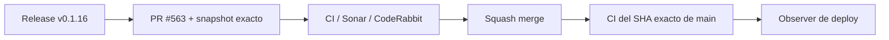

# BRVTAL — Último deploy

  
  
  

> **Development dashboard** · snapshot profesional de **solo el deploy actual**.

## Progress convention

- ✅ ~~Struck through~~ = completed and verified through the required delivery gates.
- 🚧 Normal text = pending or currently in progress.

## Estado del deploy

| Señal | Estado | Evidencia |
| --- | --- | --- |
| Work line | 🚧 **#558 Content Health navigation deflake (v0.1.16), PR #563** | un solo owner abre el registro tras navegación |
| Base exacta | ✅ **VALIDATED IN CODE** | `main` `7eb49d8a5296feb40dc1b00b3dd5fed2aa2f1683` |
| Version | 🚧 **0.1.15 → 0.1.16** | patch deploy |
| Producción | 🚧 **PENDING MERGE / OBSERVATION** | no se infiere validación de producción desde CI |

## Huella del cambio

<!-- brvtal:git-delta -->

| Archivos | Inserciones | Eliminaciones | Neto |
| ---: | ---: | ---: | ---: |
| **6** | **+46** | **−48** | **−2** |

## Calidad y entrega

<!-- brvtal:gate-plan -->

| Control | Estado / contrato |
| --- | --- |
| Navegación Content Health | `content-core-nav.js` es el único owner del click OPEN |
| Sincronización | Playwright espera el resultado compuesto de sección + registro + feedback |
| Gates | preflight + gates diff-aware de BRVTAL CI |
| Sonar + CodeRabbit | paralelo sobre head estable |
| Exact-main | CI del SHA exacto de main tras squash merge |

## Flujo de entrega

## Qué se hizo

- Se elimina el segundo click handler de Content Health que competía con la navegación delegada en capture phase.
- `OPEN` queda bajo un único contrato: navegar al módulo y luego revelar el registro mediante `BRVTALAdminRecordNavigation`.
- Las dos regresiones Playwright usan el owner canónico y sincronizan sobre el resultado completo en vez de depender de un handler local ya retirado.
- Versión **0.1.16**.

## Archivos modificados en este deploy

- `README.md`
- `config/version.php`
- `discadmin/content-health.js`
- `package.json`
- `tests/e2e/discadmin-content-health-navigation.spec.mjs`
- `tests/e2e/discadmin-content-health.spec.mjs`

## Validación

- El primer CI del head detectó correctamente un harness legado que todavía esperaba el handler local; el test quedó alineado con la navegación canónica sin aumentar timeouts.
- No hay SQL, migraciones ni mutaciones de producción.
- BRVTAL CI, Sonar y CodeRabbit deben cerrar sobre el head estable antes del merge.
- No se declara producción validada desde CI.

## Qué sigue

| Lane | Trabajo |
| --- | --- |
| **NOW** | 🚧 [#558](https://github.com/pl0n3r/brvtal/issues/558) · cerrar la regresión flaky de navegación. |
| **NEXT** | 🚧 [#174](https://github.com/pl0n3r/brvtal/issues/174) · proteger cambios sin guardar en Banners. |
| **LATER** | 🚧 [#519](https://github.com/pl0n3r/brvtal/issues/519), [#518](https://github.com/pl0n3r/brvtal/issues/518), [#257](https://github.com/pl0n3r/brvtal/issues/257) · productividad editorial y protección general de editores. |
| **BLOCKED / EXTERNAL** | 🚧 [#534](https://github.com/pl0n3r/brvtal/issues/534) · verificación de Hostinger/hPanel separada. |

## Panorama general pendiente

| Lane | Frente | Issues |
| --- | --- | --- |
| **DONE** | ✅ ~~Editor/modal navigation lifecycle~~ | ✅ ~~[#216](https://github.com/pl0n3r/brvtal/issues/216) · v0.1.15 / PR #562~~ |
| **NOW** | 🚧 Browser/navigation closeout | 🚧 [#558](https://github.com/pl0n3r/brvtal/issues/558) |
| **NEXT** | 🚧 Unsaved Banners protection | 🚧 [#174](https://github.com/pl0n3r/brvtal/issues/174) |
| **LATER** | 🚧 Editorial productivity | 🚧 [#519](https://github.com/pl0n3r/brvtal/issues/519), [#518](https://github.com/pl0n3r/brvtal/issues/518), [#257](https://github.com/pl0n3r/brvtal/issues/257) |
| **BLOCKED / EXTERNAL** | 🚧 Hostinger deploy observation | 🚧 [#534](https://github.com/pl0n3r/brvtal/issues/534) |
