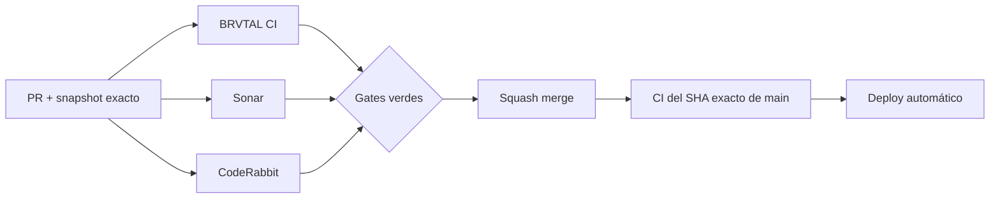

  

# BRVTAL — Último deploy

  <strong>Quality burn-down · Archive card assembly</strong>

  

> Este README representa **solo el deploy actual**. Se reemplaza en el siguiente deploy y no funciona como changelog acumulativo.

## Estado del deploy

| Señal | Estado | Evidencia |
| --- | --- | --- |
| Base exacta | ✅ **VALIDATED IN CODE** | `main` `2e6235ef14d269e2a63bd913bc15ab613c863a36` · BRVTAL CI #1067 |
| Alcance | 🧩 **P2 / #451** | reducir complejidad de la tarjeta histórica de Archive |
| Browser regression | 🧪 **Playwright** | relaciones, navegación, filtros, XSS y fallbacks |
| Producción | ⚪ **No validada por este PR** | CI verde no equivale a validación de producción |

## Flujo de entrega

## Qué se hizo

- Continúa #451 con el bloque P2 de complejidad en Archive.
- `archiveCard()` deja de concentrar cálculo de año, resumen de relaciones, fallback visual y construcción de acciones.
- Se extraen helpers pequeños para esas responsabilidades sin cambiar URLs, textos, atributos de búsqueda ni estructura pública.
- Se conserva la política de URLs seguras y el renderizado mediante `textContent`.
- Playwright fija explícitamente el fallback `HISTORICAL RECORD` y el placeholder `BRVTAL / ARCHIVE`, además de la cobertura existente de filtros, relaciones y datos hostiles.
- Este flujo es público y no autenticado; por tanto el usuario E2E de DISCADMIN no aporta cobertura adicional aquí.

## Archivos modificados en este deploy

- `README.md` — snapshot visual exacto del deploy.
- `js/archive.js` — simplifica el ensamblaje de tarjetas históricas.
- `tests/e2e/public-archive.spec.mjs` — preserva fallbacks visibles del Archive.

## Validación

- Base exacta: `main` `2e6235ef14d269e2a63bd913bc15ab613c863a36`, validada por BRVTAL CI #1067.
- El PR debe volver a pasar BRVTAL CI / `validate`, Chromium, SonarQube Cloud y CodeRabbit sobre su nuevo SHA exacto.
- Tras squash merge se verificará BRVTAL CI sobre el SHA exacto resultante de `main`.
- Ningún gate de CI implica por sí solo **VALIDATED IN PRODUCTION**.

## Qué sigue

1. Resolver findings válidos de Sonar/CodeRabbit sin ampliar el alcance.
2. Squash merge y verificar BRVTAL CI sobre el SHA exacto de `main`.
3. Marcar el bloque Archive de #451 solo después del exact-main CI verde.
4. Continuar con Theme runtime si el finding sigue reproduciendo.
5. Mantener #501 (Connected Memories) independiente hasta completar sus gates.

## Panorama general pendiente

| Frente | Estado / siguiente foco |
| --- | --- |
| 🧪 **Sonar / calidad** | #451 — public app cubierto en #500 · Archive #502 actual · Theme runtime después |
| 🗃️ **Archivo cultural** | #398 / #499 — #501 conecta Memories con relaciones explícitas |
| 🎛️ **Apariencia** | #149 — completar Light en módulos modernos |
| 🖼️ **Hero Slider** | #221 integridad editorial · #480 regresión visual desktop |
| 🔐 **Seguridad editorial** | #257, #216, #174, #193 |
| 🔎 **SEO / entrega pública** | #182, #214, #204, #272 → #390 · #479 alt · #481 IndexNow |
| 📈 **Analytics** | #427 — completar eventos `brvtal_*` dentro de GTM/GA4 |
| ✍️ **Content / edición** | #224, #252 |
| 🧾 **Activity / operaciones** | #232, #195 |
| 📚 **Bulk Actions** | #275 — registros >500 sin falsa exhaustividad |
| 🧭 **DISCADMIN / Theme** | #348, #351 |
| 🌐 **Idioma** | #212 — español canónico + inglés automático por fases |
| 💾 **Backups** | #389 — scheduling seguro + Drive opcional |

---

BRVTAL · Rave till Grave · snapshot operativo, no historial acumulativo

