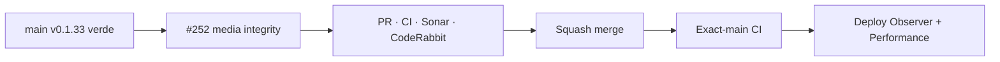

# BRVTAL — Último deploy

  
  
  

> **Development dashboard** · snapshot de **solo el deploy actual** para Issue #252.

## Progress convention

- ✅ ~~Struck through~~ = completed and verified through the required delivery gates.
- 🚧 Normal text = pending or currently in progress.

## Estado del deploy

| Señal | Estado | Evidencia |
| --- | --- | --- |
| Work line | 🚧 **#252 · integridad Media ↔ Content Core ↔ Content Health** | Events / Artists / Sets |
| Base exacta | ✅ ~~main v0.1.33 CI/validate + Deploy Observer + Performance verdes~~ | `a59f0cca44d783c84263574cbb15f3b8eb8098db` |
| Versión | 🚧 **0.1.34** | runtime/admin health, sin migración |
| Producción | 🚧 pendiente de PR → merge → exact-main → observación | no asumir deploy |

## Huella del cambio

<!-- brvtal:git-delta -->

| Archivos | Inserciones | Eliminaciones | Neto |
| ---: | ---: | ---: | ---: |
| **0** | **+0** | **−0** | **+0** |

## Calidad y entrega

<!-- brvtal:gate-plan -->

| Control | Estado / contrato |
| --- | --- |
| Gates | **preflight · coordination · fast[PHP+JS] · database · chromium · real-stack · webkit** |
| PR integrity | **PR + snapshot exacto** · Issue #252 · `work/issue-252` · UUID `2ea86e7a-6f1b-4b86-9bf6-8647f9b86cd0` |
| Media refs | 🚧 HTTP(S) seguro + `/uploads/…` resoluble; draft repairable, public fail-closed |
| Content Health | 🚧 diferencia visual ausente vs referencia rota |
| Sonar | 🚧 Quality Gate sobre head final |
| CodeRabbit | 🚧 full review sobre head final |
| Exact-main | 🚧 **CI del SHA exacto de main** tras squash merge |

## Flujo de entrega

## Qué se hizo

- Events, Artists y Sets comparten un contrato visual: referencias malformadas se rechazan y rutas locales quedan confinadas a `/uploads/…`.
- Un asset local solo cuenta como sano cuando existe dentro del árbol permitido y decodifica como imagen; no se hacen probes de red a URLs externas.
- Drafts pueden conservar temporalmente una referencia local bien formada pero rota; un estado realmente público no puede conservarla silenciosamente.
- Events usan la política pública canónica `brvtal_public_event_is_visible()`; Artists/Sets publicados aplican el mismo fail-closed visual.
- Content Health deja de equiparar “string no vacío” con visual válido, expone `image_reference_kind` y separa `empty_visuals` de `broken_visuals` manteniendo compatibilidad de `missing_visuals`.
- DISCADMIN muestra deuda visual vacía y rota por separado.
- Contratos PHP y real-stack PHP/MariaDB reproducen rutas inexistentes, archivos no-imagen, referencias externas seguras y rollback de intentos de publicación inválidos.

## Archivos modificados en este deploy

- `README.md` — huella exacta y gates del candidato.
- `api/content-health.php` — salud basada en resolubilidad real y diagnóstico de referencias.
- `api/content-validation.php` — contrato visual compartido y gate de estado público.
- `api/index.php` — validación visual en CRUD canónico.
- `config/media.php` — clasificación segura de referencias visuales.
- `config/version.php` — versión humana 0.1.34.
- `discadmin/content-health.js` — métricas separadas de visual vacío/roto.
- `package.json` — versión 0.1.34.
- `tests/content-health-contract.php` — contrato durable de Content Health.
- `tests/e2e/content-core-real-stack.spec.mjs` — reproducción real PHP/MariaDB del bug.
- `tests/e2e/discadmin-content-health.spec.mjs` — cobertura de diagnóstico en UI.
- `tests/media-reference-contract.php` — contrato de paths, URLs y estados editoriales.

## Validación

- Base exacta `a59f0cca44d783c84263574cbb15f3b8eb8098db`: BRVTAL CI / `validate` #35819015300 success.
- Deploy Observer #35819015313 y Production Performance #35819032736 success por separado sobre la misma base.
- El candidato v0.1.34 requiere CI/Sonar/CodeRabbit del HEAD final antes de merge.
- No altera credenciales, migraciones, Hostinger ni contenido editorial productivo.

## Qué sigue

| Lane | Trabajo |
| --- | --- |
| **NOW** | 🚧 [#252](https://github.com/pl0n3r/brvtal/issues/252) · cerrar integridad de referencias visuales y validar exact-main. |
| **NEXT** | 🚧 [#275](https://github.com/pl0n3r/brvtal/issues/275) · completar cobertura de catálogo en Bulk Actions. |
| **LATER** | 🚧 [#351](https://github.com/pl0n3r/brvtal/issues/351) · Theme Studio Concept 05; [#531](https://github.com/pl0n3r/brvtal/issues/531) · Media Library smarter. |
| **BLOCKED / EXTERNAL** | 🚧 Sin acciones protegidas necesarias para este slice. |

## Panorama general pendiente

| Lane | Frente | Issues |
| --- | --- | --- |
| **NOW** | 🚧 Media integrity | 🚧 [#252](https://github.com/pl0n3r/brvtal/issues/252) |
| **NEXT** | 🚧 Admin scale | 🚧 [#275](https://github.com/pl0n3r/brvtal/issues/275) |
| **LATER** | 🚧 Theme / Media evolution | 🚧 [#351](https://github.com/pl0n3r/brvtal/issues/351), [#531](https://github.com/pl0n3r/brvtal/issues/531) |
