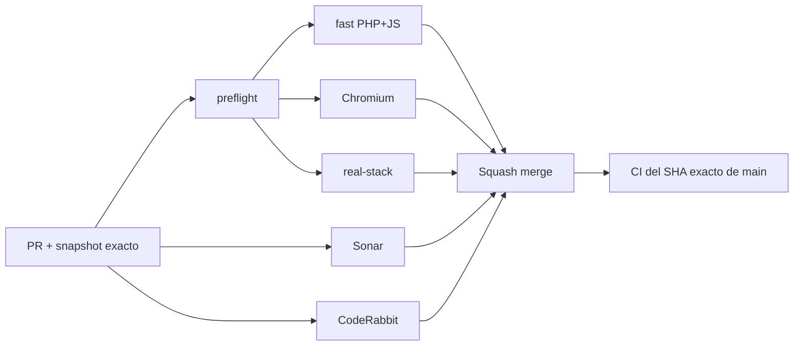

# BRVTAL — Último deploy

  
  
  

> **Development dashboard** · snapshot profesional de **solo el deploy actual**.

## Progress convention

- ✅ ~~Struck through~~ = completed and verified through the required delivery gates.
- 🚧 Normal text = pending or currently in progress.
- Keep completed items visible and crossed out instead of deleting them, so the roadmap preserves delivery history.

## Estado del deploy

| Señal | Estado | Evidencia |
| --- | --- | --- |
| Work line | 🚧 **#348 TASK-ORIENTED DISCADMIN IA** | navegación jerárquica + search canónico |
| Base exacta | 📌 **BRANCH BASE** | `main` `d7433b77786f06b67a2f6cf5edb5d6c0d268ad49` |
| Version | 🚀 **0.1.3 → 0.1.4** | patch deploy bump · pre-1.0 |
| Producción | ⛔ **BLOCKED / EXTERNAL** | Hostinger marker en [#534](https://github.com/pl0n3r/brvtal/issues/534) |

## Huella del cambio

<!-- brvtal:git-delta -->

| Archivos | Inserciones | Eliminaciones | Neto |
| ---: | ---: | ---: | ---: |
| **12** | **+198** | **−88** | **+110** |

## Calidad y entrega

<!-- brvtal:gate-plan -->

| Control | Estado / contrato |
| --- | --- |
| Gates seleccionados | **preflight · fast[PHP+JS] · chromium · real-stack** |
| Navegación | orden primario estable + children semánticos + deep links compatibles |
| Search | top-right + sidebar comparten `BRVTALGlobalSearch` |
| Sonar | Clean-as-You-Code en paralelo |
| CodeRabbit | full review del head estable en paralelo |
| Exact-main | **CI del SHA exacto de main** obligatorio tras squash merge |

## Flujo de entrega

## Qué se hizo

- DISCADMIN pasa a dos grupos: **SITE / EDITORIAL** y **CONFIGURATION / TECHNICAL**.
- El orden principal queda Dashboard → Banners → Events → Artists → Releases → Sets → Media → Pages → Blog.
- Hero Slider conserva su ruta interna pero se presenta al usuario como **Banners**.
- Memories queda subordinado a Media; Theme Studio y Security / 2FA quedan subordinados a Settings.
- Backups/Activity dejan de competir como pseudo-destinos cuando ya tienen superficie canónica.
- Global Search permanece arriba y suma acceso persistente inmediatamente antes de Logout.
- Se elimina el `ONLINE` estático que parecía un health check sin serlo.
- Se elimina el atajo legacy `⌘K/Ctrl+K → Theme Studio`; Global Search queda como único dueño del shortcut.
- Settings elimina la etiqueta ambigua “Control Plane” y expone Theme/Security desde su jerarquía.
- Se añaden regresiones Playwright y real-stack autenticado.
- BRVTAL avanza a **v0.1.4**.

## Archivos modificados en este deploy

- `AGENTS.md` — contrato durable de la nueva IA.
- `README.md` — snapshot exacto del deploy.
- `config/version.php` — versión 0.1.4.
- `discadmin/admin-information-architecture.css` — jerarquía visual de children.
- `discadmin/admin-information-architecture.js` — grupos, orden y aliases canónicos.
- `discadmin/admin-modules.css` — elimina orden CSS legacy que competía con la IA.
- `discadmin/global-search.js` — acceso sidebar al mismo buscador canónico.
- `discadmin/hero-slider.js` — nombre visible Banners.
- `discadmin/index-core.php` — elimina ONLINE y shortcut legacy conflictivo.
- `discadmin/settings-v2.js` — Theme/Security bajo Settings y header claro.
- `tests/e2e/content-core-real-stack.spec.mjs` — smoke autenticado de navegación/search.
- `tests/e2e/discadmin-information-architecture.spec.mjs` — regresiones de IA, search y Settings.

## Validación

- Chromium cubre orden, jerarquía, aliases ocultos, Global Search y compatibilidad de rutas;
- real-stack autenticado valida la misma IA contra PHP/MariaDB reales;
- PHP/JS syntax y contratos corren en `fast`;
- no hay cambio de esquema, migración de producción ni operación destructiva;
- el PR todavía debe superar Sonar, CodeRabbit y BRVTAL CI antes de merge.

## Qué sigue

| Lane | Trabajo |
| --- | --- |
| **DONE** | ✅ ~~Phase 1 quick wins y [#221](https://github.com/pl0n3r/brvtal/issues/221) Hero/Banner media integrity~~ |
| **NOW** | 🚧 Cerrar [#348](https://github.com/pl0n3r/brvtal/issues/348) con CI + Sonar + CodeRabbit + exact-main. |
| **NEXT** | 🚧 Appearance/premium UX: [#149](https://github.com/pl0n3r/brvtal/issues/149) y [#514](https://github.com/pl0n3r/brvtal/issues/514). |
| **BLOCKED / EXTERNAL** | 🚧 [#534](https://github.com/pl0n3r/brvtal/issues/534) · Hostinger Git auto-deploy marker. |
| **LATER** | 🚧 Settings/performance: [#516](https://github.com/pl0n3r/brvtal/issues/516), [#523](https://github.com/pl0n3r/brvtal/issues/523), [#480](https://github.com/pl0n3r/brvtal/issues/480). |

## Panorama general pendiente

| Lane | Frente | Issues |
| --- | --- | --- |
| **DONE** | ✅ ~~Phase 1 quick wins~~ | ✅ ~~[#527](https://github.com/pl0n3r/brvtal/issues/527), [#520](https://github.com/pl0n3r/brvtal/issues/520), [#521](https://github.com/pl0n3r/brvtal/issues/521), [#526](https://github.com/pl0n3r/brvtal/issues/526), [#522](https://github.com/pl0n3r/brvtal/issues/522), [#479](https://github.com/pl0n3r/brvtal/issues/479), [#517](https://github.com/pl0n3r/brvtal/issues/517), [#221](https://github.com/pl0n3r/brvtal/issues/221)~~ |
| **NOW** | 🚧 Admin IA / appearance | 🚧 [#348](https://github.com/pl0n3r/brvtal/issues/348), [#149](https://github.com/pl0n3r/brvtal/issues/149), [#514](https://github.com/pl0n3r/brvtal/issues/514) |
| **NEXT** | 🚧 Admin shell/settings | 🚧 [#516](https://github.com/pl0n3r/brvtal/issues/516), [#523](https://github.com/pl0n3r/brvtal/issues/523), [#193](https://github.com/pl0n3r/brvtal/issues/193), [#216](https://github.com/pl0n3r/brvtal/issues/216) |
| **LATER** | 🚧 Editorial productivity | 🚧 [#519](https://github.com/pl0n3r/brvtal/issues/519), [#518](https://github.com/pl0n3r/brvtal/issues/518), [#525](https://github.com/pl0n3r/brvtal/issues/525), [#528](https://github.com/pl0n3r/brvtal/issues/528) |
| **BLOCKED / EXTERNAL** | 🚧 Deploy observation | 🚧 [#534](https://github.com/pl0n3r/brvtal/issues/534) |
