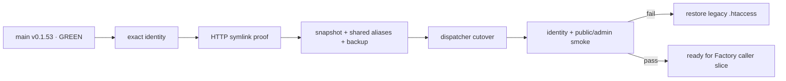

# BRVTAL — Último deploy

  
  
  

> Snapshot de **solo el deploy actual**: #670 prepara el bootstrap reversible del layout Hostinger previo al cutover Factory. No instala el caller productivo ni ejecuta writes remotos desde CI. Base exacta `main 9b4bab13a8b8750db9e7fa3440a2879dbb9de03d` / v0.1.53 GREEN.

## Progress convention

- ✅ ~~Struck through~~ = completed and verified through the required delivery gates.
- 🚧 Normal text = pending or currently in progress.

## Estado del deploy

| Señal | Estado | Evidencia |
| --- | --- | --- |
| Work line | 🚧 **#670 · Hostinger reversible bootstrap** | `work/issue-670`; reserva `b0fe3d30-2402-4a9d-b55a-e07a2cd7b8c3` |
| Base exacta | ✅ ~~main v0.1.53 GREEN~~ | `9b4bab13a8b8750db9e7fa3440a2879dbb9de03d` |
| Versión producto | ✅ ~~v0.1.53 sin cambio~~ | repository-only; el caller productivo sigue ausente |
| Identidad previa | 🚧 **SHA + versión exactos obligatorios** | `/api/deployment.php` antes de cualquier cutover |
| Symlinks Hostinger | 🚧 **prueba HTTP temporal obligatoria** | el probe se elimina incluso cuando falla |
| Estado persistente | 🚧 **aliases, no copia/move** | config, uploads, storage y .private permanecen en el árbol existente |
| Backup | 🚧 **ready antes del dispatcher** | motor canónico `brvtal_backup_create()` |
| Rollback | 🚧 **solo dispatcher/artefacto** | restaura `.htaccess`; nunca restaura BD |
| Auto-deploy Hostinger | 🚧 **debe estar deshabilitado** | gate `BRVTAL_HOSTINGER_GIT_AUTODEPLOY_DISABLED=1` |
| Producción | ✅ ~~sin writes remotos en este PR~~ | no workflow invoca `ops/factory/bootstrap` |

## Huella del cambio

<!-- brvtal:git-delta -->

| Archivos | Inserciones | Eliminaciones | Neto |
| ---: | ---: | ---: | ---: |
| **4** | **+625** | **−44** | **+581** |

## Calidad y entrega

<!-- brvtal:gate-plan -->

| Control | Estado / contrato |
| --- | --- |
| Gates esperados | **preflight · coordination · fast[PHP] · database · recovery** |
| PR + snapshot exacto | Issue #670 · reserva `b0fe3d30-2402-4a9d-b55a-e07a2cd7b8c3` |
| Roles | Infrastructure · SRE · Security · QA |
| Transporte | `DEPLOY_TOKEN` + `DEPLOY_SSH_KEY`; host key estricto; sin secretos en logs |
| Preflight | exact SHA/version → HTTP symlink proof → snapshot/shared state → backup |
| Cutover | `.factory-current` primero; dispatcher v1 después; validación final obligatoria |
| Fallo | restaura legacy `.htaccess` y elimina pointer; DB permanece intacta |
| Review | BRVTAL CI + Factory gates + Privacy + Sonar/CodeQL/CodeRabbit sobre HEAD estable |
| CI del SHA exacto de main | 🚧 después del merge |

## Flujo de entrega

## Qué se hizo

- Añade `ops/factory/bootstrap`, cerrado por credenciales completas y por la confirmación explícita de que Hostinger Git auto-deploy está deshabilitado.
- Extiende `transport.py` con preflight de identidad exacta, prueba HTTP real de symlink, preparación idempotente, activación y restore.
- El snapshot inicial queda en `factory-releases/<sha>` con identidad exacta; excluye `.git` y todo estado mutable.
- `factory-shared` enlaza el config/uploads/storage/.private existentes sin mover, borrar ni duplicar datos de usuario.
- Antes del dispatcher se exige backup canónico en estado `ready` y se conserva el legacy `.htaccess`.
- La activación conmuta `.factory-current` y después instala el dispatcher; cualquier fallo de identidad o smoke restaura la ruta legacy sin rollback de BD.
- El contrato local usa fake SSH/HTTP y cubre auto-deploy activo, identity mismatch, symlink no soportado, deny guard ausente, happy path, idempotencia y rollback por smoke fallido.
- Este slice no ejecuta bootstrap remoto y no añade todavía `factory/deploy.yml@v1`.

## Archivos modificados en este deploy

- `README.md`
- `ops/factory/bootstrap`
- `ops/factory/transport.py`
- `tests/factory-hostinger-bootstrap-contract.php`

## Validación

- 🚧 El contrato PHP debe pasar bajo PHP 8.5 sin warnings/deprecations.
- 🚧 Database/recovery permanecen obligatorios por tocar la superficie de backup/deploy.
- 🚧 Factory CI/Policy/Privacy, Sonar, CodeQL y CodeRabbit deben cerrar sobre el HEAD estable.
- 🚧 No se considera producción migrada: el auto-deploy de Hostinger sigue siendo autoridad hasta un cutover explícito posterior.
- 🚧 Tras merge: exact-main BRVTAL CI + Deploy Observer + Production Performance deben mantener GREEN.

## Qué sigue

| Lane | Trabajo |
| --- | --- |
| **NOW** | 🚧 [#670](https://github.com/pl0n3r/brvtal/issues/670): cerrar bootstrap reversible con evidencia reproducible y cero writes remotos. |
| **NEXT** | 🚧 [#630](https://github.com/pl0n3r/brvtal/issues/630): ejecutar cutover controlado y adoptar `factory/deploy.yml@v1` con rollback e2e. |
| **LATER** | 🚧 [#533](https://github.com/pl0n3r/brvtal/issues/533): reanudar roadmap de producto tras cerrar TANDA 2. |
| **BLOCKED / EXTERNAL** | 🚧 [#627](https://github.com/pl0n3r/brvtal/issues/627): labels espera paridad central de Factory. |

## Panorama general pendiente

- 🚧 **NOW**: validar #670 y mantener producción intacta.
- 🚧 **NEXT**: deshabilitar Hostinger Git auto-deploy durante un cutover reversible y luego habilitar el caller Factory.
- 🚧 **LATER**: cerrar #630 con una entrega main→producción validada o rollback automático demostrado.
- 🚧 **BLOCKED / EXTERNAL**: #627 permanece fuera hasta que Factory cubra su contrato completo.
