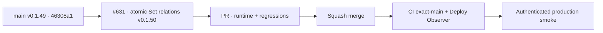

# BRVTAL — Último deploy

  
  
  

> **Production incident #631** · exact `main` v0.1.49 `46308a18ce6da0df2e2a7f57a56128537e619772` tiene CI y Deploy Observer verdes, pero smoke #35954991161 falló en New Set: Artist esperado presente, Event esperado ausente. Sets API respondió **200 en 38 ms** y navegación browser **200 en 66 ms**. La causa estructural es que la hidratación de relaciones tolera fallos parciales y abre el modal con estado incompleto. **Engineering roles:** SRE / production incident responder, frontend reliability engineer, QA automation engineer.

## Progress convention

- ✅ ~~Struck through~~ = completed and verified through the required delivery gates.
- 🚧 Normal text = pending or currently in progress.

## Estado del deploy

| Señal | Estado | Evidencia |
| --- | --- | --- |
| Work line | 🚧 **#631 · atomic Set relation hydration** | `work/issue-631`; reserva `5871dfc0-084c-4bf0-9dc6-a9145be8845c` |
| Base exacta | ✅ ~~main v0.1.49~~ | `46308a18ce6da0df2e2a7f57a56128537e619772` |
| Versión | 🚧 **v0.1.50 candidate** | runtime DISCADMIN reliability |
| CI exact-main base | ✅ ~~success~~ | [#35954707550](https://github.com/pl0n3r/brvtal/actions/runs/35954707550) |
| Deploy Observer base | ✅ ~~success~~ | [#35954707552](https://github.com/pl0n3r/brvtal/actions/runs/35954707552) |
| Smoke base | ⛔ **failure / Set relations** | [#35954991161](https://github.com/pl0n3r/brvtal/actions/runs/35954991161) · artist=true · event=false |
| Entrega candidata | 🚧 retry acotado + commit atómico + fail-closed | no modal con catálogos parciales |

## Huella del cambio

<!-- brvtal:git-delta -->

| Archivos | Inserciones | Eliminaciones | Neto |
| ---: | ---: | ---: | ---: |
| **8** | **+186** | **−55** | **+131** |

## Calidad y entrega

<!-- brvtal:gate-plan -->

| Control | Estado / contrato |
| --- | --- |
| Gates esperados | **preflight · coordination · fast[PHP+JS] · database · chromium · real-stack · webkit** |
| PR + snapshot exacto | Issue #631 · reserva `5871dfc0-084c-4bf0-9dc6-a9145be8845c` |
| CodeRabbit / Sonar | 🚧 HEAD estable; máximo 3 rondas automáticas |
| CI del SHA exacto de main | 🚧 después del merge |
| Producción | 🚧 smoke debe completar Sets relations + Hero 3/3 y terminar con cero 5xx |

## Flujo de entrega

## Qué se hizo

- Smoke #35954991161 observó v0.1.49 / `46308a18…` exactos.
- Health **200**, DB **connected**, Home **200**, DISCADMIN **200**, dashboard **499 ms**, Admin version, Events workspace y Event #6 date pasaron.
- Sets API paginado respondió **200 en 38 ms** con 3/3 filas; el navegador recibió Sets **200 en 66 ms**.
- New Set encontró el Artist publicado esperado, pero no el Event publicado esperado; Hero no se ejecutó porque el smoke falla antes.
- `hydrateSetRelations()` usaba `Promise.allSettled()` y actualizaba Artists/Events por separado. Si una colección fallaba, el modal podía abrir con la otra nueva y la fallida vieja/vacía.
- La candidata carga ambas colecciones con máximo **2 intentos** por GET, valida arrays y solo publica `state.artists/state.events` cuando ambas están completas.
- Si la hidratación sigue fallando, New Set no abre y muestra feedback; no se presenta un formulario engañosamente incompleto.
- El smoke ahora guarda conteos/presencia de IDs en `setRelations` antes de fallar, para separar datos de UI.
- Sin SQL, migraciones ni escrituras productivas.

## Archivos modificados en este deploy

- `README.md` — snapshot exacto del incidente y gates.
- `config/version.php` — candidato v0.1.50.
- `discadmin/admin-reliability.js` — hidratación atómica, retry y fail-closed.
- `package.json` — versión v0.1.50.
- `tests/admin-reliability-quick-wins-contract.php` — contrato estático de atomicidad/retry.
- `tests/discadmin-quick-wins-contract.php` — contrato de entrada directa New Set alineado al fail-closed.
- `tests/e2e/admin-reliability-quick-wins.spec.mjs` — regresiones de retry y fallo agotado.
- `tests/e2e/production-authenticated-smoke.mjs` — evidencia diagnóstica del catálogo de relaciones.

## Validación

- ✅ ~~Base v0.1.49: CI #35954707550 y Deploy Observer #35954707552 verdes.~~
- ✅ ~~Smoke #35954991161 aisló la falla después de Sets API/browser: Event relation ausente en el modal.~~
- 🚧 PR CI/revisión, merge y smoke final pendientes; **no declarar PRODUCTION GREEN** antes.
- 🚧 El smoke final debe tener **cero 5xx**, relaciones Artist/Event presentes y Hero 3/3.

## Qué sigue

| Lane | Trabajo |
| --- | --- |
| **NOW** | 🚧 [#631](https://github.com/pl0n3r/brvtal/issues/631): validar v0.1.50, mergear y repetir smoke real. |
| **NEXT** | 🚧 [#533](https://github.com/pl0n3r/brvtal/issues/533): publicar `🟢 PRODUCTION GREEN` solo con las cinco evidencias. |
| **LATER** | 🚧 detener BRVTAL después de GREEN mientras Tanda 1 global siga abierta. |
| **BLOCKED / EXTERNAL** | 🚧 Condor/GrindFlow sin GREEN y factory `v1.0.0` ausente; no iniciar Tanda 2. |

## Panorama general pendiente

- 🚧 **NOW**: cerrar #631 con smoke completo y cero 5xx.
- 🚧 **NEXT**: verificar incidentes/`[AUTO]` y registrar GREEN en #533.
- 🚧 **LATER**: esperar la barrera global.
- 🚧 **BLOCKED / EXTERNAL**: no adoptar todavía el kit factory.
