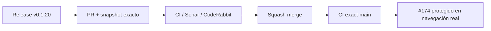

# BRVTAL — Último deploy

  
  
  

> **Development dashboard** · snapshot profesional de **solo el deploy actual**.

## Progress convention

- ✅ ~~Struck through~~ = completed and verified through the required delivery gates.
- 🚧 Normal text = pending or currently in progress.

## Estado del deploy

| Señal | Estado | Evidencia |
| --- | --- | --- |
| Work line | 🚧 **#174 Banners unsaved-change protection (v0.1.20)** | guard transaccional antes de reemplazar workspace/URL |
| Base exacta | ✅ **VALIDATED IN CODE** | `main` `a3b30d53429ce075a54c55af891a098331db2c90` |
| Version | 🚧 **0.1.19 → 0.1.20** | patch deploy |
| Producción | 🚧 **NOT VALIDATED IN PRODUCTION** | CI y tests no sustituyen validación real de Hostinger |

## Huella del cambio

<!-- brvtal:git-delta -->

| Archivos | Inserciones | Eliminaciones | Neto |
| ---: | ---: | ---: | ---: |
| **8** | **+302** | **−53** | **+249** |

## Calidad y entrega

<!-- brvtal:gate-plan -->

| Control | Estado / contrato |
| --- | --- |
| Gates | **preflight · fast[PHP+JS] · database · chromium · real-stack · webkit** |
| Banners dirty-state | snapshot limpio tras load/save; comparación normalizada |
| Navigation | confirmación antes de go/tech/Back; commit de descarte solo tras éxito |
| Browser lifecycle | `beforeunload` para refresh/cierre con cambios |
| Sonar + CodeRabbit | paralelo sobre head estable |
| Exact-main | CI del SHA exacto de main tras squash merge |

## Flujo de entrega

## Qué se hizo

- Banners mantiene un snapshot limpio después de cargar y después de guardar; el dirty-state se deriva de la configuración normalizada actual.
- Salir o reabrir Banners con cambios sin guardar exige confirmación **antes** de cambiar URL, cancelar módulos o reemplazar el workspace.
- Si el usuario cancela Back/Forward, la capa de Information Architecture restaura la ruta de Banners.
- Si una navegación confirmada falla, los cambios siguen marcados como pendientes; el descarte solo se consolida después de una transición exitosa.
- Refresh/cierre de pestaña usa `beforeunload` únicamente cuando Banners está realmente dirty.
- Versión **0.1.20**.

## Archivos modificados en este deploy

- `AGENTS.md` — documenta el contrato durable de dirty-state/navegación y actualiza prioridades.
- `README.md` — snapshot visual del deploy actual.
- `config/version.php` — declara la release runtime `0.1.20`.
- `discadmin/admin-information-architecture.js` — integra el guard antes de side effects y restaura URL en Back cancelado.
- `discadmin/hero-slider.js` — añade snapshot limpio, confirmación, commit post-éxito y `beforeunload`.
- `package.json` — alinea la versión del proyecto con `0.1.20`.
- `tests/e2e/discadmin-information-architecture.spec.mjs` — cubre cancelación de rutas dinámicas, System y browser Back.
- `tests/e2e/hero-slider-v2.spec.mjs` — cubre dirty-state, cancelar/aceptar, fallo de navegación, save y beforeunload.

## Validación

- Base exacta `a3b30d5`: BRVTAL CI / validate success; Phase B throughput artifact real también success.
- Los tests dirigidos deben demostrar que cancelación no muta URL/workspace y que navegación fallida conserva dirty-state.
- BRVTAL CI, Sonar y CodeRabbit se revisan sobre el head estable antes del merge; CodeRabbit es advisory si el servicio no produce veredicto.
- Tras merge se verificará BRVTAL CI sobre el SHA exacto de `main`.
- No se declara producción validada desde CI.

## Qué sigue

| Lane | Trabajo |
| --- | --- |
| **NOW** | 🚧 [#174](https://github.com/pl0n3r/brvtal/issues/174) · cerrar protección de cambios sin guardar en Banners. |
| **NEXT** | 🚧 [#519](https://github.com/pl0n3r/brvtal/issues/519) · visual drag/drop ordering como primitiva editorial. |
| **LATER** | 🚧 [#518](https://github.com/pl0n3r/brvtal/issues/518), [#257](https://github.com/pl0n3r/brvtal/issues/257) · data grid canónico y protección general de editores. |
| **EVIDENCE** | 🚧 [#564](https://github.com/pl0n3r/brvtal/issues/564) · acumular muestras antes de Phase D/sharding. |
| **BLOCKED / EXTERNAL** | 🚧 [#534](https://github.com/pl0n3r/brvtal/issues/534) · Hostinger/hPanel sigue siendo el frente externo. |

## Panorama general pendiente

| Lane | Frente | Issues |
| --- | --- | --- |
| **NOW** | 🚧 Unsaved Banners protection | 🚧 [#174](https://github.com/pl0n3r/brvtal/issues/174) |
| **NEXT** | 🚧 Editorial ordering / grids | 🚧 [#519](https://github.com/pl0n3r/brvtal/issues/519), [#518](https://github.com/pl0n3r/brvtal/issues/518) |
| **LATER** | 🚧 General editor protection | 🚧 [#257](https://github.com/pl0n3r/brvtal/issues/257) |
| **EVIDENCE** | 🚧 CI throughput Phase D decision | 🚧 [#564](https://github.com/pl0n3r/brvtal/issues/564) |
| **BLOCKED / EXTERNAL** | 🚧 Hostinger configuration | 🚧 [#534](https://github.com/pl0n3r/brvtal/issues/534) |
