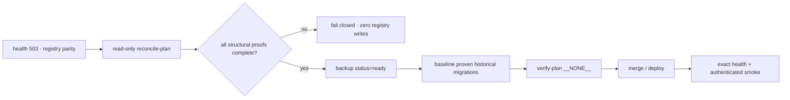

# BRVTAL — Último deploy

  
  
  

> Snapshot de **solo el deploy actual**: candidate v0.1.58 for incident #681. Production health is 503 because historical schema effects exist without complete migration-registry parity. This candidate adds controlled, backup-gated reconciliation; it does not perform destructive SQL or Factory cutover.

## Progress convention

- ✅ ~~Struck through~~ = completed and verified through the required delivery gates.
- 🚧 Normal text = pending or currently in progress.
- ⛔ = active production blocker.

## Estado del deploy

| Señal | Estado | Evidencia |
| --- | --- | --- |
| Work line | 🚧 **#681 · migration registry reconciliation** | `work/issue-681`; reservation `bf5dd92b-4b1d-4172-a0c2-3b9f6c7e3fbe` |
| Base exacta | ⛔ **main v0.1.57** | `f500ff862c8ffeea31bad19d2b2d24e29b65f326`; health incident open |
| Versión objetivo | 🚧 **v0.1.58 deploy-bound** | patch 0.1.57 → 0.1.58 |
| Reconciliation plan | ✅ **read-only / fail-closed** | information_schema proofs only |
| Backup before writes | ✅ **required by transport + CLI** | backup status=ready + marker + env gate |
| Historical SQL replay | ✅ **forbidden by this path** | proven effects are baselined only |
| Production | ⛔ **not GREEN yet** | health must return 200 after deploy/reconcile |

## Huella del cambio

<!-- brvtal:git-delta -->

| Archivos | Inserciones | Eliminaciones | Neto |
| ---: | ---: | ---: | ---: |
| **8** | **+815** | **−60** | **+755** |

## Calidad y entrega

<!-- brvtal:gate-plan -->

| Control | Estado / contrato |
| --- | --- |
| Gates esperados | **preflight · coordination · fast · database · chromium · real-stack · webkit · recovery-rehearsal** |
| PR + snapshot exacto | **Issue #681 · PR #682 · v0.1.58** |
| Roles | **Infrastructure · SRE · Security · QA** |
| Reconciliation | read-only proof → backup ready → controlled registry write → `verify-plan __NONE__` |
| Production writes | baseline metadata only; no destructive SQL, no restore, no cutover |
| Review | BRVTAL CI + Factory Policy + Privacy + Sonar/CodeQL/CodeRabbit |
| CI del SHA exacto de main | 🚧 después del merge |
| Production GREEN | 🚧 exact health + authenticated smoke required |

## Flujo de entrega

## Qué se hizo

- Añade especificaciones explícitas de prueba estructural para migraciones históricas conocidas.
- Consulta solo `information_schema`; no lee filas de negocio ni contenido privado.
- Aborta ante proof faltante/incompleto, checksum mismatch, orphan records o estados ambiguos.
- Añade `reconcile-plan` de solo lectura y `reconcile` protegido por gates de escritura y evidencia de backup.
- El transporte SSH verifica el checkout legacy exacto antes de inspección/reconciliación.
- Crea backup mediante la librería BRVTAL y exige `status=ready` antes de cualquier baseline.
- Una reconciliación exitosa termina con `verify-plan __NONE__`; una prueba incompleta detiene el flujo antes del baseline y mantiene el incidente abierto.

## Archivos modificados en este deploy

- `README.md` — snapshot exacto del incidente #681.
- `config/migration_reconcile.php` — proofs y plan/reconciliación fail-closed.
- `config/version.php` — versión v0.1.58.
- `ops/factory/transport.py` — inspección y reconciliación remota controlada.
- `package.json` — paridad de versión.
- `scripts/migrations.php` — comandos reconcile-plan/reconcile.
- `tests/factory-hostinger-transport-contract.php` — contrato del transport.
- `tests/migrations-contract.php` — regresiones del reconciliador.

## Validación

- 🚧 Los contratos PHP/transport deben pasar en BRVTAL CI sobre el HEAD estable.
- 🚧 Sonar, CodeQL y CodeRabbit deben cerrar sin findings accionables.
- 🚧 Tras merge, el transporte debe tomar backup antes de baselinear.
- 🚧 Producción solo vuelve a GREEN con health 200 exacto y smoke autenticado success.
- No se afirma que producción esté reparada antes de esas evidencias.

## Qué sigue

| Lane | Trabajo |
| --- | --- |
| **NOW** | ⛔ [#681](https://github.com/pl0n3r/brvtal/issues/681): recuperar health exacto sin replay histórico. |
| **NEXT** | 🚧 [#630](https://github.com/pl0n3r/brvtal/issues/630): continuar TANDA 2 cuando GREEN vuelva. |
| **LATER** | 🚧 [#653](https://github.com/pl0n3r/brvtal/issues/653): PHPStan + Rector. |
| **BLOCKED / EXTERNAL** | Hostinger write path requires configured transport credentials; never invent or commit them. |

## Panorama general pendiente

- ⛔ **NOW:** #681 restore production GREEN with backup-gated migration reconciliation.
- 🚧 **NEXT:** #630 complete Factory adoption after exact-main + production validation.
- 🚧 **LATER:** #653 static-analysis uplift and remaining roadmap work.
