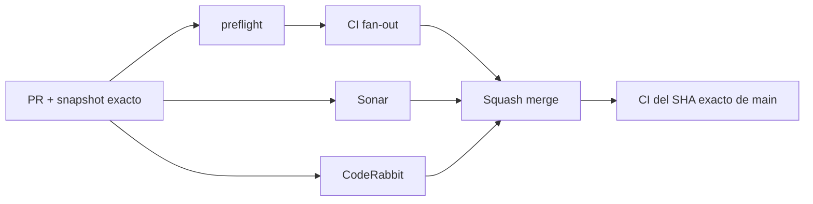

# BRVTAL — Último deploy

  
  
  

> **Development dashboard** · snapshot profesional de **solo el deploy actual**.

## Estado del deploy

| Señal | Estado | Evidencia |
| --- | --- | --- |
| Work line | 🖼️ **#221 HERO MEDIA INTEGRITY** | save seguro · Media Library autoritativa |
| Base exacta | ✅ **VALIDATED IN CODE** | `main` `30a00293d7b0204cc3ffb3bc050fa95e097789cd` · exact-main `validate` verde |
| Version | 🚀 **0.1.1 → 0.1.2** | patch deploy bump · pre-1.0 |
| Producción | ⛔ **BLOCKED / EXTERNAL** | Hostinger marker en [#534](https://github.com/pl0n3r/brvtal/issues/534) |

## Huella del cambio

<!-- brvtal:git-delta -->

| Archivos | Inserciones | Eliminaciones | Neto |
| ---: | ---: | ---: | ---: |
| **12** | **+571** | **−77** | **+494** |

## Calidad y entrega

<!-- brvtal:gate-plan -->

| Control | Estado / contrato |
| --- | --- |
| Gates seleccionados | **preflight · fast[PHP+JS] · database · chromium · real-stack · webkit** |
| Save authority | Settings API devuelve 422 con field exacto si media pública no es válida |
| Local media | published Media Library + archivo real bajo `/uploads/` |
| External media | HTTPS explícito; sin fetch server-side durante save |
| Sonar | Clean-as-You-Code en paralelo |
| CodeRabbit | full review del head estable en paralelo |
| Exact-main | **CI del SHA exacto de main** obligatorio tras squash merge |

## Flujo de entrega

## Qué se hizo

- Un slide habilitado ya no puede guardarse sin Desktop media válida.
- Paths locales deben existir como Media Library publicada y conservar su archivo fuente.
- Tipo image/video y poster image se validan antes de persistir.
- Mobile overrides y assets de layers image/logo se validan cuando están presentes.
- HTTPS externo sigue permitido y queda explícito como alternativa al Media Library.
- DISCADMIN bloquea errores obvios antes del request; el servidor sigue siendo la autoridad.
- Se añadió cobertura real-stack autenticada para persistencia y rechazo 422.
- El validador del README dejó de exigir el issue histórico #517.
- Los helpers nuevos se refactorizaron para mantener complejidad y naming dentro de Clean-as-You-Code.
- BRVTAL avanza a **v0.1.2**.

## Archivos modificados en este deploy

- `AGENTS.md`
- `README.md`
- `api/index.php`
- `config/hero_slider_integrity.php`
- `config/version.php`
- `discadmin/hero-slider.js`
- `docs/HERO-SLIDER.md`
- `scripts/readme-dashboard.py`
- `tests/e2e/hero-slider-integrity-real-stack.spec.mjs`
- `tests/e2e/hero-slider-v2.spec.mjs`
- `tests/e2e/run-content-core-real-stack.sh`
- `tests/hero-slider-integrity-contract.php`

## Validación

- contrato puro de integridad: required / registry / published / file / type / HTTPS / traversal;
- browser: save inválido no emite POST y Media Library publicada sí permite save;
- real-stack: path no registrado, archivo faltante y tipo incorrecto responden 422;
- real-stack: asset local válido y HTTPS externo persisten correctamente;
- slides deshabilitados conservan drafts incompletos;
- sin migración de producción ni operación destructiva.

## Qué sigue

| Lane | Trabajo |
| --- | --- |
| **NOW** | Cerrar [#221](https://github.com/pl0n3r/brvtal/issues/221) con CI/Sonar/CodeRabbit y exact-main. |
| **NEXT** | Phase 2 Admin: [#348](https://github.com/pl0n3r/brvtal/issues/348), [#149](https://github.com/pl0n3r/brvtal/issues/149), [#514](https://github.com/pl0n3r/brvtal/issues/514). |
| **BLOCKED / EXTERNAL** | [#534](https://github.com/pl0n3r/brvtal/issues/534) · Hostinger Git auto-deploy marker. |
| **LATER** | [#518](https://github.com/pl0n3r/brvtal/issues/518), [#519](https://github.com/pl0n3r/brvtal/issues/519), [#525](https://github.com/pl0n3r/brvtal/issues/525), [#513](https://github.com/pl0n3r/brvtal/issues/513). |

## Panorama general pendiente

| Lane | Frente | Issues |
| --- | --- | --- |
| **NOW** | Banner integrity | [#221](https://github.com/pl0n3r/brvtal/issues/221) |
| **NEXT** | Admin IA / appearance | [#348](https://github.com/pl0n3r/brvtal/issues/348), [#149](https://github.com/pl0n3r/brvtal/issues/149), [#514](https://github.com/pl0n3r/brvtal/issues/514) |
| **LATER** | Editorial productivity | [#518](https://github.com/pl0n3r/brvtal/issues/518), [#519](https://github.com/pl0n3r/brvtal/issues/519), [#525](https://github.com/pl0n3r/brvtal/issues/525), [#528](https://github.com/pl0n3r/brvtal/issues/528) |
| **LATER** | Configurable operations | [#513](https://github.com/pl0n3r/brvtal/issues/513), [#515](https://github.com/pl0n3r/brvtal/issues/515), [#532](https://github.com/pl0n3r/brvtal/issues/532) |
| **BLOCKED / EXTERNAL** | Deploy observation | [#534](https://github.com/pl0n3r/brvtal/issues/534) |
