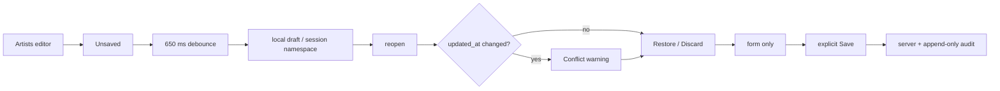

# BRVTAL — Último deploy

> Snapshot de **solo el deploy actual** para #709: drafts recuperables de Artists sobre el adaptador legacy validado en Pages. No declara producción GREEN.

## Progress convention
- ✅ ~~Struck through~~ = completed and verified through required gates.
- 🚧 Normal text = pending/in progress.
- 🚧 = active production blocker.

## Estado del deploy
| Señal | Estado | Evidencia |
| --- | --- | --- |
| Work line | 🚧 **#709 · Artists recoverable drafts** | `work/issue-709` · reserva `e3c26139-f3f2-43a1-b034-ac906625185b` |
| Base | ✅ **main** | `7adb98f7a54d75c8d9879360c7516e30418c63f9` |
| Versión | 🚧 **v0.1.68** | `config/version.php` + `package.json` |
| PR | 🚧 **Artists slice de #709** | exact-head gates obligatorios |
| Producción | 🚧 **NO GREEN · #681** | deployment exacto; `/api/health.php` sigue 503 |
| Continuidad | ✅ **#709** | Events / Sets / Releases + evaluación Hero/Theme tras este slice |

## Huella del cambio
<!-- brvtal:git-delta -->
| Archivos | Inserciones | Eliminaciones | Neto |
| ---: | ---: | ---: | ---: |
| **6** | **+215** | **−6** | **+209** |

## Calidad y entrega
<!-- brvtal:gate-plan -->
| Control | Estado / contrato |
| --- | --- |
| Gates | **preflight · coordination · fast[PHP+JS] · database · chromium · real-stack · webkit** |
| Factory | Policy · Privacy · Labels |
| Snapshot | PR + snapshot exacto |
| Main | CI del SHA exacto de main |
| Review | Sonar + CodeRabbit |
| Seguridad | localStorage same-origin por sesión; sin endpoint, proveedor, permiso ni migración nuevos |
| Producción | #681 permanece fuera de alcance; no se declara GREEN |

## Flujo de entrega

## Qué se hizo
- `legacy-editor-drafts.js` amplía el adaptador reusable existente con contrato de **Artists**.
- Pages permanece como primer consumidor validado; Events/Sets/Releases quedan en slices posteriores de #709.
- Autosave local con debounce; el adaptador no hace fetch/POST/PUT ni publica.
- Estados accesibles: Unsaved, Saving, Draft saved, Save failed y Saved to server.
- Artists ofrece Restore/Discard y usa `updated_at` para advertir conflicto.
- Save exitoso limpia el draft solo si el formulario sigue igual al payload enviado; `sort_order` visual no crea falsos positivos.
- Ediciones hechas durante un Save en vuelo permanecen en el editor y se conservan como draft.
- Fallo HTTP conserva recovery cuando storage funciona; storage degradado no promete una copia inexistente.
- Expiración de sesión y logout explícito purgan drafts locales.
- Version History y auditoría server-side permanecen como autoridad; sin segunda historia.
- #709 preserva el rollout restante sin inflar esta PR.

## Archivos modificados en este deploy
- `discadmin/legacy-editor-drafts.js`
- `tests/e2e/discadmin-artist-drafts.spec.mjs`
- `tests/legacy-editor-drafts-contract.php`
- `config/version.php`
- `package.json`
- `README.md`

## Validación
- E2E: Artists debounce + reload/Restore de bio y membership.
- E2E: conflicto por revisión `updated_at`.
- E2E: `sort_order` no editable no simula ediciones nuevas.
- E2E: Save en vuelo conserva ediciones posteriores.
- E2E: expiración de sesión elimina recovery local.
- Contract: Artists reutiliza el mismo adapter/no-network boundary de Pages.
- No cambia `datos.yml`: no añade dato personal, proveedor ni transferencia a tercero.
- Sin SQL, migración, Hostinger write ni cambios de readiness.
- 🚧 Gates exact-head deben cerrar antes de merge.

## Qué sigue
| Lane | Trabajo |
| --- | --- |
| **NOW** | 🚧 [#709](https://github.com/pl0n3r/brvtal/issues/709): integrar slice Artists. |
| **NEXT** | 🚧 [#709](https://github.com/pl0n3r/brvtal/issues/709): Events / Sets / Releases + evaluación Hero/Theme. |
| **LATER** | 🚧 [#533](https://github.com/pl0n3r/brvtal/issues/533): roadmap canónico. |
| **BLOCKED / EXTERNAL** | 🚧 [#681](https://github.com/pl0n3r/brvtal/issues/681): migration registry parity / producción NO GREEN. |
| **BLOCKED BY #681** | 🚧 #530: Recycle Bin requiere metadata durable/migración segura. |

## Panorama general pendiente
- 🚧 **NOW**: #709 Artists / v0.1.68.
- 🚧 **NEXT**: continuar #709 por slices seriales tras exact-main de Artists.
- 🚧 **LATER**: continuar #533 según prioridad real.
- 🚧 **BLOCKED / EXTERNAL**: #681 conserva recovery productivo fail-closed; #530 no añade migraciones hasta recuperar registry.
