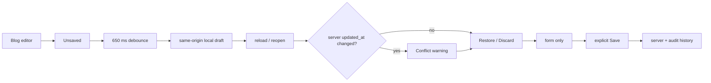

# BRVTAL — Último deploy

> Snapshot del siguiente deploy para #528: drafts editoriales recuperables en Blog. No declara producción GREEN.

## Estado del deploy

| Señal | Estado | Evidencia |
| --- | --- | --- |
| Work line | 🚧 **#528 · recoverable Blog drafts** | `work/issue-528` · reserva `0f1759ee-d30a-4993-9c7e-08b6bb4f074f` |
| Base exacta | ✅ **main** | `4eef787234ab31c8d0901653ece6388a5f5a90c1` |
| Versión de producto | 🚧 **v0.1.66** | `config/version.php` + `package.json` |
| Producción | 🚧 **NO GREEN · #681** | migration registry recovery sigue bloqueado por autoridad/transporte |
| Factory Labels | ✅ **recuperado** | exact-main v0.1.65 pasó Factory Labels |
| PR | 🚧 **pendiente** | abrir solo después de autorrevisión y huella exacta |

## Huella del cambio
<!-- brvtal:git-delta -->
| Archivos | Inserciones | Eliminaciones | Neto |
| ---: | ---: | ---: | ---: |
| **PENDING** | **PENDING** | **PENDING** | **PENDING** |

## Qué cambia

- Nuevo `discadmin/editor-drafts.js`: almacenamiento local same-origin, versionado y reutilizable.
- El namespace del draft se deriva con SHA-256 del CSRF de la sesión; el token no se persiste y sesiones distintas no comparten drafts.
- Blog autosavea el formulario localmente con debounce de 650 ms. No ejecuta POST/PUT, no publica y no escribe Version History.
- Estados visibles y accesibles: **Unsaved**, **Saving draft…**, **Draft saved locally**, **Save failed** y **Saved to server**.
- Al reabrir el mismo post se ofrece **Restore Draft / Discard Draft**.
- Cada draft guarda la revisión base `updated_at`. Si el servidor cambió, el editor muestra un conflicto antes de restaurar.
- Restore repone contenido únicamente en el formulario. El servidor sigue siendo autoridad hasta un Save manual explícito.
- Un Save HTTP exitoso limpia el draft; un fallo conserva una copia local recuperable.
- El rich body se vuelve a pasar por el sanitizador cliente antes de renderizar al restaurar.
- No hay tabla, migración, SQL productivo, Hostinger write ni proveedor externo nuevo.

## Seguridad y privacidad

- No se guarda el CSRF en localStorage; solo un fingerprint SHA-256 truncado para separar la sesión.
- No se amplían permisos, endpoints ni eventos.
- El draft vive en el mismo origen del admin y contiene únicamente los campos editoriales que el administrador ya está editando.
- No cambia `datos.yml`: el slice no añade campos personales, proveedores ni envío de datos a terceros.
- Version History permanece append-only/read-only; no se usa como mecanismo de restore.

## Cobertura

- E2E: autosave local sin mutación de red.
- E2E: reload + recuperación explícita.
- E2E: conflicto cuando `updated_at` del servidor no coincide.
- E2E: Save manual limpia el draft.
- E2E: Save HTTP fallido conserva el draft.
- E2E: fallo de localStorage muestra error sin perder el contenido visible.

## Roles

**Software Engineering · Frontend · UX · QA · Security**

- Ingeniería: mecanismo reutilizable y reversible, sin segundo backend de versiones.
- Frontend: debounce, estado async y fallo de storage.
- UX: recovery explícito, conflicto visible y acciones Restore/Discard.
- QA: criterios AC-01…AC-06 cubiertos por E2E.
- Seguridad: aislamiento por sesión, no publicación implícita, no secretos persistidos.

## Flujo

## Fuera de alcance de este slice

- Autosave server-side.
- Restauración automática desde Version History.
- Events, Artists, Releases, Sets y Pages.
- Nuevas migraciones mientras #681 siga bloqueado.
- Resolver #681 desde este PR.

## Qué sigue

| Lane | Trabajo |
| --- | --- |
| **NOW** | 🚧 #528: cerrar PR/gates del slice Blog. |
| **NEXT** | 🚧 #528: extender el contrato a la siguiente superficie editorial después de validar este slice. |
| **BLOCKED / PRODUCTION** | 🚧 #681: migration registry parity. |
| **ROADMAP** | 🚧 #533: planificación canónica. |
