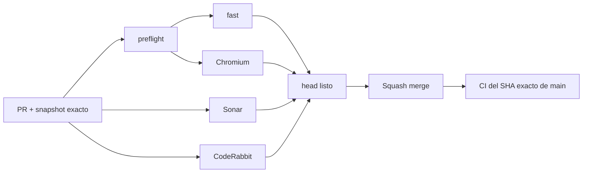

# BRVTAL — Último deploy

  
  
  

> **Development dashboard** · snapshot profesional de **solo el deploy actual**.

## Estado del deploy

| Señal | Estado | Evidencia |
| --- | --- | --- |
| Work line | ♿ **#479 Public image alt** | hardening SEO/accesibilidad sin cambio visual |
| Base exacta | ✅ **VALIDATED IN CODE** | `main` `23d6a57503a7ed26946b437a38c61f276701c4f1` · exact-main `validate` verde |
| Fase | ⚡ **Phase 1 / quick wins** | [#533](https://github.com/pl0n3r/brvtal/issues/533) |
| Producción | ⛔ **BLOCKED / EXTERNAL** | Hostinger marker en [#534](https://github.com/pl0n3r/brvtal/issues/534) |

## Huella del cambio

<!-- brvtal:git-delta -->

| Archivos | Inserciones | Eliminaciones | Neto |
| ---: | ---: | ---: | ---: |
| **3** | **+46** | **−45** | **+1** |

## Calidad y entrega

<!-- brvtal:gate-plan -->

| Control | Estado / contrato |
| --- | --- |
| Gates seleccionados | **preflight · fast[JS] · chromium** |
| Static Home | todos los `img` deben exponer atributo `alt` |
| Meaningful images | logo + flyer/arte conservan texto descriptivo no vacío |
| Generated Hero | media/layers decorativos conservan `alt=""` |
| Sonar | Clean-as-You-Code en paralelo |
| CodeRabbit | full review del head estable en paralelo |
| Exact-main | obligatorio después del squash merge |

## Flujo de entrega

## Qué se hizo

- Se confirma que las imágenes estáticas reportadas originalmente por Bing ya exponen `alt` en el Home actual.
- Se añade una regresión DOM que falla si cualquier `img` estático de Home pierde el atributo `alt`.
- Logo BRVTAL, artwork manifiesto y flyer de evento deben conservar alternativas descriptivas no vacías.
- El Hero Slider generado mantiene `alt=""` en imágenes puramente decorativas, evitando ruido para lectores de pantalla.
- No se modifica layout, assets, contenido editorial ni comportamiento visual.

## Archivos modificados en este deploy

- `tests/e2e/public-quick-wins.spec.mjs` — contrato de accesibilidad para imágenes estáticas Home.
- `tests/e2e/hero-slider.spec.mjs` — contrato para `alt=""` en media/layers generados y decorativos.
- `README.md` — dashboard exacto de #479.

## Validación

- El Home actual contiene `alt` en todas sus imágenes estáticas.
- Las imágenes con significado verificadas tienen texto alternativo no vacío.
- Las imágenes decorativas generadas por Hero Slider siguen teniendo atributo `alt` explícito vacío.
- No se introduce lógica basada en nombres de archivo ni heurísticas SEO.

## Qué sigue

| Lane | Trabajo |
| --- | --- |
| **NOW** | Cerrar [#479](https://github.com/pl0n3r/brvtal/issues/479). |
| **NEXT** | [#517](https://github.com/pl0n3r/brvtal/issues/517) · versión humana en DISCADMIN. |
| **BLOCKED / EXTERNAL** | [#534](https://github.com/pl0n3r/brvtal/issues/534) · Hostinger Git auto-deploy/hPanel. |
| **LATER** | [#221](https://github.com/pl0n3r/brvtal/issues/221), luego Phase 2. |

## Panorama general pendiente

| Lane | Frente | Issues |
| --- | --- | --- |
| **NOW** | Accessibility / SEO | [#479](https://github.com/pl0n3r/brvtal/issues/479) |
| **NEXT** | Version identity | [#517](https://github.com/pl0n3r/brvtal/issues/517) |
| **BLOCKED / EXTERNAL** | Deploy | [#534](https://github.com/pl0n3r/brvtal/issues/534) |
| **LATER** | Quick wins | [#221](https://github.com/pl0n3r/brvtal/issues/221) |
| **LATER** | Admin foundation | [#348](https://github.com/pl0n3r/brvtal/issues/348), [#149](https://github.com/pl0n3r/brvtal/issues/149), [#514](https://github.com/pl0n3r/brvtal/issues/514) |
