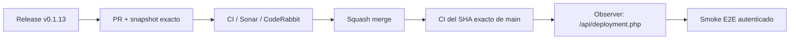

# BRVTAL — Último deploy

  
  
  

> **Development dashboard** · snapshot profesional de **solo el deploy actual**.

## Progress convention

- ✅ ~~Struck through~~ = completed and verified through the required delivery gates.
- 🚧 Normal text = pending or currently in progress.

## Estado del deploy

| Señal | Estado | Evidencia |
| --- | --- | --- |
| Work line | 🚧 **#534 HOSTINGER RELEASE OBSERVABILITY** | release-first observer + smoke |
| Base exacta | ✅ **VALIDATED IN CODE** | `main` `8f4f745ce4fda29b59066cb38adef1d676898495` |
| Version | 🚧 **0.1.12 → 0.1.13** | patch deploy |
| Producción | 🚧 **PENDING OBSERVATION** | release `v0.1.13` + SHA exacto cuando Hostinger lo exponga |

## Huella del cambio

<!-- brvtal:git-delta -->

| Archivos | Inserciones | Eliminaciones | Neto |
| ---: | ---: | ---: | ---: |
| **17** | **+550** | **−152** | **+398** |

## Calidad y entrega

<!-- brvtal:gate-plan -->

| Control | Estado / contrato |
| --- | --- |
| Gates seleccionados | **preflight · fast[PHP+JS] · database · chromium · real-stack · webkit** |
| Deploy marker | release canónica siempre; SHA exacto adicional cuando existe |
| E2E producción | espera release antes de autenticar y validar DISCADMIN |
| Cache busting | SHA exacto o fallback `release-<version>` |
| Sonar + CodeRabbit | paralelo sobre head estable |
| Exact-main | CI del SHA exacto de main tras squash merge |

## Flujo de entrega

## Qué se hizo

- El observer deja de depender de que Hostinger conserve `.git`: valida primero la release canónica y exige SHA exacto solo cuando el runtime realmente lo expone.
- El smoke autenticado espera a que la release esperada llegue a producción antes de cargar DISCADMIN, evitando fallos por propagación normal.
- Los assets dejan de usar metadata de build obsoleta como cache key cuando Git no está disponible.
- `/api/deployment.php` y health distinguen claramente release, cache key y source SHA exacto/no disponible.
- Se documenta la regla durable: cada fallo recurrente debe provocar causa raíz + prevención, no reintentos rituales.
- Versión **0.1.13**.

## Archivos modificados en este deploy

- `.github/workflows/production-authenticated-smoke.yml`
- `.github/workflows/production-deploy-observer.yml`
- `AGENTS.md`
- `README.md`
- `api/deployment.php`
- `api/health.php`
- `config/deployment.php`
- `config/version.php`
- `discadmin/index-core.php`
- `discadmin/index.php`
- `index.php`
- `package.json`
- `tests/deployment-traceability-contract.php`
- `tests/e2e/production-authenticated-smoke.mjs`
- `tests/e2e/production-release-observer-contract.mjs`
- `tests/e2e/production-release-observer.mjs`
- `tests/production-smoke-contract.php`

## Validación

- Contratos ejecutables protegen la separación release/SHA, el cache key y el orden observer → autenticación.
- El polling tolera fallos transitorios; si Hostinger expone SHA exacto, una discrepancia se reporta separada de una release ausente.
- La UI E2E sigue validando la versión visible una vez observada la release.
- No hay migraciones, SQL de producción ni despliegue manual.

## Qué sigue

| Lane | Trabajo |
| --- | --- |
| **NOW** | 🚧 [#534](https://github.com/pl0n3r/brvtal/issues/534) · cerrar observabilidad Hostinger con evidencia post-merge. |
| **NEXT** | 🚧 [#193](https://github.com/pl0n3r/brvtal/issues/193), [#216](https://github.com/pl0n3r/brvtal/issues/216), [#558](https://github.com/pl0n3r/brvtal/issues/558) · regresiones/navegación. |
| **LATER** | 🚧 [#519](https://github.com/pl0n3r/brvtal/issues/519), [#518](https://github.com/pl0n3r/brvtal/issues/518) · productividad editorial. |
| **BLOCKED / EXTERNAL** | 🚧 [#534](https://github.com/pl0n3r/brvtal/issues/534) · solo hPanel si la release tampoco aparece. |

## Panorama general pendiente

| Lane | Frente | Issues |
| --- | --- | --- |
| **DONE** | ✅ ~~Phase 1 + Phase 2 visual/Admin foundation~~ | ✅ ~~[#514](https://github.com/pl0n3r/brvtal/issues/514), [#516](https://github.com/pl0n3r/brvtal/issues/516), [#523](https://github.com/pl0n3r/brvtal/issues/523), [#480](https://github.com/pl0n3r/brvtal/issues/480)~~ |
| **NOW** | 🚧 Release/deploy observability | 🚧 [#534](https://github.com/pl0n3r/brvtal/issues/534) |
| **NEXT** | 🚧 Browser/navigation closeout | 🚧 [#193](https://github.com/pl0n3r/brvtal/issues/193), [#216](https://github.com/pl0n3r/brvtal/issues/216), [#558](https://github.com/pl0n3r/brvtal/issues/558) |
| **LATER** | 🚧 Editorial productivity | 🚧 [#519](https://github.com/pl0n3r/brvtal/issues/519), [#518](https://github.com/pl0n3r/brvtal/issues/518), [#257](https://github.com/pl0n3r/brvtal/issues/257) |
| **BLOCKED / EXTERNAL** | 🚧 Hostinger hPanel only if canonical release remains stale | 🚧 [#534](https://github.com/pl0n3r/brvtal/issues/534) |
