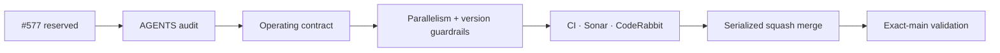

# BRVTAL — Último deploy

  
  
  

> **Development dashboard** · snapshot profesional de **solo el deploy actual**.

## Progress convention

- ✅ ~~Struck through~~ = completed and verified through the required delivery gates.
- 🚧 Normal text = pending or currently in progress.

## Estado del deploy

| Señal | Estado | Evidencia |
| --- | --- | --- |
| Work line | 🚧 **#577 AGENTS operating-model audit** | compact bootstrap · autonomy · parallel-safe coordination · release semantics |
| Base exacta | 🚧 **current main** | `7519c2d4749427622ff6de618b037d94b5a870b6` |
| Version | ✅ **0.1.23 unchanged** | repository-only maintenance; no product/runtime surface changed |
| Producción base | ✅ **NO PRODUCT RUNTIME CHANGE** | no behavioral production claim required |

## Huella del cambio

<!-- brvtal:git-delta -->

| Archivos | Inserciones | Eliminaciones | Neto |
| ---: | ---: | ---: | ---: |
| **8** | **+404** | **−559** | **−155** |

## Calidad y entrega

<!-- brvtal:gate-plan -->

| Control | Estado / contrato |
| --- | --- |
| Gates | **preflight · coordination · fast[PHP+JS] · database · chromium · real-stack · webkit · recovery** |
| Reservation | Issue #577 · `work/issue-577` · UUID trusted marker |
| PR integrity | **PR + snapshot exacto** · implementation overlaps fail closed |
| Parallelism | README is the sole non-blocking shared snapshot; real file overlaps still block |
| Versioning | product/runtime changes require bump; repository-only maintenance may keep current version |
| Sonar + CodeRabbit | parallel on stable intended head |
| Exact-main | **CI del SHA exacto de main** after squash merge |

## Flujo de entrega

## Qué se hizo

- `AGENTS.md` pasa de manual mixto de 540 líneas / ~57 KB a contrato operativo compacto de ~344 líneas / ~16 KB.
- Se explicita máximo trabajo seguro por turno, prohibición de cerrar por microavances y comunicación agrupada.
- Producto/arquitectura queda en `BRVTAL-SPEC`; progreso en #533; aceptación en cada Issue; README queda como snapshot transitorio.
- Se elimina el bootstrap histórico de #571 y se conserva coordinación GitHub-native obligatoria.
- Se corrige una contradicción de paralelización: `README.md` es la única superposición no bloqueante porque todos los PRs deben regenerarlo; cualquier otro path compartido sigue fallando cerrado.
- Se corrige una contradicción de versionado: el clasificador CI distingue producto/runtime de mantenimiento del repositorio para no inventar versiones en docs/tests/CI.
- Se añaden contratos para impedir que AGENTS vuelva a convertirse en inventario de producto o que estas dos reglas se degraden.

## Archivos modificados en este deploy

- `.github/workflows/update-release-metadata.yml` — consume clasificación product/runtime antes de exigir transición de versión.
- `AGENTS.md` — contrato operativo compacto con autonomía, paralelización y ownership de fuentes.
- `README.md` — snapshot exacto de #577.
- `scripts/ci-scope.sh` — publica `deploy_bound` para superficies de producto/runtime.
- `scripts/work_coordinator.py` — excluye solo README de colisiones bloqueantes.
- `tests/ci-scope-contract.php` — valida clasificación deploy-bound/no-runtime.
- `tests/project-operations-contract.php` — guardrails de AGENTS, versionado y paralelización.
- `tests/test_work_coordinator.py` — prueba README-only no bloqueante y colisiones reales fail-closed.

## Validación

- Sin cambio de producto/runtime: v0.1.23 permanece correcta.
- El PR debe cerrar el full matrix porque modifica el clasificador/workflow central.
- Coordination debe aceptar README compartido con PRs independientes y seguir rechazando cualquier overlap real.
- Sonar y CodeRabbit se validan sobre el head estable.
- Exact-main sigue siendo obligatorio después del squash merge.

## Qué sigue

| Lane | Trabajo |
| --- | --- |
| **NOW** | 🚧 [#577](https://github.com/pl0n3r/brvtal/issues/577) · agent operating-model audit. |
| **NEXT** | 🚧 [#257](https://github.com/pl0n3r/brvtal/issues/257) / PR #574 · unsaved editor protection; [#575](https://github.com/pl0n3r/brvtal/issues/575) / PR #576 · production-smoke IA alignment. |
| **LATER** | 🚧 [#525](https://github.com/pl0n3r/brvtal/issues/525), [#524](https://github.com/pl0n3r/brvtal/issues/524), [#528](https://github.com/pl0n3r/brvtal/issues/528), [#529](https://github.com/pl0n3r/brvtal/issues/529). |
| **BLOCKED / EXTERNAL** | 🚧 No active external blocker for this maintenance line. |

## Panorama general pendiente

| Lane | Frente | Issues |
| --- | --- | --- |
| **NOW** | 🚧 Agent operating model | 🚧 [#577](https://github.com/pl0n3r/brvtal/issues/577) |
| **NEXT** | 🚧 Editorial safety / production smoke | 🚧 [#257](https://github.com/pl0n3r/brvtal/issues/257), [#575](https://github.com/pl0n3r/brvtal/issues/575) |
| **LATER** | 🚧 Rich editor / membership / drafts / preview | 🚧 [#525](https://github.com/pl0n3r/brvtal/issues/525), [#524](https://github.com/pl0n3r/brvtal/issues/524), [#528](https://github.com/pl0n3r/brvtal/issues/528), [#529](https://github.com/pl0n3r/brvtal/issues/529) |
| **BLOCKED / EXTERNAL** | 🚧 External deploy/production evidence | monitored independently from code validation |
