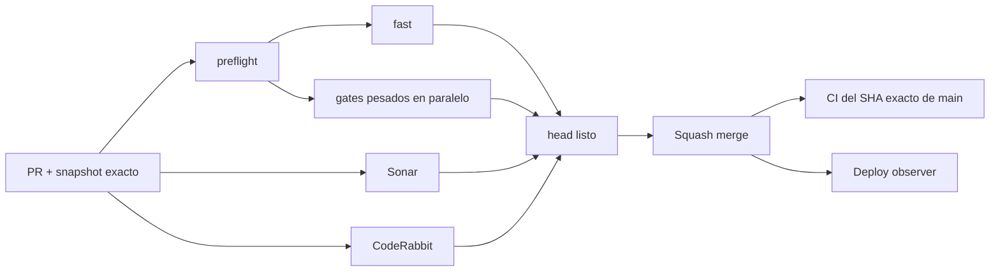

# BRVTAL — Último deploy

  
  
  

> **Development dashboard** · snapshot profesional de **solo el deploy actual**. Estado útil primero; branding decorativo después.

## Estado del deploy

| Señal | Estado actual | Evidencia |
| --- | --- | --- |
| Work line | 🟢 **#527 README dashboard** | dashboard visual + métricas verificadas por CI |
| Base exacta | ✅ **VALIDATED IN CODE** | `main` `ff3d34370d39eb7f5cc81ad6b748b0caeff6519e` · exact-main CI verde |
| Fase | ⚡ **Phase 1 / quick wins** | roadmap maestro [#533](https://github.com/pl0n3r/brvtal/issues/533) |
| Versión producto | 🧪 **pre-1.0** | versión humana/semver pendiente en [#517](https://github.com/pl0n3r/brvtal/issues/517) |
| Lead time CI | 📉 **123 s → 84 s** | último full-scope medido: **−31.7%** tras [#535](https://github.com/pl0n3r/brvtal/pull/535) |
| Producción | ⚠️ **marker pendiente de calibración** | `ff3d343` no apareció en >4 min; seguimiento [#534](https://github.com/pl0n3r/brvtal/issues/534) |

## Huella del cambio

<!-- brvtal:git-delta -->

| Archivos | Inserciones | Eliminaciones | Neto |
| ---: | ---: | ---: | ---: |
| **7** | **+350** | **−186** | **+164** |

La huella se calcula con `git diff --numstat` y CI rechaza el README si estos números o la lista de archivos quedan desactualizados.

## Calidad y entrega

<!-- brvtal:gate-plan -->

| Control | Estado / contrato |
| --- | --- |
| Gates seleccionados | **preflight · fast[PHP+JS] · database · chromium · real-stack · webkit · recovery** |
| BRVTAL CI | badge vivo arriba · `validate` agrega todas las capas aplicables |
| Sonar | badge vivo arriba · Clean-as-You-Code, sin inventar resultados |
| CodeRabbit | full review sobre el head estable, en paralelo con CI/Sonar |
| Exact-main | se valida otra vez después del squash merge |
| Producción | deploy marker y validación funcional son evidencias distintas |

## Flujo de entrega

## Qué se hizo

- Convierte README en un tablero operativo: estado, huella Git, calidad, lead time y prioridades visibles en segundos.
- Añade `scripts/readme-dashboard.py` para verificar automáticamente archivos, inserciones, eliminaciones, neto y gates seleccionados.
- Sustituye el validador inline del workflow por el validador reutilizable.
- Elimina el logo como elemento protagonista del README.
- Calibra el observador de Hostinger a una ventana acotada más realista y corrige el failure path de shell.
- Mantiene **CI ≠ deploy ≠ VALIDATED IN PRODUCTION** como estados separados.

## Archivos modificados en este deploy

**Automation**
- `.github/workflows/production-deploy-observer.yml` — ventana de observación calibrada y failure path seguro.
- `.github/workflows/update-release-metadata.yml` — usa el validador reusable del dashboard.

**Policy / handoff**
- `AGENTS.md` — persiste el contrato visual, métricas exactas y estado del pipeline.
- `README.md` — nuevo dashboard profesional de desarrollo.

**Tooling / contracts**
- `scripts/readme-dashboard.py` — calcula y valida huella Git + gate plan.
- `tests/ci-scope-contract.php` — protege la calibración del observador y el validador.
- `tests/project-operations-contract.php` — protege el dashboard como contrato operacional.

## Validación

- El propio PR debe pasar el validador contra su **base/head exactos**; no se aceptan métricas manuales desfasadas.
- La lista de archivos de este bloque debe coincidir exactamente con el diff real.
- El cambio de workflow selecciona la matriz completa para probar el nuevo contrato de extremo a extremo.
- Sonar y CodeRabbit se ejecutan en paralelo sobre el head estable.
- Tras merge, exact-main CI se valida de nuevo; el observador de Hostinger corre en paralelo y no equivale a validación funcional.

## Qué sigue

| Lane | Trabajo |
| --- | --- |
| **NOW** | Cerrar [#527](https://github.com/pl0n3r/brvtal/issues/527) y medir el observador calibrado de [#534](https://github.com/pl0n3r/brvtal/issues/534). |
| **NEXT** | Quick wins Admin: [#520](https://github.com/pl0n3r/brvtal/issues/520) → [#521](https://github.com/pl0n3r/brvtal/issues/521) → [#526](https://github.com/pl0n3r/brvtal/issues/526) → [#522](https://github.com/pl0n3r/brvtal/issues/522). |
| **BLOCKED / EXTERNAL** | Si el SHA sigue sin aparecer: verificar en Hostinger hPanel Git auto-deploy, repositorio/branch seleccionado y autorización GitHub; no debilitar CI. |
| **LATER** | Continuar [#533](https://github.com/pl0n3r/brvtal/issues/533) de bajo riesgo → arquitectura más compleja. |

## Panorama general pendiente

| Lane | Frente | Issues |
| --- | --- | --- |
| **NOW** | Delivery / deploy observation | [#534](https://github.com/pl0n3r/brvtal/issues/534) |
| **NEXT** | Admin friction | [#520](https://github.com/pl0n3r/brvtal/issues/520), [#521](https://github.com/pl0n3r/brvtal/issues/521), [#526](https://github.com/pl0n3r/brvtal/issues/526), [#522](https://github.com/pl0n3r/brvtal/issues/522), [#479](https://github.com/pl0n3r/brvtal/issues/479), [#517](https://github.com/pl0n3r/brvtal/issues/517), [#221](https://github.com/pl0n3r/brvtal/issues/221) |
| **LATER** | Shell / apariencia | [#348](https://github.com/pl0n3r/brvtal/issues/348), [#149](https://github.com/pl0n3r/brvtal/issues/149), [#514](https://github.com/pl0n3r/brvtal/issues/514) |
| **LATER** | Editorial productivity | [#518](https://github.com/pl0n3r/brvtal/issues/518), [#519](https://github.com/pl0n3r/brvtal/issues/519), [#525](https://github.com/pl0n3r/brvtal/issues/525), [#528](https://github.com/pl0n3r/brvtal/issues/528) |
| **LATER** | Operational dashboards | [#513](https://github.com/pl0n3r/brvtal/issues/513), [#515](https://github.com/pl0n3r/brvtal/issues/515), [#532](https://github.com/pl0n3r/brvtal/issues/532) |
| **LATER** | Archive / resilience | [#398](https://github.com/pl0n3r/brvtal/issues/398), [#389](https://github.com/pl0n3r/brvtal/issues/389), [#530](https://github.com/pl0n3r/brvtal/issues/530) |
