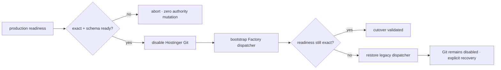

# BRVTAL — Último deploy

  
  
  

> Snapshot de **solo el deploy actual**: #678 endurece el cutover manual de Hostinger para exigir el contrato Factory de readiness exacta antes de tocar autoridad y después de activar el dispatcher. Este PR no ejecuta el cutover ni habilita deploy automático por `push`. Base exacta `main 042643bbb11f14d174c14b85daa43cf57a8493a9` / v0.1.55 GREEN.

## Progress convention

- ✅ ~~Struck through~~ = completed and verified through the required delivery gates.
- 🚧 Normal text = pending or currently in progress.

## Estado del deploy

| Señal | Estado | Evidencia |
| --- | --- | --- |
| Work line | 🚧 **#678 · cutover readiness gate** | `work/issue-678`; reserva `25cb7c14-808d-42d4-a1ce-b408392e1ddb` |
| Base exacta | ✅ ~~main v0.1.55 GREEN~~ | `042643bbb11f14d174c14b85daa43cf57a8493a9` |
| Versión producto | 🚧 **v0.1.56 deploy-bound** | patch 0.1.55 → 0.1.56 |
| Preflight | 🚧 **read-only antes de PUT** | 200 JSON + versión/SHA exactos + schema ready |
| Postflight | 🚧 **readiness tras dispatcher** | mismo contrato antes de declarar éxito |
| Recovery | 🚧 **legacy restore + Git disabled** | nunca reactiva auto-deploy de forma implícita |
| Producción | ✅ ~~sin cutover en este PR~~ | Hostinger Git conserva autoridad durante este slice |

## Huella del cambio

<!-- brvtal:git-delta -->

| Archivos | Inserciones | Eliminaciones | Neto |
| ---: | ---: | ---: | ---: |
| **0** | **+0** | **−0** | **+0** |

## Calidad y entrega

<!-- brvtal:gate-plan -->

| Control | Estado / contrato |
| --- | --- |
| Gates esperados | **preflight · coordination · fast[PHP+JS] · database · chromium · real-stack · webkit · recovery** |
| PR + snapshot exacto | Issue #678 · reserva `25cb7c14-808d-42d4-a1ce-b408392e1ddb` |
| Roles | Infrastructure · SRE · Security · QA |
| Readiness HTTP | HTTPS bounded, sin redirects, HTTP 200 JSON exacto |
| Mutación | ningún PUT/bootstrap si falla el preflight |
| Recovery | fallo post-bootstrap restaura dispatcher legacy cuando puede y deja Git disabled |
| Review | BRVTAL CI + Factory gates + Privacy + Sonar/CodeQL/CodeRabbit sobre HEAD estable |
| CI del SHA exacto de main | 🚧 después del merge |

## Flujo de entrega

## Qué se hizo

- Añade una sonda Factory de readiness acotada: HTTPS, sin redirects, tamaño limitado, HTTP 200 y JSON.
- Exige `status=ok`, versión canónica, SHA exacto de 40 caracteres y `schema_up_to_date=true`.
- El cutover ejecuta esa sonda antes de cualquier PUT de Hostinger; un fallo deja autoridad y layout intactos.
- Tras bootstrap/dispatcher, exige nuevamente el mismo contrato antes de declarar éxito.
- Un fallo post-bootstrap reutiliza el recovery existente: restaura el dispatcher legacy cuando es demostrable y mantiene Hostinger Git disabled.
- Los errores de la sonda son sanitizados: no incorporan body ni stderr remoto.
- Los tests cubren éxito, preflight sin mutación, postflight con recovery y contrato HTTP/JSON.
- No inicializa, baselinea ni aplica migraciones automáticamente y no añade aún el caller permanente `factory/deploy.yml@v1`.

## Archivos modificados en este deploy

- `README.md` — snapshot operacional de #678.
- `config/version.php` — versión de producto 0.1.56.
- `ops/factory/hostinger_cutover.py` — gates de readiness pre/post cutover.
- `ops/factory/transport.py` — sonda HTTPS/JSON exacta y sanitizada.
- `package.json` — versión de producto 0.1.56.
- `tests/test_hostinger_cutover.py` — cobertura determinista de readiness y recovery.

## Validación

- 🚧 Unit/contract de Hostinger debe probar dos sondas exitosas y ambos fallos cerrados.
- 🚧 Recovery es obligatorio porque cambia la frontera de transferencia de autoridad.
- 🚧 Factory CI/Policy/Privacy, Sonar y CodeQL deben pasar sobre el HEAD estable.
- 🚧 CodeRabbit continúa advisory según AGENTS.md; solo hallazgos accionables bloquean.
- ✅ ~~Producción permanece intacta~~: este PR no ejecuta el workflow manual de cutover.

## Qué sigue

| Lane | Trabajo |
| --- | --- |
| **NOW** | 🚧 [#678](https://github.com/pl0n3r/brvtal/issues/678): cerrar readiness pre/post del cutover. |
| **NEXT** | 🚧 [#630](https://github.com/pl0n3r/brvtal/issues/630): ejecutar el cutover manual desde exact-main GREEN y probar recovery/health. |
| **LATER** | 🚧 [#630](https://github.com/pl0n3r/brvtal/issues/630): integrar el caller permanente `factory/deploy.yml@v1` tras cutover probado. |
| **BLOCKED / EXTERNAL** | 🚧 [#627](https://github.com/pl0n3r/brvtal/issues/627): labels espera paridad central de Factory. |

## Panorama general pendiente

- 🚧 **NOW**: integrar #678 sin tocar autoridad de producción.
- 🚧 **NEXT**: ejecutar cutover manual solo con exact-main + readiness GREEN.
- 🚧 **LATER**: cerrar #630 con Factory como autoridad de deploy y rollback/health e2e.
- 🚧 **BLOCKED / EXTERNAL**: #627 sigue fuera hasta paridad completa del kit.
