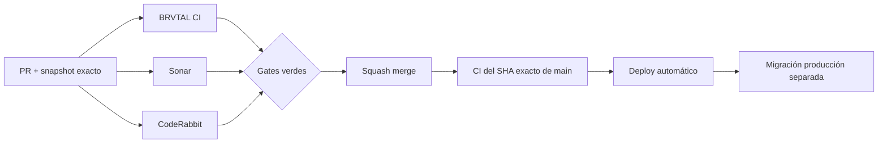

  

# BRVTAL — Último deploy

  <strong>Connected Memories · explicit cultural relationships</strong>

  

> Este README representa **solo el deploy actual**. Se reemplaza en el siguiente deploy y no funciona como changelog acumulativo.

## Estado del deploy

| Señal | Estado | Evidencia |
| --- | --- | --- |
| Base exacta | ✅ **VALIDATED IN CODE** | `main` `2e6235ef14d269e2a63bd913bc15ab613c863a36` · BRVTAL CI #1067 |
| Alcance | 🧠 **#499** | relaciones explícitas desde Memory curada |
| Real stack | 🧪 **E2E admin** | login + persistencia + lectura pública con usuario CI aislado |
| Migración | ⚪ **Pendiente de producción** | `migration_memory_relations_01.sql` no se ejecuta automáticamente |
| Producción | ⚪ **No validada por este PR** | CI verde no equivale a validación de producción |

## Flujo de entrega

## Qué se hizo

- #499 conecta **Memories curadas** con Event, Artist, Set y Release mediante relaciones explícitas; Media Library sigue siendo almacenamiento y nunca adquiere contexto cultural por inferencia.
- Se añade `memory_relations` como migración aditiva/idempotente con FK a `memories`, tipos allowlisted, deduplicación y orden server-side.
- El editor vive dentro de **MEDIA → Memories** y conserva relaciones existentes si una fuente de catálogo falla temporalmente.
- Memory + relaciones se guardan transaccionalmente con auth/CSRF y validación real de los destinos.
- `api/public.php` elimina relaciones hacia entidades no públicas antes de entregar IDs, slugs o etiquetas.
- Home Memories muestra enlaces de contexto canónicos y CONNECTED incorpora Memory edges sin crear una quinta pestaña.
- Las páginas canónicas de Event/Artist/Set/Release muestran únicamente Memories publicadas y relacionadas de forma estructurada.
- La cobertura incluye contratos, MariaDB y Playwright real-stack autenticado con el **usuario E2E/CI**, además de harnesses aislados.
- El código puede desplegarse antes de la migración sin romper Memories: el editor de relaciones se degrada honestamente hasta que la tabla exista.

## Archivos modificados en este deploy

- `AGENTS.md` — registra que las relaciones pertenecen a Memory curada.
- `README.md` — snapshot visual exacto del deploy y panorama pendiente.
- `api/memories.php` — CRUD transaccional de Memory + relaciones y catálogo admin.
- `api/public.php` — sanitiza relaciones contra los pools públicos finales.
- `config/memory_relations.php` — modelo, validación, sanitización y consultas compartidas.
- `config/public_page.php` — Memories explícitas en páginas canónicas y enlaces internos seguros.
- `css/public-memories.css` — contexto cultural responsive/táctil.
- `database/migration_memory_relations_01.sql` — migración aditiva/idempotente.
- `database/schema.sql` — incorpora `memory_relations` al esquema base.
- `discadmin/memories.css` — UI del editor de relaciones.
- `discadmin/memories.js` — edición y preservación segura de relaciones.
- `js/public-media.js` — enlaces públicos de contexto y búsqueda enriquecida.
- `js/related-content.js` — Memory edges dentro de CONNECTED sin nueva capa.
- `package.json` — integra la nueva prueba MariaDB.
- `scripts/ci-scope.sh` — clasifica cualquier spec `*-real-stack` para el gate autenticado.
- `tests/e2e/discadmin-memories.spec.mjs` — edición aislada de relaciones.
- `tests/e2e/memory-relations-real-stack.spec.mjs` — flujo autenticado completo con usuario E2E.
- `tests/e2e/public-media.spec.mjs` — contexto público y touch targets.
- `tests/e2e/public-related-content.spec.mjs` — Memory edges y cuatro tabs de CONNECTED.
- `tests/e2e/run-content-core-real-stack.sh` — aplica migraciones en DB descartable y ejecuta el nuevo smoke.
- `tests/event-record-contract.php` — exige Memories estructuradas, no inferidas.
- `tests/integration/memory-relations.php` — persistencia, rollback, privacidad y cascade en MariaDB.
- `tests/memory-relations-contract.php` — contrato de arquitectura/seguridad/entrega pública.

## Validación

- Base exacta: `2e6235ef14d269e2a63bd913bc15ab613c863a36`, validada por BRVTAL CI #1067.
- El PR debe volver a pasar **BRVTAL CI / validate**, SonarQube Cloud y CodeRabbit sobre su nuevo SHA exacto.
- El gate real-stack usa el usuario E2E/CI descartable, no credenciales personales ni datos de producción.
- Tras squash merge se verificará BRVTAL CI sobre el SHA exacto resultante de `main`.
- La migración de producción permanece separada y requiere la frontera operativa habitual.
- Ningún resultado de CI implica por sí solo **VALIDATED IN PRODUCTION**.

## Qué sigue

1. Resolver cualquier finding válido de CI/Sonar/CodeRabbit en este mismo PR.
2. Squash merge con gates verdes y verificar BRVTAL CI del SHA exacto de `main`.
3. Mantener `migration_memory_relations_01.sql` sin ejecución automática en producción.
4. Continuar #398 usando únicamente relaciones estructuradas reales.
5. Mantener #502 (Archive P2) independiente y reconciliarlo sobre el main resultante cuando corresponda.

## Panorama general pendiente

| Frente | Estado / siguiente foco |
| --- | --- |
| 🗃️ **Archivo cultural** | #398 · #499 conecta Memories; profundizar cross-discovery solo con relaciones reales |
| 🧪 **Sonar / calidad** | #451 · public app cubierto en #500 · Archive #502 en paralelo · Theme runtime después |
| 🎛️ **Apariencia** | #149 — completar Light en módulos modernos |
| 🖼️ **Hero Slider** | #221 integridad editorial · #480 regresión visual desktop |
| 🔐 **Seguridad editorial** | #257, #216, #174, #193 |
| 🔎 **SEO / entrega pública** | #182, #214, #204, #272 → #390 · #479 alt · #481 IndexNow |
| 📈 **Analytics** | #427 — completar eventos `brvtal_*` dentro de GTM/GA4 |
| ✍️ **Content / edición** | #224, #252 |
| 🧾 **Activity / operaciones** | #232, #195 |
| 📚 **Bulk Actions** | #275 — registros >500 sin falsa exhaustividad |
| 🧭 **DISCADMIN / Theme** | #348, #351 |
| 🌐 **Idioma** | #212 — español canónico + inglés automático por fases |
| 💾 **Backups** | #389 — scheduling seguro + Drive opcional |

---

BRVTAL · Rave till Grave · snapshot operativo, no historial acumulativo

