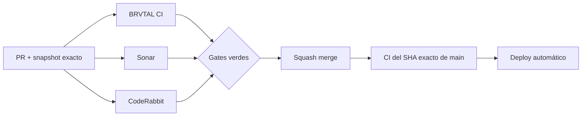

  

# BRVTAL — Último deploy

  <strong>Quality burn-down · public dynamic interactions</strong>

  

> Este README representa **solo el deploy actual**. Se reemplaza en el siguiente deploy y no funciona como changelog acumulativo.

## Estado del deploy

| Señal | Estado | Evidencia |
| --- | --- | --- |
| Base exacta | ✅ **VALIDATED IN CODE** | `main` `cf2e60865114459d9a709cfb4e798207ee5b49eb` · BRVTAL CI #1049 |
| Alcance | 🧩 **P2 / #451** | reducir complejidad de interacciones dinámicas en `js/app.js` |
| Browser regression | 🧪 **Playwright** | cursor, magnetic y preview de artista dinámicos |
| Regla E2E | 🔐 **Durable** | DISCADMIN autenticado prioriza usuario real-stack E2E cuando aplique |
| Producción | ⚪ **No validada por este PR** | CI verde no equivale a validación de producción |

## Flujo de entrega

## Qué se hizo

- Continúa #451 con un bloque pequeño de mantenibilidad en el frontend público.
- `bindDynamicInteractions()` deja de mezclar la lógica de cursor, magnetic y preview de artista.
- Se extraen bindings independientes para cada comportamiento, preservando los mismos atributos de guardia y la misma interacción visible.
- Playwright cubre nodos renderizados dinámicamente desde CMS: cursor label, cambio de preview de artista y movimiento magnetic.
- La política operativa queda explícita en `AGENTS.md`: cuando un flujo autenticado de DISCADMIN pueda ejercitarse en el real-stack aislado, se prioriza el usuario E2E y PHP/MariaDB reales frente a depender únicamente de mocks.
- Los harnesses mock siguen siendo válidos cuando aportan aislamiento específico; nunca se usan credenciales ni datos de producción para E2E.

## Archivos modificados en este deploy

- `AGENTS.md` — regla durable para priorizar el usuario E2E real-stack en validación autenticada.
- `README.md` — snapshot visual exacto del deploy y panorama pendiente.
- `js/app.js` — separa los bindings dinámicos de cursor, magnetic y artist preview.
- `tests/e2e/public-runtime-fallback.spec.mjs` — regresión Playwright para las interacciones dinámicas.

## Validación

- Base exacta: `main` `cf2e60865114459d9a709cfb4e798207ee5b49eb`.
- Esa base pasó **BRVTAL CI #1049** sobre evento `push` y queda **VALIDATED IN CODE**.
- El PR debe pasar BRVTAL CI / `validate`, SonarQube Cloud y CodeRabbit sobre su SHA exacto.
- La prueba pública no necesita login; la nueva regla de usuario E2E se aplicará a próximos cambios autenticados de DISCADMIN y a cualquier cobertura real-stack que pueda ampliarse razonablemente.
- Tras squash merge se verificará BRVTAL CI sobre el SHA exacto resultante de `main`.
- Ningún gate de CI implica por sí solo **VALIDATED IN PRODUCTION**.

## Qué sigue

1. Resolver findings válidos de Sonar/CodeRabbit sin ampliar el alcance.
2. Squash merge y verificar BRVTAL CI sobre el SHA exacto de `main`.
3. Marcar este bloque de public `app.js` en #451 solo después del exact-main CI verde.
4. Continuar el siguiente P2 que todavía reproduzca: Archive o Theme runtime.
5. Mantener #398 como dirección de producto para relaciones culturales explícitas, sin inferir conexiones.

## Panorama general pendiente

| Frente | Estado / siguiente foco |
| --- | --- |
| 🧪 **Sonar / calidad** | #451 — este bloque public app; después Archive / Theme runtime |
| 🎛️ **Apariencia** | #149 — completar Light en módulos modernos |
| 🖼️ **Hero Slider** | #221 integridad editorial · #480 regresión visual desktop |
| 🔐 **Seguridad editorial** | #257, #216, #174, #193 |
| 🔎 **SEO / entrega pública** | #182, #214, #204, #272 → #390 · #479 alt · #481 IndexNow |
| 📈 **Analytics** | #427 — completar eventos `brvtal_*` dentro de GTM/GA4 |
| ✍️ **Content / edición** | #224, #252 |
| 🧾 **Activity / operaciones** | #232, #195 |
| 📚 **Bulk Actions** | #275 — registros >500 sin falsa exhaustividad |
| 🧭 **DISCADMIN / Theme** | #348, #351 |
| 🗃️ **Archivo cultural** | #398, #403 — relaciones explícitas, sin heurísticas |
| 🧠 **Memories** | #415 cerrado; migración de producción sigue separada/protegida |
| 🌐 **Idioma** | #212 — español canónico + inglés automático por fases |
| 💾 **Backups** | #389 — scheduling seguro + Drive opcional |

---

BRVTAL · Rave till Grave · snapshot operativo, no historial acumulativo

