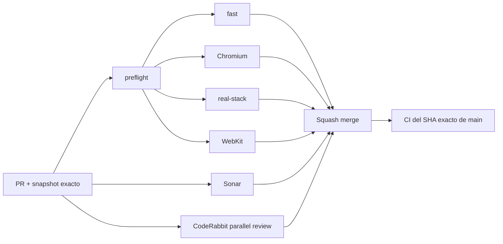

# BRVTAL — Último deploy

  
  
  

> **Development dashboard** · snapshot profesional de **solo el deploy actual**.

## Progress convention

- ✅ ~~Struck through~~ = completed and verified through the required delivery gates.
- 🚧 Normal text = pending or currently in progress.
- Completed roadmap items remain visible and crossed out.

## Estado del deploy

| Señal | Estado | Evidencia |
| --- | --- | --- |
| Work line | 🚧 **#514 PREMIUM ADMIN** | legibilidad + spacing + componentes de baja fatiga |
| Base exacta | ✅ **VALIDATED IN CODE** | `main` `41fc040fb94a9988a6bad7c0933408f9f0349dcd` · exact-main `validate` verde |
| Version | 🚧 **0.1.5 → 0.1.6** | patch deploy bump · pre-1.0 |
| Producción | ⛔ **BLOCKED / EXTERNAL** | Hostinger marker tracked in [#534](https://github.com/pl0n3r/brvtal/issues/534) |

## Huella del cambio

<!-- brvtal:git-delta -->

| Archivos | Inserciones | Eliminaciones | Neto |
| ---: | ---: | ---: | ---: |
| **8** | **+380** | **−30** | **+350** |

## Calidad y entrega

<!-- brvtal:gate-plan -->

| Control | Estado / contrato |
| --- | --- |
| Gates seleccionados | **preflight · fast[PHP+JS] · chromium · real-stack · webkit** |
| Browser | escala tipográfica, superficies, responsive y carga final del design system |
| Real stack | E2E admin autenticado valida Dashboard + Settings reales |
| Sonar | Clean-as-You-Code en paralelo |
| CodeRabbit | full review del head estable en paralelo |
| Exact-main | **CI del SHA exacto de main** obligatorio tras squash merge |

## Flujo de entrega

## Qué se hizo

- Añade una capa única `admin-design-system.css` cargada después de los estilos de cada módulo.
- Establece tipografía de sistema profesional, body/table/input alrededor de 14 px y metadatos persistentes de 11–13 px.
- Corrige la dependencia visual de texto de 7–10 px en Dashboard, Settings, System Status, Content Core, Media, Blog y Releases.
- Unifica spacing, radios, elevación y microinteracciones sin convertir DISCADMIN en una copia visual de Apple.
- Mantiene Dark / Light / Glass como apariencias del mismo sistema semántico.
- Mantiene formularios móviles en 16 px para evitar zoom involuntario y conserva reduced-motion.
- Añade E2E de comportamiento y un smoke real-stack autenticado para legibilidad computada.
- Incrementa BRVTAL a **0.1.6**.

## Archivos modificados en este deploy

- `AGENTS.md`
- `README.md`
- `config/version.php`
- `discadmin/index.php`
- `discadmin/admin-design-system.css`
- `tests/e2e/discadmin-premium-ui.spec.mjs`
- `tests/e2e/discadmin-premium-real-stack.spec.mjs`
- `tests/e2e/run-content-core-real-stack.sh`

## Validación

- Chromium verifica tamaños computados mínimos en shell y módulos representativos.
- Chromium verifica que móvil mantenga lectura cómoda y controles de formulario de 16 px.
- Real-stack usa el administrador E2E aislado y valida Dashboard + Settings dentro de PHP/MariaDB reales.
- El design system se carga al final para que los módulos nuevos hereden la capa semántica sin hard-codes por tema.
- No hay migración ni operación destructiva de producción.

## Qué sigue

| Lane | Trabajo |
| --- | --- |
| **NOW** | 🚧 [#514](https://github.com/pl0n3r/brvtal/issues/514) · cerrar gates y exact-main. |
| **NEXT** | 🚧 [#516](https://github.com/pl0n3r/brvtal/issues/516) · Settings Advanced + consolidación 2FA. |
| **NEXT** | 🚧 [#523](https://github.com/pl0n3r/brvtal/issues/523) · medir/corregir primer load de Banners. |
| **BLOCKED / EXTERNAL** | 🚧 [#534](https://github.com/pl0n3r/brvtal/issues/534) · Hostinger Git auto-deploy marker. |

## Panorama general pendiente

| Lane | Frente | Issues |
| --- | --- | --- |
| **DONE** | ✅ ~~Phase 1 + Admin IA + Appearance~~ | ✅ ~~[#527](https://github.com/pl0n3r/brvtal/issues/527), [#520](https://github.com/pl0n3r/brvtal/issues/520), [#521](https://github.com/pl0n3r/brvtal/issues/521), [#526](https://github.com/pl0n3r/brvtal/issues/526), [#522](https://github.com/pl0n3r/brvtal/issues/522), [#479](https://github.com/pl0n3r/brvtal/issues/479), [#517](https://github.com/pl0n3r/brvtal/issues/517), [#221](https://github.com/pl0n3r/brvtal/issues/221), [#348](https://github.com/pl0n3r/brvtal/issues/348), [#149](https://github.com/pl0n3r/brvtal/issues/149)~~ |
| **NOW** | 🚧 Premium Admin | 🚧 [#514](https://github.com/pl0n3r/brvtal/issues/514) |
| **NEXT** | 🚧 Settings / Shell reliability | 🚧 [#516](https://github.com/pl0n3r/brvtal/issues/516), [#523](https://github.com/pl0n3r/brvtal/issues/523), [#193](https://github.com/pl0n3r/brvtal/issues/193), [#216](https://github.com/pl0n3r/brvtal/issues/216) |
| **LATER** | 🚧 Editorial productivity | 🚧 [#519](https://github.com/pl0n3r/brvtal/issues/519), [#518](https://github.com/pl0n3r/brvtal/issues/518), [#525](https://github.com/pl0n3r/brvtal/issues/525), [#528](https://github.com/pl0n3r/brvtal/issues/528) |
| **BLOCKED / EXTERNAL** | 🚧 Deploy observation | 🚧 [#534](https://github.com/pl0n3r/brvtal/issues/534) |
