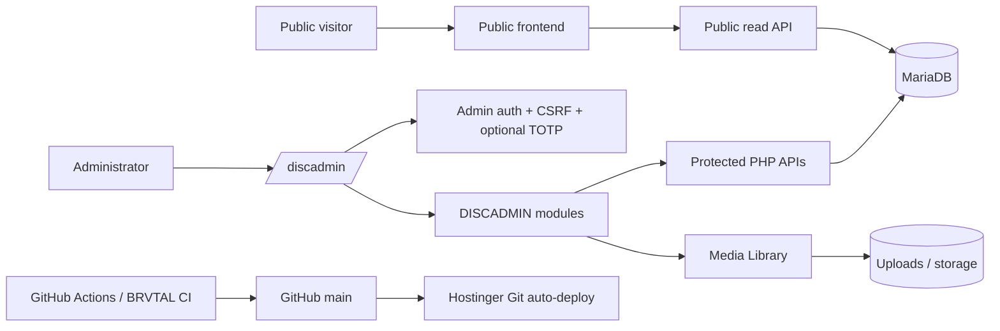

# BRVTAL

> **RAVE TILL GRAVE**  
> Proprietary digital platform for underground electronic music, events, artists, media, editorial content and the future BRVTAL label ecosystem.

[](https://github.com/pl0n3r/brvtal/actions/workflows/update-release-metadata.yml)


**Production:** https://brvtal.com.co  
**Administration:** `/discadmin`  
**Architecture source of truth:** [`docs/BRVTAL-SPEC.md`](docs/BRVTAL-SPEC.md)

---

## What is BRVTAL?

BRVTAL is being built as more than an event website. It is a proprietary platform that combines an underground electronic-music collective, event production, artist infrastructure, music and release publishing, media/archive management, editorial content and future booking/label/community capabilities.

The product direction is intentionally opinionated: **dark, aggressive, hypnotic, editorial and recognizably BRVTAL**. The public experience is designed as an immersive art-directed website, while **DISCADMIN** provides a single protected operational workspace for managing the platform.

The current public frontend is **English only**. The architecture remains capable of future internationalization without introducing unnecessary translation complexity today.

---

## Platform snapshot

The current platform already includes the operational foundations required to manage BRVTAL content from one system:

| Area | Current state |
|---|---|
| Public website | Active, English-first frontend |
| DISCADMIN shell | Implemented as one canonical admin application |
| Events | CRUD, lifecycle, ticket configuration, artist participation / lineup |
| Artists | CRUD, profile data, collective lifecycle |
| Sets / Music | CRUD with artist/event relations and external platforms |
| Media Library | Visual library, upload/picker workflow, reusable assets, reference protection |
| Releases | Label/catalog module with artists, artwork, platforms and publication state |
| Blog | Draft/publish/archive workflow, tags, related content and SEO fields |
| Pages | CMS-managed page data and SEO metadata |
| Content Core | Guided event/artist/ticket operational workspace |
| Content Health | Read-only completeness / publication quality guidance |
| SEO metadata | Per-content metadata foundation plus global theme defaults |
| Global admin search | Cross-module search with `⌘K` / `Ctrl+K` |
| Theme Studio | Visual system, effects, branding, analytics and global SEO controls |
| Security | Sessions, CSRF, rate limiting and optional TOTP / recovery codes |
| System Status | Runtime, API, database, storage, PHP and logs diagnostics |
| CI | PHP, JS, contracts, MariaDB integration and Playwright browser tests |
| Deployment | GitHub `main` → Hostinger Git auto-deployment |

> **Completion rule:** code existing in a branch is not considered finished. BRVTAL tracks work through **developed → validated → integrated → merged to `main` → deployed → verified in production**.

---

## Architecture

BRVTAL deliberately avoids a collection of disconnected admin tools. `/discadmin` is one application with one session, one sidebar, one navigation model and one central workspace.



### Canonical DISCADMIN navigation

```text
DASHBOARD
EVENTS
ARTISTS
RELEASES
SETS
MEDIA
PAGES
BLOG
CONTENT CORE

TECHNICAL
THEME STUDIO
SETTINGS
SECURITY / 2FA
SYSTEM STATUS
```

Dynamic modules are mounted into the canonical shell. Direct module URLs redirect back into `/discadmin` rather than creating independent admin applications.

---

## Core product domains

### Events

Events are first-class entities with draft/publication lifecycle, date and location data, visual identity, ticket configuration, SEO metadata and relations to artists. Artist participation is stored independently through `event_artists`, so an artist's event appearance does not redefine collective membership history.

Canonical lineup contract:

```text
GET  /events/{id}/lineup
POST /events/{id}/lineup
```

The POST operation is authenticated, CSRF-protected and replaces event participation transactionally.

### Artists

Artists support profile data, imagery, social/music links, publication state and BRVTAL collective lifecycle fields. The model is intentionally richer than a simple lineup-name table because artists are reusable entities across events, sets, releases and editorial content.

### Sets / Music

Sets support multiple platforms through external/embed URLs and can relate to artists and events. The model is not limited to SoundCloud.

### Releases / Label

The Releases module provides the foundation for BRVTAL's label evolution: singles, EPs, albums, compilations, artwork, catalog numbers, release dates, linked artists, streaming/store destinations, featured state and publication lifecycle.

### Media Library

Media is reusable platform content rather than disposable form attachments. The Media Library provides visual selection, upload handling, path normalization, metadata, thumbnails and reference-aware deletion protection.

The long-term Media Engine principle is:

> **one source image → multiple optimized variants**

Originals are preserved and the architecture is prepared for richer crop/variant automation without requiring editors to manually create many image sizes.

### Blog

The Blog module supports drafts, published and archived posts, cover media, tags, related Events/Artists/Sets/Releases and SEO metadata. Editorial automation is intentionally limited: the CMS advises but does not autonomously publish content.

### Content Health

Content Health is an advisory layer inside DISCADMIN. It evaluates common completeness signals such as missing descriptions, imagery and SEO metadata and surfaces actionable warnings. It does **not** make irreversible editorial decisions.

### Global Search

DISCADMIN provides fast global search across Events, Artists, Sets, Media, Pages, Releases and Blog.

Keyboard shortcut:

```text
macOS:   ⌘ K
Windows: Ctrl K
```

Sensitive operational data such as administrator records, private logs and raw settings are intentionally excluded from global search.

---

## Technology stack

| Layer | Technology |
|---|---|
| Backend | PHP 8.3+ |
| Database | MariaDB / MySQL-compatible SQL |
| Frontend | HTML, CSS and vanilla JavaScript |
| Admin | Proprietary DISCADMIN shell + dynamically mounted modules |
| Authentication | PHP sessions, CSRF protection, login rate limiting |
| 2FA | TOTP / Google Authenticator-compatible flow with encrypted secrets and hashed recovery codes |
| Media | PHP upload/storage layer + browser media picker |
| Browser testing | Playwright / Chromium |
| CI | GitHub Actions + MariaDB service container |
| Production hosting | Hostinger shared/managed hosting + LiteSpeed |
| Deployment | GitHub `main` through Hostinger Git integration |

The project intentionally remains compatible with shared hosting: it does not require a long-running Node application server, container runtime or SSH-based production deployment.

---

## Repository structure

```text
brvtal/
├── .github/              GitHub Actions / CI
├── api/                  Public and protected PHP APIs
├── assets/               Public static assets
├── config/               Bootstrap, auth, media, TOTP and release configuration
├── css/                  Public frontend styles
├── database/             Base schema and explicit SQL migrations
├── discadmin/            Canonical administration application and modules
├── docs/                 Product and technical specifications
├── js/                   Public frontend JavaScript
├── scripts/              Project maintenance / support scripts
├── storage/              Runtime storage structure; sensitive runtime data is not source code
├── tests/                Contracts, integration tests and Playwright E2E tests
├── index.html            Public entry point
├── package.json          Test tooling / Playwright dependencies
└── playwright.config.mjs Browser-test configuration
```

The most important architectural document is [`docs/BRVTAL-SPEC.md`](docs/BRVTAL-SPEC.md). Review it before changing the database model, DISCADMIN architecture, API contracts, frontend structure or repository layout.

---

## Local setup

### Requirements

- PHP **8.3+**
- MariaDB or compatible MySQL server
- PHP PDO MySQL extension
- Node.js only for the JavaScript/browser test toolchain
- Apache/LiteSpeed-style rewrite support is recommended for parity with production

### 1. Clone the repository

```bash
git clone https://github.com/pl0n3r/brvtal.git
cd brvtal
```

### 2. Create local configuration

Copy the example configuration:

```bash
cp config/config.example.php config/config.php
```

Then configure your local database and secrets in `config/config.php`.

Example structure:

```php
return [
    'app' => [
        'name' => 'BRVTAL',
        'base_url' => 'http://localhost',
        'timezone' => 'America/Bogota',
        'debug' => true,
    ],
    'db' => [
        'host' => 'localhost',
        'port' => 3306,
        'name' => 'brvtal_local',
        'user' => 'brvtal',
        'pass' => 'change-me',
        'charset' => 'utf8mb4',
    ],
    'security' => [
        'session_name' => 'BRVTAL_ADMIN',
        'csrf_key' => 'use-a-long-random-secret',
        'encryption_key' => 'use-a-32-plus-byte-random-secret',
    ],
];
```

Never commit real production credentials, runtime secrets, recovery codes or private configuration.

### 3. Prepare the database

`database/schema.sql` contains the historical/base schema. Additional features are introduced through explicit migration files in `database/`.

Current feature migrations include:

```text
migration_content_core_01.sql
migration_releases_01.sql
migration_blog_01.sql
migration_seo_01.sql
migration_totp_foundation.sql
```

Database migrations are deliberately treated separately from source deployment. **Merging code does not mean a production migration has been executed.** Production SQL changes are applied manually and verified before dependent code is considered fully deployed.

### 4. Install test dependencies

```bash
npm install
```

---

## Configuration and secrets

`config/config.example.php` documents the expected application/database/security structure. The real production configuration is not part of the repository.

Important rules:

- never commit `config/config.php` with live credentials;
- never commit database dumps containing production data;
- never commit TOTP secrets, recovery codes or encryption keys;
- never treat files under runtime storage as source-of-truth content;
- use `utf8mb4` for database text data.

Application release metadata lives in `config/version.php`. Product version/build metadata is updated intentionally for releases; CI does not rewrite it on every commit.

---

## Security model

The admin surface is intentionally isolated from the public API.

Implemented protections include:

- centralized authenticated PHP sessions;
- CSRF validation for state-changing requests;
- login rate limiting;
- optional TOTP challenge during login;
- encrypted TOTP secrets;
- hashed recovery codes;
- authentication requirements on protected module fragments and APIs;
- public API allowlisting rather than exposing arbitrary settings;
- media deletion/reference safeguards;
- no purchaser/attendee personal-data storage in the current ticketing phase.

Security-sensitive production configuration must remain outside version control.

---

## API model

BRVTAL uses a small REST-style PHP API rather than a framework-heavy application server.

Conceptually:

```text
/api/index.php/auth
/api/index.php/dashboard
/api/index.php/events
/api/index.php/artists
/api/index.php/sets
/api/index.php/media
/api/index.php/pages
/api/index.php/settings
/api/public.php
/api/releases.php
/api/blog.php
/api/global-search.php
```

The public API is read-only and filters private settings. Protected APIs require an authenticated administrator session, and state-changing operations require CSRF validation.

---

## Testing

BRVTAL uses multiple validation layers instead of relying on manual browser checks alone.

### Contract tests

Contracts verify critical implementation assumptions for APIs and modules, including Media Library, Releases, Blog, Content Health, SEO metadata and Global Search.

### MariaDB integration tests

CI starts a real MariaDB service and validates persistence behavior and SQL assumptions. Database migrations that are expected to be idempotent are executed repeatedly in CI.

### Browser tests

Playwright validates DISCADMIN behavior such as module mounting, media interactions, Content Health, SEO persistence and Global Search routing.

### Useful commands

```bash
npm run test:contracts
npm run test:integration
npm run test:e2e
npm test
```

Some integration tests require the BRVTAL test database environment variables used by GitHub Actions. See [`.github/workflows/update-release-metadata.yml`](.github/workflows/update-release-metadata.yml) for the canonical CI setup.

---

## Continuous integration

`BRVTAL CI` runs on pull requests to `main`, pushes to `main` and manual workflow dispatch.

The pipeline currently validates:

```text
PHP syntax
JavaScript syntax
API contracts
Media Library contract
Releases contract
Blog contract
Content Health contract
SEO metadata contract
Global Search contract
Blog migration idempotency
MariaDB persistence integration
Global Search MariaDB integration
SEO migration idempotency
Playwright / Chromium browser tests
```

A green branch build is required before the normal merge flow.

---

## Development workflow

The normal delivery path is:

```text
main
  ↓
feature/fix/docs branch
  ↓
implementation + tests
  ↓
Pull Request
  ↓
BRVTAL CI
  ↓
squash merge to main
  ↓
Hostinger Git auto-deploy
  ↓
production verification
```

Important operational rules:

- avoid direct feature work on `main`;
- keep one concern per branch/PR where practical;
- schema changes must ship with explicit migrations;
- migrations are not assumed to run automatically in production;
- do not create parallel DISCADMIN shells or sidebars;
- preserve working data before architectural cleanup;
- production verification remains a separate step after merge/deployment.

---

## Deployment

Production source deployment is handled by the existing Hostinger Git integration from GitHub `main`.

```text
GitHub main → Hostinger Git integration → production files
```

FTP is not the normal deployment mechanism, and source changes should not be manually copied into production when the Git workflow can deliver them.

Database migrations remain a separate manual operation. A release can therefore be:

1. merged in source;
2. green in CI;
3. deployed by Hostinger;
4. still awaiting a required database migration or production verification.

That distinction is intentional.

---

## Current product direction

The major platform foundations are now in place: Content Core, Media Library, Releases, Blog, Content Health, SEO metadata and Global Search are implemented in the main application architecture.

The next development areas are expected to concentrate on operational maturity rather than creating more disconnected modules. Current directions include:

- safe **Bulk Actions** where they materially improve editorial operations;
- archive/history UX and stronger discovery of historical content;
- richer media-engine variants/crop automation;
- legal/privacy/consent tooling;
- analytics integration and reporting;
- redirect / 404 management;
- deeper event preview/history/versioning;
- public label/release and editorial experiences;
- future merch, booking/community and internationalization capabilities.

The roadmap is directional. The authoritative product constraints and architecture live in [`docs/BRVTAL-SPEC.md`](docs/BRVTAL-SPEC.md), and newer explicit project decisions supersede older roadmap notes.

---

## Product principles

BRVTAL development follows a few non-negotiable principles:

1. **One platform, not disconnected tools.** DISCADMIN remains one proprietary application.
2. **Content relationships are data, not duplicated text.** Artists, events, sets, releases and media should link to each other.
3. **Drafts are first-class.** Editors must be able to save incomplete work safely.
4. **CMS intelligence advises; it does not autonomously publish.**
5. **Media is reusable.** Assets should not become orphaned form attachments.
6. **Public exposure is explicit.** Private settings and operational data are not part of the public API.
7. **Production database changes are deliberate.** Source deployment and SQL migration are separate concerns.
8. **Visual identity matters.** The public frontend should feel like BRVTAL, not a generic SaaS template.
9. **Mobile and reduced-motion behavior are first-class requirements.**
10. **A feature is complete only after production verification.**

---

## Documentation

Primary references:

- [`docs/BRVTAL-SPEC.md`](docs/BRVTAL-SPEC.md) — master product and technical specification
- [`database/CONTENT_CORE_README.md`](database/CONTENT_CORE_README.md) — Content Core database notes
- [`config/config.example.php`](config/config.example.php) — application configuration shape
- [`.github/workflows/update-release-metadata.yml`](.github/workflows/update-release-metadata.yml) — canonical CI environment

When the README and implementation disagree on a deep architectural detail, consult the master specification and the current code before changing behavior.

---

## Ownership and use

BRVTAL is a proprietary project under active development. This repository is the source of truth for the application code and technical history; absence of an open-source license should not be interpreted as permission to redistribute or reuse the project.

---

<p align="center">
  <strong>BRVTAL</strong><br>
  RAVE TILL GRAVE
</p>
