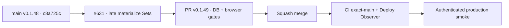

# BRVTAL — Último deploy

  
  
  

> **Production incident #631** · snapshot de **solo el deploy actual**: v0.1.48 exact `main` `c8a725c266180087f6e7003cec2ccfa582d59877` tiene CI y Deploy Observer verdes. Smoke #35949810190 acreditó release/health/Home/Admin/dashboard/Events/date y demostró que la navegación real a Sets excede 20 s. **Engineering roles:** SRE / production incident responder, DBA, PHP backend performance engineer, QA automation engineer.

## Progress convention

- ✅ ~~Struck through~~ = completed and verified through the required delivery gates.
- 🚧 Normal text = pending or currently in progress.

## Estado del deploy

| Señal | Estado | Evidencia |
| --- | --- | --- |
| Work line | 🚧 **#631 · optimize paginated Sets read** | `work/issue-631`; reserva `afff06c5-1729-4da5-99aa-c11144b9714a` |
| Base exacta | ✅ ~~main v0.1.48~~ | `c8a725c266180087f6e7003cec2ccfa582d59877` |
| Versión | 🚧 **v0.1.49 candidate** | optimización runtime del endpoint Sets |
| CI exact-main base | ✅ ~~success~~ | [#35949759746](https://github.com/pl0n3r/brvtal/actions/runs/35949759746) |
| Deploy Observer base | ✅ ~~success~~ | [#35949759721](https://github.com/pl0n3r/brvtal/actions/runs/35949759721) |
| Smoke base | ⛔ **failure / real Sets navigation >20 s** | [#35949810190](https://github.com/pl0n3r/brvtal/actions/runs/35949810190) · `navigate:sets` |
| Entrega candidata | 🚧 late materialization + API latency evidence | ordenar IDs primero; materializar solo la página seleccionada |

## Huella del cambio

<!-- brvtal:git-delta -->

| Archivos | Inserciones | Eliminaciones | Neto |
| ---: | ---: | ---: | ---: |
| **9** | **+230** | **−35** | **+195** |

## Calidad y entrega

<!-- brvtal:gate-plan -->

| Control | Estado / contrato |
| --- | --- |
| Gates esperados | **preflight · coordination · fast[PHP+JS] · database · chromium · real-stack · webkit** |
| PR + snapshot exacto | Issue #631 · reserva `afff06c5-1729-4da5-99aa-c11144b9714a` |
| CodeRabbit / Sonar | 🚧 HEAD estable; máximo 3 rondas automáticas |
| CI del SHA exacto de main | 🚧 después del merge |
| Producción | 🚧 smoke debe medir GET paginado Sets y completar Sets/Hero |

## Flujo de entrega

## Qué se hizo

- Smoke #35949810190 observó v0.1.48 / `c8a725c2…` exactos.
- Health **200**, DB **connected**, Home **200**, DISCADMIN **200**, dashboard **892 ms** sin 5xx, Admin version, Events y Event #6 date pasaron.
- La espera causal confirmó el fallo real: `failureStage=sets-relations` / `failureOperation=navigate:sets` después de **20 s**; no hubo 5xx ni mutaciones bloqueadas.
- La colección Sets usa `ORDER BY sort_order,id` sobre filas anchas con `TEXT`/URLs y no dispone de índice de ese orden.
- v0.1.49 aplica **late materialization**: MariaDB ordena/pagina solo `id` y después carga los registros completos de los IDs seleccionados, preservando el orden canónico.
- La integración MariaDB cubre 130 Sets con descripciones anchas, segunda página, orden estable y búsqueda.
- El smoke medirá `setsApiPage` con HTTP, latencia, cantidad de filas, total y page size antes de ejercer la navegación real.
- Sin SQL destructivo, migraciones ni mutaciones de contenido productivo.

## Archivos modificados en este deploy

- `README.md` — snapshot exacto del incidente.
- `api/admin-read-plan.php` — late materialization de Sets.
- `api/index.php` — usa el plan optimizado en páginas de Sets.
- `config/version.php` — candidato v0.1.49.
- `package.json` — versión e integración DB.
- `tests/admin-performance-contract.php` — contrato de performance.
- `tests/admin-read-plan-contract.php` — contrato del plan de lectura.
- `tests/e2e/production-authenticated-smoke.mjs` — evidencia de latencia del GET Sets.
- `tests/integration/admin-sets-pagination.php` — regresión MariaDB de filas anchas.

## Validación

- ✅ ~~Base v0.1.48: CI #35949759746 y Deploy Observer #35949759721 verdes.~~
- ✅ ~~Smoke #35949810190 acreditó todo hasta Events/date y aisló Sets como único bloqueo.~~
- 🚧 PR CI/revisión, merge y smoke final pendientes; **no declarar PRODUCTION GREEN** antes.

## Qué sigue

| Lane | Trabajo |
| --- | --- |
| **NOW** | 🚧 [#631](https://github.com/pl0n3r/brvtal/issues/631): validar v0.1.49, mergear y repetir smoke real. |
| **NEXT** | 🚧 [#533](https://github.com/pl0n3r/brvtal/issues/533): publicar `🟢 PRODUCTION GREEN` con las cinco evidencias. |
| **LATER** | 🚧 detener BRVTAL después de GREEN mientras Tanda 1 global siga abierta. |
| **BLOCKED / EXTERNAL** | 🚧 Condor/GrindFlow sin GREEN y factory `v1.0.0` ausente; no iniciar Tanda 2. |

## Panorama general pendiente

- 🚧 **NOW**: cerrar #631 con smoke completo.
- 🚧 **NEXT**: verificar incidentes/`[AUTO]` y registrar GREEN en #533.
- 🚧 **LATER**: esperar la barrera global.
- 🚧 **BLOCKED / EXTERNAL**: no adoptar todavía el kit factory.
