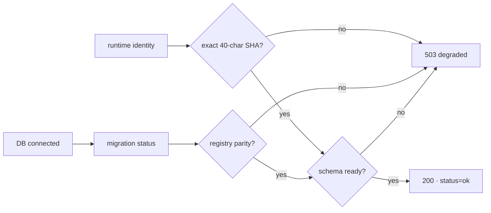

# BRVTAL — Último deploy

  
  
  

> Snapshot de **solo el deploy actual**: #676 adapta `/api/health.php` al contrato exacto de Factory y prueba readiness por identidad + estado real del registro de migraciones. Este PR no ejecuta el cutover ni habilita deploy automático por `push`. Base exacta `main a6cfd5ac357842a1e4797ae548850af25965903d` / v0.1.54 GREEN.

## Progress convention

- ✅ ~~Struck through~~ = completed and verified through the required delivery gates.
- 🚧 Normal text = pending or currently in progress.

## Estado del deploy

| Señal | Estado | Evidencia |
| --- | --- | --- |
| Work line | 🚧 **#676 · Factory-compatible exact health** | `work/issue-676`; reserva `3bae3966-aadd-492b-8f1f-29e7a1c7d995` |
| Base exacta | ✅ ~~main v0.1.54 GREEN~~ | `a6cfd5ac357842a1e4797ae548850af25965903d` |
| Versión producto | 🚧 **v0.1.55 deploy-bound** | patch 0.1.54 → 0.1.55 |
| Identidad | 🚧 **SHA exacto obligatorio** | runtime no exacto → 503; nunca inventa `release_sha` |
| Schema | 🚧 **registro real, read-only** | registry + checksums + pendientes + orphans deben estar limpios |
| Factory health | 🚧 **200 solo cuando ready** | `status=ok`, `version`, `release_sha`, `schema_up_to_date=true` |
| Producción | ✅ ~~sin cutover/caller en este PR~~ | Hostinger Git sigue siendo autoridad durante este slice |

## Huella del cambio

<!-- brvtal:git-delta -->

| Archivos | Inserciones | Eliminaciones | Neto |
| ---: | ---: | ---: | ---: |
| **7** | **+258** | **−68** | **+190** |

## Calidad y entrega

<!-- brvtal:gate-plan -->

| Control | Estado / contrato |
| --- | --- |
| Gates esperados | **preflight · coordination · fast[PHP+JS] · database · chromium · real-stack · webkit** |
| PR + snapshot exacto | Issue #676 · reserva `3bae3966-aadd-492b-8f1f-29e7a1c7d995` |
| Roles | Infrastructure · SRE · Security · QA |
| Health final | exact SHA + schema parity; cualquier deriva → HTTP 503 |
| Compatibilidad | conserva `ok`, `app`, `database`, `deployment`, `time`, `latency_ms`; añade `readiness_status` |
| Escrituras | ninguna: health solo consulta DB/registro de migraciones |
| Review | BRVTAL CI + Factory gates + Privacy + Sonar/CodeQL/CodeRabbit sobre HEAD estable |
| CI del SHA exacto de main | 🚧 después del merge |

## Flujo de entrega

## Qué se hizo

- Añade `config/deploy_readiness.php` con un modelo puro/fail-closed para readiness Factory y resumen acotado del registro de migraciones.
- `/api/health.php` exige identidad exacta y reutiliza `brvtalMigrationVerifyPlanStatus(..., "__NONE__")` como única definición de schema listo.
- El endpoint devuelve 200 únicamente con `status=ok`, versión canónica, SHA exacto y `schema_up_to_date=true`; cualquier drift o identidad no exacta devuelve 503.
- Se preservan los diagnósticos operativos existentes y se añade `readiness_status=ready|degraded` para el descriptor humano.
- El health permanece estrictamente read-only: no activa gates de escritura, no aplica migraciones y no hace baseline/repair.
- El contrato prueba identidad exacta/no exacta, registry ausente, pending, checksum mismatch, orphan records y resumen de schema.
- No ejecuta el cutover Hostinger ni añade todavía el caller permanente `factory/deploy.yml@v1`.

## Archivos modificados en este deploy

- `api/health.php` — contrato Factory exacto + respuesta fail-closed.
- `config/deploy_readiness.php` — modelo puro de readiness y resumen de schema.
- `config/version.php` — versión de producto 0.1.55.
- `package.json` — versión de producto 0.1.55.
- `tests/deployment-traceability-contract.php` — compatibilidad del diagnóstico de fuente desplegada.
- `tests/factory-health-contract.php` — cobertura determinista de identidad/schema/read-only.
- `README.md` — snapshot exacto del deploy.

## Validación

- 🚧 `factory-health-contract.php` debe pasar dentro del gate `fast` junto al suite PHP 8.5 completo.
- 🚧 Database/real-stack siguen obligatorios porque el health consulta el estado canónico de migraciones; `recovery` no aplica a este diff según la matriz de CI.
- 🚧 Factory CI/Policy/Privacy, Sonar y CodeQL deben pasar sobre el HEAD estable.
- 🚧 CodeRabbit continúa advisory según AGENTS.md; solo hallazgos accionables bloquean.
- ✅ ~~Producción no cambia de autoridad~~: Hostinger Git continúa hasta el cutover manual posterior.

## Qué sigue

| Lane | Trabajo |
| --- | --- |
| **NOW** | 🚧 [#676](https://github.com/pl0n3r/brvtal/issues/676): cerrar health exacto Factory y revalidar producción. |
| **NEXT** | 🚧 [#630](https://github.com/pl0n3r/brvtal/issues/630): ejecutar cutover manual controlado; después añadir caller Factory por `push`. |
| **LATER** | 🚧 [#533](https://github.com/pl0n3r/brvtal/issues/533): reanudar roadmap tras cerrar TANDA 2. |
| **BLOCKED / EXTERNAL** | 🚧 [#627](https://github.com/pl0n3r/brvtal/issues/627): labels espera paridad central de Factory. |

## Panorama general pendiente

- 🚧 **NOW**: integrar #676 con exact-main + producción GREEN.
- 🚧 **NEXT**: ejecutar cutover manual desde exact main; Hostinger Git queda disabled y Factory dispatcher activo.
- 🚧 **THEN**: integrar el caller permanente `factory/deploy.yml@v1` con rollback/health e2e.
- 🚧 **BLOCKED / EXTERNAL**: #627 sigue fuera hasta paridad completa del kit.
