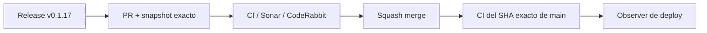

# BRVTAL — Último deploy

  
  
  

> **Development dashboard** · snapshot profesional de **solo el deploy actual**.

## Progress convention

- ✅ ~~Struck through~~ = completed and verified through the required delivery gates.
- 🚧 Normal text = pending or currently in progress.

## Estado del deploy

| Señal | Estado | Evidencia |
| --- | --- | --- |
| Work line | 🚧 **#564 CI throughput telemetry (v0.1.17), PR #566** | observador post-CI sin añadir dependencias al DAG principal |
| Base exacta | ✅ **VALIDATED IN CODE** | `main` `2a57147e3c7b0ba9b1176e0293d501144a510b8f` |
| Version | 🚧 **0.1.16 → 0.1.17** | patch deploy |
| Producción | 🚧 **PENDING MERGE / OBSERVATION** | no se infiere validación de producción desde CI |

## Huella del cambio

<!-- brvtal:git-delta -->

| Archivos | Inserciones | Eliminaciones | Neto |
| ---: | ---: | ---: | ---: |
| **6** | **+123** | **−24** | **+99** |

## Calidad y entrega

<!-- brvtal:gate-plan -->

| Control | Estado / contrato |
| --- | --- |
| Throughput observer | `workflow_run` post-completion; no serializa ni extiende BRVTAL CI |
| Job pagination | todas las páginas se aplanan antes de calcular jobs y critical path |
| Gates | **preflight · fast[PHP+JS] · database · chromium · real-stack · webkit · recovery** |
| Sonar + CodeRabbit | paralelo sobre head estable |
| Exact-main | CI del SHA exacto de main tras squash merge |

## Flujo de entrega

## Qué se hizo

- Se añade `CI Throughput Telemetry` como observador aislado después de BRVTAL CI, sin añadir latencia al DAG de validación.
- La telemetría persiste wall time, duración por job y critical path, incluyendo todas las páginas devueltas por GitHub Actions.
- `actions/upload-artifact` queda fijado al commit revisado de v4.6.2; el fan-out paralelo de los gates permanece intacto.
- La regresión Content Health ahora muta y acciona el botón atómicamente para probar el fallback real sin competir con el rerender del dashboard.
- Versión **0.1.17**.

## Archivos modificados en este deploy

- `.github/workflows/ci-throughput-telemetry.yml`
- `.github/workflows/update-release-metadata.yml`
- `README.md`
- `config/version.php`
- `package.json`
- `tests/e2e/discadmin-content-health-navigation.spec.mjs`

## Validación

- En el head anterior, preflight, MariaDB, Chromium, real-stack, WebKit y recovery pasaron; `fast` falló únicamente por el snapshot README desactualizado.
- Los findings válidos de CodeRabbit sobre paginación multi-page y pinning del action quedan corregidos en este cierre.
- BRVTAL CI, Sonar y CodeRabbit deben cerrar sobre el head estable antes del merge.
- No se declara producción validada desde CI.

## Qué sigue

| Lane | Trabajo |
| --- | --- |
| **NOW** | 🚧 [#564](https://github.com/pl0n3r/brvtal/issues/564) · medir y reducir el critical path del pipeline. |
| **NEXT** | 🚧 [#174](https://github.com/pl0n3r/brvtal/issues/174) · proteger cambios sin guardar en Banners. |
| **LATER** | 🚧 [#519](https://github.com/pl0n3r/brvtal/issues/519), [#518](https://github.com/pl0n3r/brvtal/issues/518), [#257](https://github.com/pl0n3r/brvtal/issues/257) · productividad editorial y protección general de editores. |
| **BLOCKED / EXTERNAL** | 🚧 [#534](https://github.com/pl0n3r/brvtal/issues/534) · verificación de Hostinger/hPanel separada. |

## Panorama general pendiente

| Lane | Frente | Issues |
| --- | --- | --- |
| **DONE** | ✅ ~~Editor/modal navigation lifecycle~~ | ✅ ~~[#216](https://github.com/pl0n3r/brvtal/issues/216) · v0.1.15 / PR #562~~ |
| **NOW** | 🚧 CI throughput telemetry | 🚧 [#564](https://github.com/pl0n3r/brvtal/issues/564) |
| **NEXT** | 🚧 Unsaved Banners protection | 🚧 [#174](https://github.com/pl0n3r/brvtal/issues/174) |
| **LATER** | 🚧 Editorial productivity | 🚧 [#519](https://github.com/pl0n3r/brvtal/issues/519), [#518](https://github.com/pl0n3r/brvtal/issues/518), [#257](https://github.com/pl0n3r/brvtal/issues/257) |
| **BLOCKED / EXTERNAL** | 🚧 Hostinger deploy observation | 🚧 [#534](https://github.com/pl0n3r/brvtal/issues/534) |
