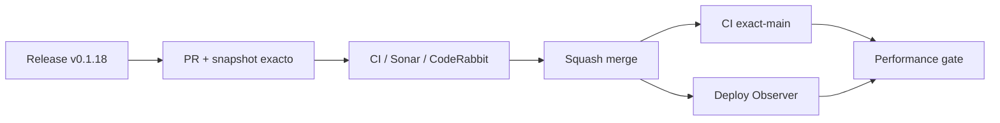

# BRVTAL — Último deploy

  
  
  

> **Development dashboard** · snapshot profesional de **solo el deploy actual**.

## Progress convention

- ✅ ~~Struck through~~ = completed and verified through the required delivery gates.
- 🚧 Normal text = pending or currently in progress.

## Estado del deploy

| Señal | Estado | Evidencia |
| --- | --- | --- |
| Work line | 🚧 **#564 unified deploy/performance signal (v0.1.18), PR #567** | performance solo mide con CI + observer verdes sobre el mismo SHA |
| Base exacta | ✅ **VALIDATED IN CODE** | `main` `e29970ca9d03d5028df35604df423b06328d6e02` |
| Version | 🚧 **0.1.17 → 0.1.18** | patch deploy |
| Producción | 🚧 **PENDING MERGE / OBSERVATION** | no se infiere validación de producción desde CI |

## Huella del cambio

<!-- brvtal:git-delta -->

| Archivos | Inserciones | Eliminaciones | Neto |
| ---: | ---: | ---: | ---: |
| **9** | **+298** | **−102** | **+196** |

## Calidad y entrega

<!-- brvtal:gate-plan -->

| Control | Estado / contrato |
| --- | --- |
| Gates | **preflight · fast[PHP+JS] · database · chromium · real-stack · webkit** |
| Performance prerequisite | mismo SHA con **BRVTAL CI + Production Deploy Observer** en success |
| Deploy truth | único observer canónico; Performance ya no hace polling corto `?v=<sha>` |
| Sonar + CodeRabbit | paralelo sobre head estable |
| Exact-main | CI del SHA exacto de main tras squash merge |

## Flujo de entrega

## Qué se hizo

- Production Performance escucha BRVTAL CI y Production Deploy Observer, pero solo mide cuando ambos están verdes para el mismo SHA de `main`.
- Un helper determinista asigna un único owner automático por SHA al prerequisite que terminó más tarde; el `run_id` desempata timestamps iguales, evitando mediciones/artefactos duplicados.
- Se elimina el detector privado de ocho intentos sobre `?v=<sha>`, evitando falsos rojos cuando Hostinger tarda más que esa ventana.
- Los contratos y la guía de testing fijan la separación entre **MAIN VALIDATED**, **DEPLOY OBSERVED** y **PRODUCTION PERFORMANCE MEASURED**.
- Versión **0.1.18**.

## Archivos modificados en este deploy

- `.github/workflows/production-performance.yml` — coordina CI + Deploy Observer por SHA, asigna ownership único y elimina el segundo polling de Hostinger.
- `AGENTS.md` — conserva el nuevo contrato operativo y actualiza prioridades ya completadas.
- `README.md` — snapshot visual del deploy actual.
- `config/version.php` — declara la release runtime `0.1.18`.
- `docs/TESTING.md` — documenta la compuerta automática de dos señales y sus semánticas.
- `package.json` — alinea la versión del proyecto con `0.1.18`.
- `scripts/production-performance-prerequisite.py` — decide de forma testeable el único owner automático por SHA.
- `tests/ci-scope-contract.php` — prueba missing/pending/failed/same-SHA/different-SHA y ownership único, además de impedir el detector corto de deploy.
- `tests/project-operations-contract.php` — protege la coordinación same-SHA entre CI, observer y performance.

## Validación

- La reproducción real en `e29970c` confirmó el defecto: BRVTAL CI terminó verde mientras Production Performance falló antes de que el Deploy Observer terminara.
- La telemetría real identificó el critical path actual en browser: WebKit 84s, real-stack 80s y Chromium 79s; no se añadirá sharding sin medir setup vs test.
- El primer review de CodeRabbit detectó dos findings válidos — ownership duplicable y cobertura demasiado textual — corregidos con helper determinista + fixtures locales.
- BRVTAL CI, Sonar y CodeRabbit deben volver a cerrar sobre el head estable antes del merge.
- No se declara producción validada desde CI ni desde el marcador de despliegue.

## Qué sigue

| Lane | Trabajo |
| --- | --- |
| **NOW** | 🚧 [#564](https://github.com/pl0n3r/brvtal/issues/564) · medir setup vs test en WebKit / real-stack / Chromium antes de optimizar runners o shards. |
| **NEXT** | 🚧 [#174](https://github.com/pl0n3r/brvtal/issues/174) · proteger cambios sin guardar en Banners. |
| **LATER** | 🚧 [#519](https://github.com/pl0n3r/brvtal/issues/519), [#518](https://github.com/pl0n3r/brvtal/issues/518), [#257](https://github.com/pl0n3r/brvtal/issues/257) · productividad editorial y protección general de editores. |
| **BLOCKED / EXTERNAL** | 🚧 [#534](https://github.com/pl0n3r/brvtal/issues/534) · hPanel solo si el observer canónico sigue sin ver la release. |

## Panorama general pendiente

| Lane | Frente | Issues |
| --- | --- | --- |
| **NOW** | 🚧 CI throughput phase B | 🚧 [#564](https://github.com/pl0n3r/brvtal/issues/564) |
| **NEXT** | 🚧 Unsaved Banners protection | 🚧 [#174](https://github.com/pl0n3r/brvtal/issues/174) |
| **LATER** | 🚧 Editorial productivity | 🚧 [#519](https://github.com/pl0n3r/brvtal/issues/519), [#518](https://github.com/pl0n3r/brvtal/issues/518), [#257](https://github.com/pl0n3r/brvtal/issues/257) |
| **BLOCKED / EXTERNAL** | 🚧 Hostinger configuration | 🚧 [#534](https://github.com/pl0n3r/brvtal/issues/534) |
