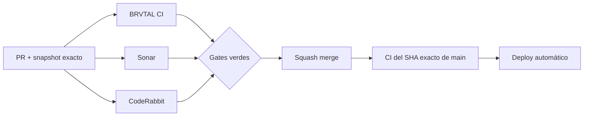

  

# BRVTAL — Último deploy

  <strong>Archive × Memories · explicit cultural continuity</strong>

  

> Este README representa **solo el deploy actual**. Se reemplaza en el siguiente deploy y no funciona como changelog acumulativo.

## Estado del deploy

| Señal | Estado | Evidencia |
| --- | --- | --- |
| Base exacta | ✅ **VALIDATED IN CODE** | `main` `7199a067df54f6e05a8bfed4a0e6a3cd341c81be` · BRVTAL CI #1081 |
| Alcance | 🗃️ **#503** | Archive reconoce Event↔Memory explícitos |
| Real stack | 🧪 **E2E admin** | Event histórico + Memory + relación + Archive + cleanup |
| Datos | 🔗 **Sin inferencia** | solo `memories[].relations` sanitizadas por `api/public.php` |
| Producción | ⚪ **No validada por este PR** | CI verde no equivale a validación de producción |

## Flujo de entrega

## Qué se hizo

- #503 continúa #398 después de #501: Archive reconoce las Memories curadas que tienen una relación Event explícita.
- No se añade endpoint, consulta pública adicional, tabla ni inferencia; el módulo reutiliza el mismo `window.BRVTALPublicDataPromise`.
- Archive agrupa `data.memories[].relations` por Event y muestra `MEMORY / MEMORIES` junto a Artists/Sets.
- Un Event histórico con **solo Memories** ahora sí expone `EXPLORE CONNECTIONS`.
- Se añade filtro `WITH MEMORIES` dentro del mismo sistema de filtros por año/relación/búsqueda.
- Relaciones Memory→Artist/Set/Release no cuentan como Event Memory y no alteran Archive.
- El comportamiento móvil conserva touch targets ≥44 px y evita overflow horizontal.
- El real-stack usa el usuario E2E aislado para crear un Event histórico y una Memory descartables, relacionarlos desde DISCADMIN y verificar Archive de punta a punta.

## Archivos modificados en este deploy

- `README.md` — snapshot exacto de #503.
- `index.html` — añade el filtro público `WITH MEMORIES`.
- `js/archive.js` — deriva y renderiza conexiones Event↔Memory explícitas.
- `tests/e2e/memory-relations-real-stack.spec.mjs` — valida Archive con usuario E2E real-stack.
- `tests/e2e/public-archive.spec.mjs` — cubre Memory como única relación, filtro, CONNECTED y mobile.
- `tests/public-archive-contract.php` — protege reutilización del payload y relación explícita-only.

## Validación

- Base exacta `7199a067df54f6e05a8bfed4a0e6a3cd341c81be` pasó BRVTAL CI #1081 completo.
- El PR debe pasar BRVTAL CI, Sonar y CodeRabbit sobre su SHA exacto.
- El job `real-stack` debe ejecutar el flujo autenticado con el usuario E2E/CI y limpiar todos los fixtures.
- Tras squash merge se verificará BRVTAL CI sobre el SHA exacto resultante de `main`.
- No hay migración de producción en este alcance.
- Ningún resultado de CI implica por sí solo **VALIDATED IN PRODUCTION**.

## Qué sigue

1. Corregir cualquier finding válido de CI/Sonar/CodeRabbit.
2. Squash merge y exact-main CI.
3. Continuar #398 únicamente donde exista profundidad real respaldada por relaciones estructuradas.
4. Continuar #451 con el siguiente slice de calidad de mayor riesgo sin mezclarlo con producto.

## Panorama general pendiente

| Frente | Estado / siguiente foco |
| --- | --- |
| 🗃️ **Archivo cultural** | #398 · #503 conecta Archive con Memories explícitas |
| 🧪 **Sonar / calidad** | #451 · #500/#502 completados; Theme runtime sigue pendiente |
| 🎛️ **Apariencia** | #149 — completar Light en módulos modernos |
| 🖼️ **Hero Slider** | #221 integridad editorial · #480 regresión visual desktop |
| 🔐 **Seguridad editorial** | #257, #216, #174, #193 |
| 🔎 **SEO / entrega pública** | #182, #214, #204, #272 → #390 · #479 alt · #481 IndexNow |
| 📈 **Analytics** | #427 — completar eventos `brvtal_*` dentro de GTM/GA4 |
| ✍️ **Content / edición** | #224, #252 |
| 🧾 **Activity / operaciones** | #232, #195 |
| 📚 **Bulk Actions** | #275 — registros >500 sin falsa exhaustividad |
| 🧭 **DISCADMIN / Theme** | #348, #351 |
| 🌐 **Idioma** | #212 — español canónico + inglés automático por fases |
| 💾 **Backups** | #389 — scheduling seguro + Drive opcional |

---

BRVTAL · Rave till Grave · snapshot operativo, no historial acumulativo

