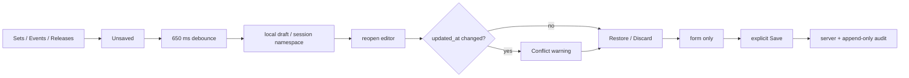

# BRVTAL — Último deploy

> Snapshot de **solo el deploy actual** para #711: recovery local de drafts en Sets, Events y Releases sobre el motor compartido ya validado en Pages/Artists. No declara producción GREEN.

## Progress convention
- ✅ ~~Struck through~~ = completed and verified through required gates.
- 🚧 Normal text = pending/in progress.
- 🚧 = active production blocker.

## Estado del deploy
| Señal | Estado | Evidencia |
| --- | --- | --- |
| Work line | 🚧 **#711 · Events / Sets / Releases** | `work/issue-711` · reserva `6a8c4049-33d6-45e6-8d57-9882920239d9` |
| Base | ✅ **main** | `643d5acd1e418f5ca78b55a237bd9f990efdf434` |
| Versión | 🚧 **v0.1.69** | `config/version.php` + `package.json` |
| PR | 🚧 **delivery de #711** | exact-head gates obligatorios antes de merge |
| Producción | 🚧 **NO GREEN · #681** | migration registry parity sigue bloqueado externamente |
| Continuidad | ✅ **separada** | #713 Hero Slider · #714 Theme Studio · #715 SEO E2E flake |

## Huella del cambio
<!-- brvtal:git-delta -->
| Archivos | Inserciones | Eliminaciones | Neto |
| ---: | ---: | ---: | ---: |
| **11** | **+1051** | **−114** | **+937** |

## Calidad y entrega
<!-- brvtal:gate-plan -->
| Control | Estado / contrato |
| --- | --- |
| Gates | 🚧 **preflight · coordination · fast[PHP+JS] · database · chromium · real-stack · webkit** |
| Factory | 🚧 Policy · Privacy · Labels |
| Snapshot | 🚧 PR + snapshot exacto |
| Main | 🚧 CI del SHA exacto de main tras merge |
| Review | 🚧 Sonar + CodeRabbit |
| Seguridad | localStorage same-origin por sesión; sin endpoint, proveedor, permiso ni migración nuevos |
| Producción | #681 permanece fuera de alcance; no se declara GREEN |

## Flujo de entrega

## Qué se hizo
- **Sets** reutiliza el adaptador legacy sin tocar su Save genérico; relaciones Artist/Event quedan dentro del recovery.
- **Events** integra recovery con el workflow atómico existente y vincula el draft solo después de cargar ticket types + roster.
- **Events** conserva tickets/roster y usa la revisión server-side real; un fallo al refrescar el listado después de guardar no convierte el Save exitoso en un falso error.
- **Releases** integra su modal/Save propio; artwork se compara normalizado, `featured` usa `0/1` como el payload y un create adopta el ID real de la API.
- Un Release con ediciones posteriores al Save mantiene el modal abierto y actualiza el store local sin un refresh de red que pueda pisar el estado.
- Los Save races migran recovery de `new` al ID server-side y no crean una segunda historia.
- Autosave local no hace POST/PUT ni publica. Version History/auditoría server-side siguen siendo autoridad.
- Fallos de Save conservan recovery cuando storage está disponible; expiración de sesión elimina drafts.
- Hero Slider y Theme Studio permanecen separados en #713/#714.
- Sin SQL, migración, Hostinger write ni cambios de readiness.

## Archivos modificados en este deploy
- `README.md`
- `config/version.php`
- `discadmin/content-core.js`
- `discadmin/event-workflow.js`
- `discadmin/legacy-editor-drafts.js`
- `discadmin/releases.js`
- `package.json`
- `tests/e2e/discadmin-event-drafts.spec.mjs`
- `tests/e2e/discadmin-release-drafts.spec.mjs`
- `tests/e2e/discadmin-set-drafts.spec.mjs`
- `tests/legacy-editor-drafts-contract.php`

## Validación
- Tests añadidos: Sets cubre autosave, Restore, conflicto, Save limpio/race/fallo y session boundary.
- Tests añadidos: Events cubre Event + ticket + roster, conflicto, revisión post-Save, fallo y session boundary.
- Tests añadidos: Releases cubre metadata/artists, conflicto, Save limpio/race, `new → server ID`, fallo y session boundary.
- Contract: el adapter no realiza network mutations y los Save lifecycles entregan success/failure al motor compartido.
- No cambia `datos.yml`: sin nuevo dato personal, proveedor ni transferencia.
- 🚧 La evidencia de CI/Sonar/CodeRabbit se registra solo después de ejecutar los gates del HEAD exacto.

## Qué sigue
| Lane | Trabajo |
| --- | --- |
| **NOW** | 🚧 [#711](https://github.com/pl0n3r/brvtal/issues/711): cerrar exact-head gates y merge. |
| **NEXT** | 🚧 [#713](https://github.com/pl0n3r/brvtal/issues/713) / [#714](https://github.com/pl0n3r/brvtal/issues/714): recovery con state models propios. |
| **CI DEBT** | 🚧 [#715](https://github.com/pl0n3r/brvtal/issues/715): SEO failed-save E2E; el rerun exact-main previo pasó. |
| **LATER** | 🚧 [#533](https://github.com/pl0n3r/brvtal/issues/533): roadmap canónico. |
| **BLOCKED / EXTERNAL** | 🚧 [#681](https://github.com/pl0n3r/brvtal/issues/681): migration registry parity / producción NO GREEN. |
| **BLOCKED BY #681** | 🚧 #530: Recycle Bin requiere metadata durable/migración segura. |

## Panorama general pendiente
- 🚧 **NOW**: #711 / v0.1.69.
- 🚧 **NEXT**: #713 y #714 según prioridad real después de exact-main.
- 🚧 **CI DEBT**: #715, separado del rollout de drafts.
- 🚧 **BLOCKED / EXTERNAL**: #681 permanece fail-closed; no se ejecuta reconcile sin backup/autoridad verificable.
