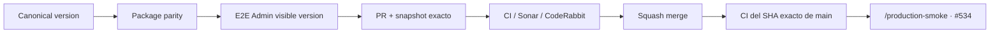

# BRVTAL — Último deploy

  
  
  

> **Development dashboard** · snapshot profesional de **solo el deploy actual**.

## Progress convention

- ✅ ~~Struck through~~ = completed and verified through the required delivery gates.
- 🚧 Normal text = pending or currently in progress.

## Estado del deploy

| Señal | Estado | Evidencia |
| --- | --- | --- |
| Work line | 🚧 **#534 ADMIN RELEASE IDENTITY** | versión visible + smoke E2E |
| Base exacta | ✅ **VALIDATED IN CODE** | `main` `2b5a0d4d7539ef744a4bebd88afab89c00d9fcf3` |
| Version | 🚧 **0.1.11 → 0.1.12** | patch deploy |
| Producción | ⛔ **BLOCKED / EXTERNAL** | usuario reporta 0.1.0; se verificará con smoke autenticado |

## Huella del cambio

<!-- brvtal:git-delta -->

| Archivos | Inserciones | Eliminaciones | Neto |
| ---: | ---: | ---: | ---: |
| **8** | **+122** | **−59** | **+63** |

## Calidad y entrega

<!-- brvtal:gate-plan -->

| Control | Estado / contrato |
| --- | --- |
| Gates seleccionados | **preflight · fast[PHP+JS] · database · chromium · real-stack · webkit** |
| Release identity | `BRVTAL_APP_VERSION` = `package.json.version` |
| E2E real-stack | usuario E2E valida versión visible, navegación y reload |
| Producción | smoke read-only registra versión esperada/renderizada |
| Sonar + CodeRabbit | paralelo sobre head estable |
| Exact-main | CI del SHA exacto de main tras squash merge |

## Flujo de entrega

## Qué se hizo

- Alinea `package.json` con la release canónica y añade contrato para impedir otra deriva a 0.1.0.
- El usuario E2E real-stack verifica `data-testid="admin-product-version"` en carga, navegación y reload.
- El smoke autenticado de producción registra la versión visible antes de fallar por un marker exacto ausente.
- #534 acepta el comando owner-only `/production-smoke` para ejecutar ese smoke read-only.
- Versión **0.1.12**.

## Archivos modificados en este deploy

- `.github/workflows/production-authenticated-smoke.yml` — trigger owner-only desde #534.
- `AGENTS.md` — regla durable de release identity.
- `README.md` — snapshot de esta verificación.
- `config/version.php` — versión 0.1.12.
- `package.json` — metadata 0.1.12.
- `tests/deployment-traceability-contract.php` — paridad de versión.
- `tests/e2e/discadmin-premium-real-stack.spec.mjs` — versión visible con usuario E2E.
- `tests/e2e/production-authenticated-smoke.mjs` — evidencia de versión en producción.

## Validación

- El contrato fast falla si package y release canónica divergen.
- Real-stack debe autenticar el admin E2E y leer `BRVTAL v0.1.12`.
- Producción queda separada: el smoke reporta exactamente qué versión sirve Hostinger y no convierte CI en VALIDATED IN PRODUCTION.
- Sin migración ni SQL destructivo.

## Qué sigue

| Lane | Trabajo |
| --- | --- |
| **NOW** | 🚧 [#534](https://github.com/pl0n3r/brvtal/issues/534) · ejecutar smoke autenticado y comparar versión visible con main. |
| **NEXT** | 🚧 [#193](https://github.com/pl0n3r/brvtal/issues/193), [#216](https://github.com/pl0n3r/brvtal/issues/216) · cerrar Phase 2. |
| **LATER** | 🚧 [#519](https://github.com/pl0n3r/brvtal/issues/519), [#518](https://github.com/pl0n3r/brvtal/issues/518) · productividad editorial. |
| **BLOCKED / EXTERNAL** | 🚧 [#534](https://github.com/pl0n3r/brvtal/issues/534) · Hostinger Git/deploy marker. |

## Panorama general pendiente

| Lane | Frente | Issues |
| --- | --- | --- |
| **DONE** | ✅ ~~Phase 1 + Admin IA/Appearance/Settings/Security + Banners + Hero desktop~~ | ✅ ~~[#514](https://github.com/pl0n3r/brvtal/issues/514), [#516](https://github.com/pl0n3r/brvtal/issues/516), [#523](https://github.com/pl0n3r/brvtal/issues/523), [#480](https://github.com/pl0n3r/brvtal/issues/480)~~ |
| **NOW** | 🚧 Release/deploy observability | 🚧 [#534](https://github.com/pl0n3r/brvtal/issues/534) |
| **NEXT** | 🚧 Phase 2 closeout | 🚧 [#193](https://github.com/pl0n3r/brvtal/issues/193), [#216](https://github.com/pl0n3r/brvtal/issues/216) |
| **LATER** | 🚧 Editorial productivity | 🚧 [#519](https://github.com/pl0n3r/brvtal/issues/519), [#518](https://github.com/pl0n3r/brvtal/issues/518), [#257](https://github.com/pl0n3r/brvtal/issues/257) |
| **BLOCKED / EXTERNAL** | 🚧 Hostinger deploy | 🚧 [#534](https://github.com/pl0n3r/brvtal/issues/534) |
