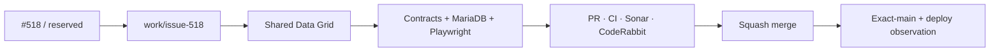

# BRVTAL — Último deploy

  
  
  

> **Development dashboard** · snapshot profesional de **solo el deploy actual**.

## Progress convention

- ✅ ~~Struck through~~ = completed and verified through the required delivery gates.
- 🚧 Normal text = pending or currently in progress.

## Estado del deploy

| Señal | Estado | Evidencia |
| --- | --- | --- |
| Work line | 🚧 **#518 canonical Admin data grid (v0.1.23)** | sorting · Columns/View · multi-select · shared table model |
| Base exacta | ✅ **VALIDATED IN CODE** | `main` `e05cc9113f89d247dcb892186180ab497d31b060` · BRVTAL CI #1375 success |
| Version | 🚧 **0.1.22 → 0.1.23** | editorial productivity release |
| Producción base | ✅ **DEPLOYED release observed** | v0.1.22 visible through Production Deploy Observer after 9 s; not behavioral validation |

## Huella del cambio

<!-- brvtal:git-delta -->

| Archivos | Inserciones | Eliminaciones | Neto |
| ---: | ---: | ---: | ---: |
| **20** | **+1195** | **−99** | **+1096** |

## Calidad y entrega

<!-- brvtal:gate-plan -->

| Control | Estado / contrato |
| --- | --- |
| Gates | **preflight · coordination · fast[PHP+JS] · database · chromium · real-stack · webkit** |
| Reservation | Issue #518 · `work/issue-518` · atomic reservation |
| PR integrity | **PR + snapshot exacto** · Issue/branch/reservation fail closed |
| Grid contract | seven modules · tri-state sort · per-admin columns · shared selection |
| Bulk safety | existing transactional Bulk Actions · CSRF · audit · no bulk delete |
| Sonar + CodeRabbit | parallel on stable intended head |
| Exact-main | **CI del SHA exacto de main** after squash merge |

## Flujo de entrega

## Qué se hizo

- Se crea un único motor `admin-data-grid` para Events, Artists, Releases, Sets, Media, Pages y Blog.
- Sort de columnas usa ciclo ascendente → descendente → orden por defecto, con desempate determinista por ID.
- Columns / View permite ocultar/restaurar columnas y persiste preferencias privadas por administrador + módulo sin nueva migración.
- Las preferencias `admin.grid.*` quedan protegidas frente al editor genérico de Settings.
- Multi-select, Select All y Clear viven en el grid; módulos compatibles entregan la selección al Bulk Actions transaccional existente.
- Releases Catalog y Blog dejan el patrón bespoke en el shell real y renderizan con la misma tabla canónica.
- Media conserva uploader/inspector, pero su listado administrativo usa el grid común.
- Artists, Sets, Releases y Blog conservan drag/drop; el reorder se bloquea cuando hay filtro o sort explícito.
- Se añaden contratos, persistencia MariaDB y Playwright para sort, columnas, aislamiento, selección, bulk handoff y móvil.
- Versión **0.1.23**.

## Archivos modificados en este deploy

- `README.md` — snapshot exacto de v0.1.23.
- `api/admin-grid-preferences.php` — endpoint privado de preferencias por administrador/módulo.
- `api/index.php` — oculta/protege preferencias privadas del Settings genérico.
- `config/admin_grid.php` — allowlist y normalización canónica de columnas/preferencias.
- `config/version.php` — release runtime v0.1.23.
- `discadmin/admin-data-grid.css` — layout compartido, focus y comportamiento móvil.
- `discadmin/admin-data-grid.js` — sorting, chooser, selección, acciones y render compartido.
- `discadmin/blog.js` — Blog usa el grid canónico en el shell.
- `discadmin/bulk-actions.js` — acepta selección inicial desde el grid.
- `discadmin/content-ordering.js` — ayuda UX coherente con filtro/sort.
- `discadmin/index-core.php` — Events/Artists/Sets/Pages migran al grid compartido.
- `discadmin/index.php` — carga assets canónicos del grid.
- `discadmin/media-library.js` — listado Media migrado al grid, inspector preservado.
- `discadmin/releases.js` — Catalog migrado al grid compartido.
- `docs/BRVTAL-SPEC.md` — contrato durable del data-grid.
- `package.json` — v0.1.23 + persistencia de preferencias en integración.
- `tests/admin-data-grid-contract.php` — arquitectura, protección y aislamiento.
- `tests/e2e/content-core-real-stack.spec.mjs` — valida que reorder siga siendo canónico a través del grid compartido.
- `tests/e2e/discadmin-data-grid.spec.mjs` — tri-state, columnas, selección, módulos y móvil.
- `tests/integration/admin-grid-preferences.php` — persistencia real aislada por admin/módulo.

## Validación

- Base exacta `e05cc9113f89d247dcb892186180ab497d31b060`: BRVTAL CI / `validate` success.
- v0.1.22 observada en producción tras 9 s; esto confirma identidad de release, no comportamiento.
- La rama incluye contratos PHP, MariaDB integration y Playwright específicos de #518.
- El PR debe cerrar BRVTAL CI, Sonar y CodeRabbit sobre el head estable.
- Exact-main seguirá siendo obligatorio después del squash merge.

## Qué sigue

| Lane | Trabajo |
| --- | --- |
| **NOW** | 🚧 [#518](https://github.com/pl0n3r/brvtal/issues/518) · canonical professional Admin data grid v0.1.23. |
| **NEXT** | 🚧 [#257](https://github.com/pl0n3r/brvtal/issues/257) · protect unsaved editor changes. |
| **LATER** | 🚧 [#525](https://github.com/pl0n3r/brvtal/issues/525), [#524](https://github.com/pl0n3r/brvtal/issues/524), [#528](https://github.com/pl0n3r/brvtal/issues/528), [#529](https://github.com/pl0n3r/brvtal/issues/529) · editorial productivity. |
| **BLOCKED / EXTERNAL** | 🚧 [#534](https://github.com/pl0n3r/brvtal/issues/534) remains freshness monitoring; no active Hostinger blocker. |

## Panorama general pendiente

| Lane | Frente | Issues |
| --- | --- | --- |
| **NOW** | 🚧 Admin data grid | 🚧 [#518](https://github.com/pl0n3r/brvtal/issues/518) |
| **NEXT** | 🚧 Unsaved editor protection | 🚧 [#257](https://github.com/pl0n3r/brvtal/issues/257) |
| **LATER** | 🚧 Rich editor / membership / drafts / preview | 🚧 [#525](https://github.com/pl0n3r/brvtal/issues/525), [#524](https://github.com/pl0n3r/brvtal/issues/524), [#528](https://github.com/pl0n3r/brvtal/issues/528), [#529](https://github.com/pl0n3r/brvtal/issues/529) |
| **BLOCKED / EXTERNAL** | 🚧 Hostinger freshness monitoring | 🚧 [#534](https://github.com/pl0n3r/brvtal/issues/534) |
