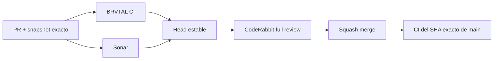

  

# BRVTAL — Último deploy

<strong>Cultural archive · contextual TRANSMISSIONS</strong>

  

> Este README representa **solo el deploy actual**. Se reemplaza en el siguiente deploy y no funciona como changelog acumulativo.

## Estado del deploy

| Señal | Estado | Evidencia |
| --- | --- | --- |
| Base exacta | ✅ **VALIDATED IN CODE** | `main` `50b8a6b7253c000565f23d16e9e5355b660b7806` · exact-main BRVTAL CI verde |
| Alcance | 🔎 **#511 / parent #398** | inverse TRANSMISSIONS on canonical entity pages |
| Relaciones | 🧬 **EXPLICIT ONLY** | `blog_post_relations` |
| Visibilidad | 🔒 **PUBLISHED ONLY** | drafts/private posts excluded |
| Producción | ⚪ **No validada** | CI no equivale a validación de producción |

## Flujo de entrega

## Qué se hizo

- Centraliza la resolución inversa de Blog/TRANSMISSIONS para Event, Artist, Set y Release.
- Solo usa relaciones explícitas `blog_post_relations`; no infiere conexiones.
- Mantiene Event Record y extiende el mismo comportamiento a Artist, Set y Release.
- Las tarjetas navegan a la URL canónica `/blog/{slug}`.
- Los Blog drafts quedan excluidos por el query de publicación.
- TRANSMISSIONS y Memories se ensamblan en un único bloque cultural compartido para evitar divergencias entre entidades.
- La cobertura nueva es behavior-first: mapping/render ejecutable + integración MariaDB.
- Se elimina del Event Record una comprobación frágil que dependía del SQL literal anterior.

## Archivos modificados en este deploy

- `AGENTS.md` — contrato durable de relaciones inversas TRANSMISSIONS.
- `README.md` — snapshot exacto del deploy #511.
- `config/public_page.php` — helper central y entrega contextual a entidades canónicas.
- `package.json` — incorpora la integración MariaDB al suite canónico.
- `tests/contextual-transmissions-contract.php` — contrato ejecutable de mapping/render.
- `tests/event-record-contract.php` — elimina aserciones frágiles sobre SQL literal.
- `tests/integration/contextual-transmissions.php` — publicación/relaciones reales en MariaDB.

## Validación

- Base exacta `50b8a6b7253c000565f23d16e9e5355b660b7806`: exact-main BRVTAL CI verde tras #510.
- PHP 8.5 debe ejecutar el contrato behavior-first.
- MariaDB debe probar Event/Artist/Set/Release, draft exclusion y aislamiento por entity ID.
- Sonar debe mantenerse en cero issues nuevos accionables.
- La revisión CodeRabbit profunda se solicita únicamente sobre el head estable.
- Tras squash merge se verificará BRVTAL CI sobre el SHA exacto de `main`.
- No se declara **VALIDATED IN PRODUCTION** desde CI.

## Qué sigue

1. Cerrar #511 y actualizar el progreso maestro de #398.
2. Implementar #513 — Dashboard DISCADMIN modular, drag/drop, redimensionable y persistido por administrador.
3. Retomar el siguiente slice real de #398 después de #513, sin repetir Event Record/Roster/Sets/Memories/Archive/Transmissions ya integrados.

## Panorama general pendiente

| Frente | Estado / siguiente foco |
| --- | --- |
| 🧩 **Dashboard configurable** | #513 · siguiente prioridad: módulos, drag/drop, resize responsive grid y previews Analytics reales |
| 🗃️ **Archivo cultural** | #398 · implementación incremental activa; pausa después de #511 mientras se ejecuta #513 |
| 🎛️ **Apariencia** | #149 · completar Light en módulos modernos |
| 🖼️ **Hero Slider** | #221 integridad editorial · #480 regresión visual desktop |
| 🔐 **Seguridad editorial** | #257, #216, #174, #193 |
| 📈 **Analytics** | #427 · completar eventos `brvtal_*` en GTM/GA4 |
| ✍️ **Content / edición** | #224, #252 |
| 🧾 **Activity / operaciones** | #232, #195 |
| 📚 **Bulk Actions** | #275 · registros >500 sin falsa exhaustividad |
| 🌐 **Idioma** | #212 · español canónico + inglés automático por fases |
| 💾 **Backups** | #389 · scheduling seguro + Drive opcional |

---

BRVTAL · Rave till Grave · deploy snapshot

