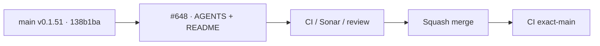

# BRVTAL — Último deploy

  
  
  

> Snapshot de **solo el deploy actual**: PR #648 es documentación de gobernanza sobre `main` v0.1.51 `138b1babac0ff6797ad9e0f3ccb0fbda0f793452`; no cambia runtime, versión ni producción.

## Progress convention

- ✅ ~~Struck through~~ = completed and verified through the required delivery gates.
- 🚧 Normal text = pending or currently in progress.

## Estado del deploy

| Señal | Estado | Evidencia |
| --- | --- | --- |
| Work line | 🚧 **#647 · common Factory protocol pointer** | `work/issue-647`; reserva `1f953c1a-b1d4-4840-87ea-14ef3ad04510` |
| Base exacta | ✅ ~~main v0.1.51~~ | `138b1babac0ff6797ad9e0f3ccb0fbda0f793452` |
| Versión | ✅ ~~v0.1.51 sin bump~~ | docs-only |
| Producción | ✅ ~~sin cambios~~ | no runtime / no SQL / no deploy funcional |

## Huella del cambio

<!-- brvtal:git-delta -->

| Archivos | Inserciones | Eliminaciones | Neto |
| ---: | ---: | ---: | ---: |
| **2** | **+34** | **−46** | **-12** |

## Calidad y entrega

<!-- brvtal:gate-plan -->

| Control | Estado / contrato |
| --- | --- |
| Gates esperados | **preflight · coordination · fast[docs-only]** |
| PR + snapshot exacto | Issue #647 · reserva `1f953c1a-b1d4-4840-87ea-14ef3ad04510` |
| CodeRabbit / Sonar | 🚧 revalidar HEAD estable tras sincronizar README |
| CI del SHA exacto de main | 🚧 después del merge |
| Producción | ✅ ~~no aplica; documentación únicamente~~ |

## Flujo de entrega

## Qué se hizo

- `AGENTS.md` obliga a leer y aplicar el protocolo común de Factory antes de trabajar.
- El protocolo común prevalece si contradice reglas locales.
- Se recuperó la reserva existente de #647 sin recrear rama ni PR.
- Rol profesional: **product**, porque el cambio fija una regla de gobernanza/operación para agentes.
- No hay cambios de producto, runtime, base de datos ni producción.

## Archivos modificados en este deploy

- `AGENTS.md` — referencia obligatoria al protocolo común de Factory.
- `README.md` — snapshot exacto y transitorio de este PR.

## Validación

- ✅ ~~Sonar Quality Gate previo: success, 0 issues/hotspots nuevos.~~
- ✅ ~~CodeRabbit previo: sin comentarios accionables.~~
- 🚧 BRVTAL CI debe revalidar el HEAD con README sincronizado.
- 🚧 Después del merge, verificar `validate` sobre el SHA exacto de `main`.

## Qué sigue

| Lane | Trabajo |
| --- | --- |
| **NOW** | 🚧 [#647](https://github.com/pl0n3r/brvtal/issues/647): cerrar gobernanza común con CI verde. |
| **NEXT** | 🚧 [#654](https://github.com/pl0n3r/brvtal/issues/654): adoptar privacidad como código de Factory con seis documentos. |
| **LATER** | 🚧 [#533](https://github.com/pl0n3r/brvtal/issues/533): mantener Roadmap sincronizado. |
| **BLOCKED / EXTERNAL** | 🚧 Factory TANDA 1 sigue abierta hasta cerrar #54/#13 y publicar `v1.0.0`. |

## Panorama general pendiente

- 🚧 **NOW**: integrar #647 sin cambiar producción.
- 🚧 **NEXT**: continuar la adopción crítica #654 requerida por Factory #54.
- 🚧 **LATER**: mantener BRVTAL production-green durante el cierre de TANDA 1.
- 🚧 **BLOCKED / EXTERNAL**: TANDA 2 sigue prohibida hasta Factory `v1.0.0`.
