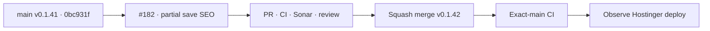

# BRVTAL — Último deploy

  
  
  

> **Development dashboard** · snapshot de **solo el deploy actual** para Issue #182.

## Progress convention

- ✅ ~~Struck through~~ = completed and verified through the required delivery gates.
- 🚧 Normal text = pending or currently in progress.

## Estado del deploy

| Señal | Estado | Evidencia |
| --- | --- | --- |
| Work line | 🚧 **#182 · SEO partial-save recovery** | rama reservada `work/issue-182` |
| Base exacta | ✅ ~~main v0.1.41 exact-main CI/deploy/performance verde~~ | `0bc931fab87f7a9c889f00c40d516a734ca071df` |
| Versión | 🚧 **0.1.42 candidate** | DISCADMIN save reliability |
| Producción | 🚧 pendiente PR + merge + exact-main + observación Hostinger | sin migraciones ni mutaciones manuales de producción |

## Huella del cambio

<!-- brvtal:git-delta -->

| Archivos | Inserciones | Eliminaciones | Neto |
| ---: | ---: | ---: | ---: |
| **8** | **+253** | **−43** | **+210** |

## Calidad y entrega

<!-- brvtal:gate-plan -->

| Control | Estado / contrato |
| --- | --- |
| Gates | **preflight · coordination · fast[PHP+JS] · database · chromium · real-stack · webkit** |
| PR integrity | **PR + snapshot exacto** · Issue #182 · `work/issue-182` · UUID `f1bea9ba-90fc-429e-90fa-96e74b9467cb` |
| Partial save | 🚧 contenido persistido + SEO fallido se reporta como parcial, nunca como éxito completo |
| Duplicate prevention | 🚧 un POST ya persistido no puede repetirse mientras SEO siga pendiente |
| Recovery | 🚧 Retry SEO usa el ID ya guardado y conserva los campos editados |
| Editor lifecycle | 🚧 modal permanece abierto hasta resolver SEO; luego cierra/refresca normalmente |
| Event atomicity | 🚧 Content Core mantiene SEO dentro del workflow atómico existente |
| Durable coverage | 🚧 browser contract de fallo, bloqueo de duplicado y retry |
| Sonar | 🚧 stable-head analysis |
| CodeRabbit | 🚧 stable-head review |
| CI del SHA exacto de main | 🚧 después del squash merge |

## Flujo de entrega

## Qué se hizo

- Un fallo del endpoint SEO después de guardar contenido deja de presentarse al caller como éxito completo.
- El editor conserva los valores SEO y muestra una recuperación explícita **RETRY SEO**.
- Mientras existe un partial save pendiente, nuevos intentos de SAVE no repiten la mutación principal; esto evita duplicar creaciones.
- El retry escribe únicamente SEO sobre el ID de contenido ya persistido y, al resolver, completa el cierre/refresco normal del editor.
- Events en Content Core conservan su workflow atómico existente; no se introduce una segunda estrategia.
- Se añade cobertura browser para el caso crítico POST → SEO fail → duplicate SAVE blocked → SEO retry success.

## Archivos modificados en este deploy

- `README.md`
- `config/version.php`
- `discadmin/admin-modules.js`
- `discadmin/releases.js`
- `discadmin/seo-metadata.js`
- `docs/BRVTAL-SPEC.md`
- `package.json`
- `tests/e2e/discadmin-seo-metadata.spec.mjs`

## Validación

- Base exacta `0bc931fab87f7a9c889f00c40d516a734ca071df`: BRVTAL CI/`validate`, Production Deploy Observer y Production Performance verdes.
- #182 tiene reserva canónica activa y `work/issue-182` partió idéntica a `main`.
- Pendiente: PR, gates sobre HEAD estable, Sonar, revisión, squash merge, exact-main y observación de deploy.

## Qué sigue

| Lane | Trabajo |
| --- | --- |
| **NOW** | 🚧 [#182](https://github.com/pl0n3r/brvtal/issues/182) · recuperar fallos SEO sin repetir el guardado principal. |
| **NEXT** | 🚧 [#214](https://github.com/pl0n3r/brvtal/issues/214) · siguiente frente SEO explícito del roadmap. |
| **LATER** | 🚧 [#528](https://github.com/pl0n3r/brvtal/issues/528) · autosave/recovery; [#530](https://github.com/pl0n3r/brvtal/issues/530) · recycle bin. |
| **BLOCKED / EXTERNAL** | 🚧 mutaciones o migraciones de producción requieren autorización explícita. |

## Panorama general pendiente

| Lane | Frente | Issues |
| --- | --- | --- |
| **NOW** | 🚧 SEO save reliability | 🚧 [#182](https://github.com/pl0n3r/brvtal/issues/182) |
| **NEXT** | 🚧 SEO/publication integrity | 🚧 [#214](https://github.com/pl0n3r/brvtal/issues/214), [#390](https://github.com/pl0n3r/brvtal/issues/390) |
| **LATER** | 🚧 Editorial resilience | 🚧 [#528](https://github.com/pl0n3r/brvtal/issues/528), [#530](https://github.com/pl0n3r/brvtal/issues/530) |
