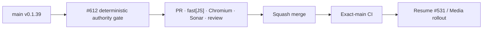

# BRVTAL — Último deploy

  
  
  

> **Development dashboard** · snapshot de **solo el deploy actual** para Issue #612.

## Progress convention

- ✅ ~~Struck through~~ = completed and verified through the required delivery gates.
- 🚧 Normal text = pending or currently in progress.

## Estado del deploy

| Señal | Estado | Evidencia |
| --- | --- | --- |
| Work line | 🚧 **#612 · deterministic Dashboard V2 authority test** | CI resilience follow-up after #611 |
| Base exacta | 🚧 **main v0.1.39** · exact-main/deploy finishing | `554a98de681498067ba67b02ab1fc352ae0ef0d8` |
| Versión | ✅ ~~0.1.39 sin bump~~ | cambio test-only; runtime intacto |
| Producción | 🚧 v0.1.39 source en `main`; migración Media sigue explícitamente pendiente | #612 no toca runtime ni schema |

## Huella del cambio

<!-- brvtal:git-delta -->

| Archivos | Inserciones | Eliminaciones | Neto |
| ---: | ---: | ---: | ---: |
| **2** | **+0** | **−0** | **+0** |

## Calidad y entrega

<!-- brvtal:gate-plan -->

| Control | Estado / contrato |
| --- | --- |
| Gates | **preflight · coordination · fast[JS] · chromium** |
| PR integrity | **PR + snapshot exacto** · Issue #612 · `work/issue-612` · UUID `876aed08-fc35-446c-9c22-bf0ab9ce859f` |
| Flake removal | 🚧 overview response gated explicitly · no fixed timing race |
| Runtime scope | ✅ ~~Dashboard V2 production JS unchanged~~ |
| Regression proof | 🚧 same authority contract must pass without rerun dependence |
| Media migration | 🚧 still explicit/manual; untouched by #612 |
| Sonar | 🚧 analysis on stable HEAD |
| CodeRabbit | 🚧 full review on stable HEAD |
| CI del SHA exacto de main | 🚧 después del squash merge |
| Production migration | 🚧 remains blocked on explicit human authorization |

## Flujo de entrega

## Qué se hizo

- Se identificó una carrera del **test**, no del runtime: el harness usaba `overviewDelay:200`, por lo que bajo carga el Dashboard V2 podía terminar un render válido antes de que el test cambiara `state.section`.
- El mismo HEAD de #611 falló una vez por esa condición y pasó en el rerun aislado de Chromium, confirmando flakiness.
- El test ahora usa una promesa/gate controlada: primero reserva el root, luego invalida la sección y solo después libera la respuesta de overview.
- La aserción sigue probando exactamente el contrato original: un mount que se vuelve inválido antes de resolver debe liberar el root reservado y dejar Health/Activity recuperar ownership.
- No se modificó `dashboard-v2.js`, navegación, API ni comportamiento productivo.

## Archivos modificados en este deploy

- `README.md` — snapshot exacto de #612 y gates test-only.
- `tests/e2e/discadmin-dashboard-v2-authority.spec.mjs` — compuerta determinista para la invalidación de ownership.

## Validación

- Base exacta `554a98de681498067ba67b02ab1fc352ae0ef0d8`: source v0.1.39 ya integrado; la migración Media continúa como acción separada.
- #612 está reservado por el coordinador en `work/issue-612`; no existe PR competidor.
- El fallo que originó #612 ocurrió fuera del diff de #611 y desapareció en rerun sobre el mismo SHA, confirmando la carrera del harness.
- Pendiente: ejecutar la suite test-only sin dependencia de rerun, revisión final, squash y exact-main.

## Qué sigue

| Lane | Trabajo |
| --- | --- |
| **NOW** | 🚧 [#612](https://github.com/pl0n3r/brvtal/issues/612) · eliminar flake del authority test Dashboard V2. |
| **NEXT** | 🚧 [#531](https://github.com/pl0n3r/brvtal/issues/531) · continuar Media optimization; migración #610 solo con autorización explícita. |
| **LATER** | 🚧 [#398](https://github.com/pl0n3r/brvtal/issues/398) · archivo cultural conectado; [#530](https://github.com/pl0n3r/brvtal/issues/530) · recycle bin. |
| **BLOCKED / EXTERNAL** | 🚧 producción: `migration_media_content_hash_01.sql` requiere control humano. |

## Panorama general pendiente

| Lane | Frente | Issues |
| --- | --- | --- |
| **NOW** | 🚧 CI determinism | 🚧 [#612](https://github.com/pl0n3r/brvtal/issues/612) |
| **NEXT** | 🚧 Media optimization / archive evolution | 🚧 [#531](https://github.com/pl0n3r/brvtal/issues/531), [#398](https://github.com/pl0n3r/brvtal/issues/398) |
| **LATER** | 🚧 Admin resilience / SEO | 🚧 [#530](https://github.com/pl0n3r/brvtal/issues/530), [#528](https://github.com/pl0n3r/brvtal/issues/528), [#390](https://github.com/pl0n3r/brvtal/issues/390) |
