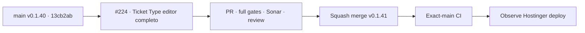

# BRVTAL — Último deploy

  
  
  

> **Development dashboard** · snapshot de **solo el deploy actual** para Issue #224.

## Progress convention

- ✅ ~~Struck through~~ = completed and verified through the required delivery gates.
- 🚧 Normal text = pending or currently in progress.

## Estado del deploy

| Señal | Estado | Evidencia |
| --- | --- | --- |
| Work line | 🚧 **#224 · Ticket Types metadata completa en DISCADMIN** | rama reservada `work/issue-224` |
| Base exacta | ✅ ~~main v0.1.40 exact-main CI/deploy/performance verde~~ | `13cb2ab1d5efbf48c6ec278fde925b60b81206b2` |
| Versión | 🚧 **0.1.41 candidate** | Events / Ticket Types deploy-bound |
| Producción | 🚧 pendiente PR + merge + exact-main + observación Hostinger | sin migraciones ni mutaciones manuales de tickets reales |

## Huella del cambio

<!-- brvtal:git-delta -->

| Archivos | Inserciones | Eliminaciones | Neto |
| ---: | ---: | ---: | ---: |
| **11** | **+208** | **−58** | **+150** |

## Calidad y entrega

<!-- brvtal:gate-plan -->

| Control | Estado / contrato |
| --- | --- |
| Gates | **preflight · coordination · fast[PHP+JS] · database · chromium · real-stack · webkit** |
| PR integrity | **PR + snapshot exacto** · Issue #224 · `work/issue-224` · UUID `c42d756c-e6fa-4b88-85b6-3f21e1b2a60a` |
| Metadata parity | 🚧 name · description · price · currency · status · external URL · payment instructions · QR · availability |
| Availability | 🚧 datetime-local editable · chronological validation · canonical backend normalization |
| Atomic workflow | 🚧 Event + Ticket Types + roster siguen guardándose en un solo workflow transaccional |
| Media reuse | 🚧 QR por ticket reutiliza el Media Library picker existente |
| Responsive Admin | 🚧 Ticket editor expandido sin romper desktop/mobile |
| Durable coverage | 🚧 browser contract + real-stack round-trip de metadata |
| Sonar | 🚧 stable-head analysis |
| CodeRabbit | 🚧 stable-head review |
| CI del SHA exacto de main | 🚧 después del squash merge |

## Flujo de entrega

## Qué se hizo

- El paso **TICKET TYPES** deja de ocultar capacidades ya soportadas por `event_ticket_types`.
- Cada tipo permite editar nombre, descripción, precio, moneda ISO, estado, URL externa, instrucciones de pago, QR y ventana `available_from` / `available_until`.
- El guardado atómico de Events transporta el contrato completo; no se creó un endpoint ni un source of truth paralelo.
- Moneda y disponibilidad se validan en cliente y siguen siendo validadas/normalizadas por el backend.
- El QR individual puede seleccionar una imagen desde el Media Library picker reutilizable.
- Se amplió la cobertura real-stack para comprobar persistencia y round-trip de la metadata completa.
- Se añadió un browser contract específico que impide enviar una ventana invertida y verifica el payload canónico.

## Archivos modificados en este deploy

- `README.md`
- `config/version.php`
- `discadmin/content-core.css`
- `discadmin/content-core.js`
- `discadmin/content-core.php`
- `discadmin/event-workflow.js`
- `discadmin/media-library.js`
- `docs/BRVTAL-SPEC.md`
- `package.json`
- `tests/e2e/content-core-real-stack.spec.mjs`
- `tests/e2e/ticket-types-editor.spec.mjs`

## Validación

- Base exacta `13cb2ab1d5efbf48c6ec278fde925b60b81206b2`: **BRVTAL CI / validate success**, Production Deploy Observer success y Production Performance success.
- #224 tiene reserva canónica activa y la rama partió idéntica a `main`.
- Pendiente: PR, matriz completa sobre HEAD estable, Sonar, revisión, squash merge, exact-main y observación de deploy.

## Qué sigue

| Lane | Trabajo |
| --- | --- |
| **NOW** | 🚧 [#224](https://github.com/pl0n3r/brvtal/issues/224) · cerrar metadata completa de Ticket Types. |
| **NEXT** | 🚧 [#182](https://github.com/pl0n3r/brvtal/issues/182) · no perder metadata SEO ante guardado parcial. |
| **LATER** | 🚧 [#528](https://github.com/pl0n3r/brvtal/issues/528) · autosave/recovery; [#530](https://github.com/pl0n3r/brvtal/issues/530) · recycle bin. |
| **BLOCKED / EXTERNAL** | 🚧 migraciones o mutaciones manuales de producción requieren autorización explícita. |
