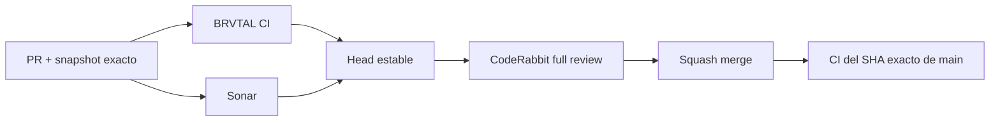

  

# BRVTAL — Último deploy

<strong>Cultural archive · contextual TRANSMISSIONS</strong>

  

> Este README representa **solo el deploy actual**. Se reemplaza en el siguiente deploy y no funciona como changelog acumulativo.

## Estado del deploy

| Señal | Estado | Evidencia |
| --- | --- | --- |
| Base exacta | ✅ **VALIDATED IN CODE** | `main` `50b8a6b7253c000565f23d16e9e5355b660b7806` · exact-main BRVTAL CI verde |
| Git delta | 📐 **7 files · 456 insertions · 55 deletions · net +401** | PR diff vs base `50b8a6b7253c000565f23d16e9e5355b660b7806` |
| Alcance | 🔎 **#511 / parent #398** | inverse TRANSMISSIONS on canonical entity pages |
| Relaciones | 🧬 **EXPLICIT ONLY** | `blog_post_relations` |
| Visibilidad | 🔒 **PUBLISHED ONLY** | drafts/private posts excluded |
| Producción | ⚪ **No validada** | CI no equivale a validación de producción |

## Flujo de entrega

## Qué se hizo

- Centraliza la resolución inversa de Blog/TRANSMISSIONS para Event, Artist, Set y Release.
- Solo usa relaciones explícitas `blog_post_relations`; no infiere conexiones.
- Mantiene Event Record y extiende el mismo comportamiento a Artist, Set y Release.
- Las tarjetas navegan a la URL canónica `/blog/{slug}`.
- Los Blog drafts quedan excluidos por el query de publicación.
- TRANSMISSIONS y Memories se ensamblan en un único bloque cultural compartido para evitar divergencias entre entidades.
- La cobertura nueva es behavior-first: mapping/render ejecutable + integración MariaDB.
- Se elimina del Event Record una comprobación frágil que dependía del SQL literal anterior.

## Archivos modificados en este deploy

- `AGENTS.md` — contrato durable de relaciones inversas TRANSMISSIONS.
- `README.md` — snapshot exacto del deploy #511.
- `config/public_page.php` — helper central y entrega contextual a entidades canónicas.
- `package.json` — incorpora la integración MariaDB al suite canónico.
- `tests/contextual-transmissions-contract.php` — contrato ejecutable de mapping/render.
- `tests/event-record-contract.php` — elimina aserciones frágiles sobre SQL literal.
- `tests/integration/contextual-transmissions.php` — publicación/relaciones reales en MariaDB.

## Validación

- Base exacta `50b8a6b7253c000565f23d16e9e5355b660b7806`: exact-main BRVTAL CI verde tras #510.
- PHP 8.5 debe ejecutar el contrato behavior-first.
- MariaDB debe probar Event/Artist/Set/Release, draft exclusion y aislamiento por entity ID.
- Sonar debe mantenerse en cero issues nuevos accionables.
- La revisión CodeRabbit profunda se solicita únicamente sobre el head estable.
- Tras squash merge se verificará BRVTAL CI sobre el SHA exacto de `main`.
- No se declara **VALIDATED IN PRODUCTION** desde CI.

## Qué sigue

| Lane | Trabajo |
| --- | --- |
| **NOW** | Cerrar [#511](https://github.com/pl0n3r/brvtal/issues/511) / [PR #512](https://github.com/pl0n3r/brvtal/pull/512), luego ejecutar [#534](https://github.com/pl0n3r/brvtal/issues/534) para reducir el lead time de desarrollo a producción. |
| **NEXT** | [#527](https://github.com/pl0n3r/brvtal/issues/527) — convertir README en dashboard profesional de desarrollo. |
| **LATER** | Continuar las fases priorizadas en [#533](https://github.com/pl0n3r/brvtal/issues/533), de quick wins hacia cambios estructurales. |

## Panorama general pendiente

| Lane | Frente | Estado / siguiente foco |
| --- | --- | --- |
| **NOW** | ⚡ **Delivery lead time** | [#534](https://github.com/pl0n3r/brvtal/issues/534) · paralelización segura de commits, gates y observación de deploy |
| **NEXT** | 📊 **Development dashboard** | [#527](https://github.com/pl0n3r/brvtal/issues/527) · README visual con métricas y panorama |
| **NEXT** | 🗺️ **Roadmap activo** | [#533](https://github.com/pl0n3r/brvtal/issues/533) · ejecución de fácil/bajo riesgo → arquitectura compleja |
| **NEXT** | ⚡ **Quick wins Admin** | [#520](https://github.com/pl0n3r/brvtal/issues/520), [#521](https://github.com/pl0n3r/brvtal/issues/521), [#526](https://github.com/pl0n3r/brvtal/issues/526), [#522](https://github.com/pl0n3r/brvtal/issues/522), [#479](https://github.com/pl0n3r/brvtal/issues/479), [#517](https://github.com/pl0n3r/brvtal/issues/517), [#221](https://github.com/pl0n3r/brvtal/issues/221) |
| **LATER** | 🧩 **Dashboard configurable** | [#513](https://github.com/pl0n3r/brvtal/issues/513) · módulos, drag/drop, resize y Analytics reales |
| **LATER** | 🗃️ **Archivo cultural** | [#398](https://github.com/pl0n3r/brvtal/issues/398) · continuar después de la estabilización priorizada |
| **LATER** | 🎛️ **Apariencia** | [#149](https://github.com/pl0n3r/brvtal/issues/149) + [#514](https://github.com/pl0n3r/brvtal/issues/514) · Light/Glass y Admin premium |
| **LATER** | 🖼️ **Hero / Banners** | [#221](https://github.com/pl0n3r/brvtal/issues/221) integridad editorial · [#480](https://github.com/pl0n3r/brvtal/issues/480) visual desktop |
| **LATER** | 🔐 **Seguridad editorial** | [#257](https://github.com/pl0n3r/brvtal/issues/257), [#216](https://github.com/pl0n3r/brvtal/issues/216), [#174](https://github.com/pl0n3r/brvtal/issues/174), [#193](https://github.com/pl0n3r/brvtal/issues/193) |
| **LATER** | 📈 **Analytics** | [#427](https://github.com/pl0n3r/brvtal/issues/427) · completar eventos `brvtal_*` en GTM/GA4 |
| **LATER** | ✍️ **Content / edición** | [#224](https://github.com/pl0n3r/brvtal/issues/224), [#252](https://github.com/pl0n3r/brvtal/issues/252) |
| **LATER** | 🧾 **Activity / operaciones** | [#232](https://github.com/pl0n3r/brvtal/issues/232), [#195](https://github.com/pl0n3r/brvtal/issues/195) |
| **LATER** | 📚 **Bulk Actions** | [#275](https://github.com/pl0n3r/brvtal/issues/275) · registros >500 sin falsa exhaustividad |
| **LATER** | 🌐 **Idioma** | [#212](https://github.com/pl0n3r/brvtal/issues/212) · español canónico + inglés automático por fases |
| **LATER** | 💾 **Backups** | [#389](https://github.com/pl0n3r/brvtal/issues/389) · scheduling seguro + Drive opcional |

---

BRVTAL · Rave till Grave · deploy snapshot

