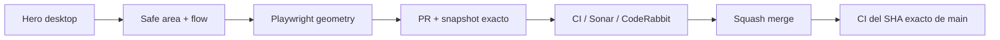

# BRVTAL — Último deploy

  
  
  

> **Development dashboard** · snapshot profesional de **solo el deploy actual**.

## Progress convention

- ✅ ~~Struck through~~ = completed and verified through the required delivery gates.
- 🚧 Normal text = pending or currently in progress.

## Estado del deploy

| Señal | Estado | Evidencia |
| --- | --- | --- |
| Work line | 🚧 **#480 HOME HERO DESKTOP** | safe-area + composición responsive |
| Base exacta | ✅ **VALIDATED IN CODE** | `main` `1526bbb1180b5b9bc97968b6f41e77b4e05751c3` |
| Version | 🚧 **0.1.10 → 0.1.11** | patch deploy |
| Producción | ⛔ **BLOCKED / EXTERNAL** | Hostinger observado en [#534](https://github.com/pl0n3r/brvtal/issues/534) |

## Huella del cambio

<!-- brvtal:git-delta -->

| Archivos | Inserciones | Eliminaciones | Neto |
| ---: | ---: | ---: | ---: |
| **8** | **+136** | **−55** | **+81** |

## Calidad y entrega

<!-- brvtal:gate-plan -->

| Control | Estado / contrato |
| --- | --- |
| Gates seleccionados | **preflight · fast[JS] · chromium** |
| Browser | geometría real desktop + safe-area de layers |
| Sonar + CodeRabbit | paralelo sobre head estable |
| Exact-main | CI del SHA exacto de main tras squash merge |

## Flujo de entrega

## Qué se hizo

- El Hero fallback conserva escala editorial grande, pero limita el título desktop a 220 px y coloca la declaración cultural dentro del flujo.
- La copia principal queda separada del header fijo con un safe top explícito.
- En desktop, las capas publicadas desde Banners conservan X/ancho, pero su centro vertical se clampa fuera del header y de los controles inferiores; mobile conserva sus coordenadas previas.
- Playwright valida bounding boxes en 1440×800 y 1920×900, además de capas extremas Y=0/Y=100.
- Versión **0.1.11**.

## Archivos modificados en este deploy

- `AGENTS.md` — contrato durable del safe-area y prioridades.
- `README.md` — snapshot #480.
- `config/version.php` — versión 0.1.11.
- `css/hero-slider.css` — escala desktop segura del slider.
- `css/public-home-phase-a.css` — composición desktop del fallback.
- `js/hero-slider.js` — límites verticales de layers.
- `tests/e2e/hero-slider.spec.mjs` — regresión de layers.
- `tests/e2e/public-home-phase-a.spec.mjs` — regresión geométrica desktop.

## Validación

- El título/declaración no se solapan y el bloque completo permanece dentro del Hero en viewports desktop amplios.
- Las capas desktop extremas quedan fuera del header y del borde inferior; las coordenadas mobile no cambian.
- Mobile conserva sus reglas existentes; no hay migración ni SQL de producción.

## Qué sigue

| Lane | Trabajo |
| --- | --- |
| **NOW** | 🚧 [#480](https://github.com/pl0n3r/brvtal/issues/480) · gates, merge y exact-main. |
| **NEXT** | 🚧 [#193](https://github.com/pl0n3r/brvtal/issues/193), [#216](https://github.com/pl0n3r/brvtal/issues/216) · shell/navigation consistency. |
| **LATER** | 🚧 [#519](https://github.com/pl0n3r/brvtal/issues/519), [#518](https://github.com/pl0n3r/brvtal/issues/518) · editorial productivity. |
| **BLOCKED / EXTERNAL** | 🚧 [#534](https://github.com/pl0n3r/brvtal/issues/534) · Hostinger Git auto-deploy marker. |

## Panorama general pendiente

| Lane | Frente | Issues |
| --- | --- | --- |
| **DONE** | ✅ ~~Phase 1 + Admin IA/Appearance/Settings/Security + Banners performance~~ | ✅ ~~[#348](https://github.com/pl0n3r/brvtal/issues/348), [#149](https://github.com/pl0n3r/brvtal/issues/149), [#514](https://github.com/pl0n3r/brvtal/issues/514), [#516](https://github.com/pl0n3r/brvtal/issues/516), [#553](https://github.com/pl0n3r/brvtal/issues/553), [#523](https://github.com/pl0n3r/brvtal/issues/523)~~ |
| **NOW** | 🚧 Phase 2 closeout | 🚧 [#480](https://github.com/pl0n3r/brvtal/issues/480), [#193](https://github.com/pl0n3r/brvtal/issues/193), [#216](https://github.com/pl0n3r/brvtal/issues/216) |
| **LATER** | 🚧 Editorial productivity | 🚧 [#519](https://github.com/pl0n3r/brvtal/issues/519), [#518](https://github.com/pl0n3r/brvtal/issues/518), [#257](https://github.com/pl0n3r/brvtal/issues/257), [#525](https://github.com/pl0n3r/brvtal/issues/525) |
| **BLOCKED / EXTERNAL** | 🚧 Deploy observation | 🚧 [#534](https://github.com/pl0n3r/brvtal/issues/534) |
