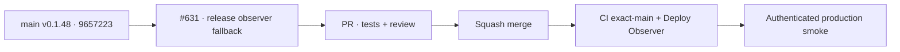

# BRVTAL — Último deploy

  
  
  

> **Production incident #631** · snapshot de **solo el deploy actual**: v0.1.48 exact `main` `96572232ab697aa68dd2429e273af2554bbb10dc` tiene CI exact-main y Deploy Observer verdes, pero smoke #35946714877 falló antes de autenticarse porque el APIRequestContext no obtuvo identidad utilizable desde `/api/deployment.php`, aunque el observer por curl sí observó v0.1.48 tras 9 s. **Engineering roles:** SRE / production incident responder, QA automation engineer.

## Progress convention

- ✅ ~~Struck through~~ = completed and verified through the required delivery gates.
- 🚧 Normal text = pending or currently in progress.

## Estado del deploy

| Señal | Estado | Evidencia |
| --- | --- | --- |
| Work line | 🚧 **#631 · harden release identity observation** | `work/issue-631`; reserva `f2a302c6-0f95-4133-961c-6c3ffe3634ab` |
| Base exacta | ✅ ~~main v0.1.48~~ | `96572232ab697aa68dd2429e273af2554bbb10dc` |
| Versión | ✅ ~~v0.1.48 sin incremento~~ | cambio exclusivo de pruebas/observabilidad |
| CI exact-main base | ✅ ~~success~~ | [#35946563066](https://github.com/pl0n3r/brvtal/actions/runs/35946563066) |
| Deploy Observer base | ✅ ~~success~~ | [#35946563088](https://github.com/pl0n3r/brvtal/actions/runs/35946563088) · v0.1.48 observado tras 9 s |
| Smoke base | ⛔ **failure / release observation** | [#35946714877](https://github.com/pl0n3r/brvtal/actions/runs/35946714877) · no llegó a auth/health/Admin |
| Entrega candidata | 🚧 deployment probe primario + health fallback diagnóstico | exige versión/SHA exactos; sin mutaciones productivas |

## Huella del cambio

<!-- brvtal:git-delta -->

| Archivos | Inserciones | Eliminaciones | Neto |
| ---: | ---: | ---: | ---: |
| **5** | **+222** | **−80** | **+142** |

## Calidad y entrega

<!-- brvtal:gate-plan -->

| Control | Estado / contrato |
| --- | --- |
| Gates esperados | **preflight · coordination · fast[PHP+JS] · chromium** |
| PR + snapshot exacto | Issue #631 · reserva `f2a302c6-0f95-4133-961c-6c3ffe3634ab` |
| CodeRabbit / Sonar | 🚧 validar HEAD estable; máximo 3 rondas automáticas |
| CI del SHA exacto de main | 🚧 después del merge |
| Producción | 🚧 smoke nuevo debe completar release/auth/health/Home/Admin/Events/date/Sets/Hero |

## Flujo de entrega

## Qué se hizo

- El deploy de v0.1.48 está demostrado: Deploy Observer #35946563088 pasó y vio la nueva versión a los **9 s**; exact-main CI #35946563066 también pasó.
- Smoke #35946714877 falló en `release-authentication` antes de ejecutar las comprobaciones de health/Admin, con `observedDeployment.version=null` durante su ventana.
- La sonda `/api/deployment.php` sigue siendo primaria. Solo si su respuesta es inutilizable se consulta `/api/health.php`, que expone la misma identidad canónica más estado de DB.
- El fallback no relaja identidad: versión esperada y cualquier SHA exacto observado siguen verificándose; un SHA exacto distinto continúa fallando.
- La evidencia del smoke ahora conserva sonda usada, HTTP/parse error y motivo del fallback.
- Se añadieron contratos para fallback por JSON inválido, errores transitorios, mismatch exacto y orden observe-before-auth.
- Sin cambios de producto, credenciales, SQL ni datos productivos.

## Archivos modificados en este deploy

- `README.md` — snapshot exacto del incidente y gates.
- `tests/e2e/production-authenticated-smoke.mjs` — evidencia diagnóstica de sonda/fallback.
- `tests/e2e/production-release-observer-contract.mjs` — regresiones del observer.
- `tests/e2e/production-release-observer.mjs` — fallback seguro a health cuando deployment es inutilizable.
- `tests/production-smoke-contract.php` — contrato estático del fallback y su evidencia.

## Validación

- ✅ ~~Base exacta: v0.1.48 / `96572232…`; CI #35946563066 y Deploy Observer #35946563088 verdes.~~
- ✅ ~~Smoke #35946714877 demostró una divergencia entre curl observer y APIRequestContext antes de auth; no hubo mutación de producción.~~
- ✅ ~~La corrección mantiene `deployment.php` primario y solo usa health para una respuesta primaria inutilizable.~~
- 🚧 PR CI/revisión, merge y smoke productivo completo pendientes; **no declarar PRODUCTION GREEN** antes.

## Qué sigue

| Lane | Trabajo |
| --- | --- |
| **NOW** | 🚧 [#631](https://github.com/pl0n3r/brvtal/issues/631): validar observer robusto, mergear y repetir smoke real. |
| **NEXT** | 🚧 [#533](https://github.com/pl0n3r/brvtal/issues/533): publicar `🟢 PRODUCTION GREEN` solo con las cinco evidencias. |
| **LATER** | 🚧 detener BRVTAL después de GREEN mientras la Tanda 1 global siga abierta. |
| **BLOCKED / EXTERNAL** | 🚧 Condor/GrindFlow aún no tienen GREEN y factory `v1.0.0` no existe; Tanda 2 no inicia. |

## Panorama general pendiente

- 🚧 **NOW**: cerrar #631 con un smoke real completo.
- 🚧 **NEXT**: verificar ausencia de incidentes/`[AUTO]` y registrar GREEN en #533.
- 🚧 **LATER**: esperar la barrera global de Tanda 1.
- 🚧 **BLOCKED / EXTERNAL**: no adoptar todavía el kit de factory.
