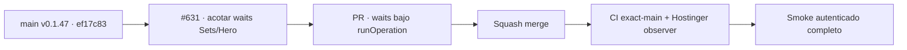

# BRVTAL — Último deploy

  
  
  

> **Production incident #631** · snapshot de **solo el deploy actual**: v0.1.47 exact `main` `ef17c8345ccec6853912a7aa322a336a2e430a64` tiene CI exact-main y Deploy Observer verdes. Smoke autenticado #35942878443 acreditó health/Home/Admin/dashboard/Events/date y agotó el watchdog en `sets-relations` con `failureOperation: null`; la espera de readiness de Sets estaba fuera de `runOperation`. **Engineering roles:** SRE / production incident responder, QA automation engineer.

## Progress convention

- ✅ ~~Struck through~~ = completed and verified through the required delivery gates.
- 🚧 Normal text = pending or currently in progress.

## Estado del deploy

| Señal | Estado | Evidencia |
| --- | --- | --- |
| Work line | 🚧 **#631 · bound Sets/Hero smoke waits** | `work/issue-631`; reserva `10a4d417-11ca-4a28-9701-b60cab5f73f4` |
| Base exacta | ✅ ~~main v0.1.47~~ | `ef17c8345ccec6853912a7aa322a336a2e430a64` |
| Versión | ✅ ~~v0.1.47 sin incremento~~ | mantenimiento exclusivo de prueba/documentación |
| CI del SHA exacto de main | ✅ ~~success~~ | [#35942701683](https://github.com/pl0n3r/brvtal/actions/runs/35942701683) |
| Deploy Observer base | ✅ ~~success~~ | [#35942701677](https://github.com/pl0n3r/brvtal/actions/runs/35942701677) |
| Smoke autenticado base | ⛔ **failure / diagnostic** | [#35942878443](https://github.com/pl0n3r/brvtal/actions/runs/35942878443) · dashboard 448 ms; Events/date PASS; timeout en `sets-relations` |
| Entrega candidata | 🚧 waits finales acotados | Sets readiness/modal/options + Hero readiness/state quedan dentro de `runOperation` |

## Huella del cambio

<!-- brvtal:git-delta -->

| Archivos | Inserciones | Eliminaciones | Neto |
| ---: | ---: | ---: | ---: |
| **2** | **+56** | **−34** | **+22** |

## Calidad y entrega

<!-- brvtal:gate-plan -->

| Control | Estado / contrato |
| --- | --- |
| Gates | **preflight · coordination · fast[JS] · chromium** |
| PR + snapshot exacto | Issue #631 · reserva `10a4d417-11ca-4a28-9701-b60cab5f73f4` |
| CodeRabbit / Sonar | 🚧 validar HEAD estable; máximo 3 rondas automáticas |
| CI del SHA exacto de main | 🚧 después del merge |
| Producción | 🚧 ejecutar smoke nuevo y exigir Sets + Hero + cierre limpio además de todas las señales ya probadas |

## Flujo de entrega

## Qué se hizo

- Envolver la espera de readiness del workspace Sets en `runOperation`, porque el artefacto real demostró que un bloqueo del canal del navegador podía ignorar el timeout propio de Playwright y llegar al watchdog global con `operation=null`.
- Acotar también la visibilidad del modal y la lectura de opciones Artist/Event para que cualquier fallo de #124 quede etiquetado con una operación concreta.
- Acotar readiness y lectura de estado en las tres aperturas de Hero Slider para evitar repetir el mismo patrón en #125.
- Persistir evidencia después de cada intento exitoso de Hero y usar un temporizador local para la pausa corta entre navegaciones.
- Mantener el smoke estrictamente read-only: sin SQL, migraciones ni mutaciones de contenido productivo.

## Archivos modificados en este deploy

- `README.md` — snapshot exacto del incidente, evidencia y gates.
- `tests/e2e/production-authenticated-smoke.mjs` — bounds explícitos para las esperas restantes de Sets y Hero.

## Validación

- ✅ ~~Base v0.1.47 exacta: CI #35942701683 y observer #35942701677 aprobaron sobre `ef17c834…`.~~
- ⛔ Smoke #35942878443: release exacto, health **200** / DB **connected**, Home/DISCADMIN **200**, dashboard **448 ms** sin 5xx, versión Admin exacta, Events workspace PASS y Event #6 date PASS; watchdog de 12 min cortó en `sets-relations`.
- ✅ ~~Artefacto real: `failureStage=sets-relations`, `failureOperation=null`, sin mutaciones bloqueadas; Sets/Hero no llegaron a acreditarse.~~
- ✅ ~~Auditoría de fuente: el primer await tras `navigate(page, 'sets')` era `page.waitForFunction(...SETS...)` fuera de `runOperation`; Hero conservaba waits/reads con el mismo riesgo.~~
- 🚧 PR CI/Chromium, revisión, merge y smoke ejecutado final pendientes; **no declarar PRODUCTION GREEN** antes.

## Qué sigue

| Lane | Trabajo |
| --- | --- |
| **NOW** | 🚧 [#631](https://github.com/pl0n3r/brvtal/issues/631): validar waits acotados, mergear y ejecutar smoke real completo. |
| **NEXT** | 🚧 [#533](https://github.com/pl0n3r/brvtal/issues/533): publicar `🟢 PRODUCTION GREEN` solo con las cinco evidencias. |
| **LATER** | 🚧 retomar backlog de producto después de GREEN y de la barrera global de Tanda 1. |
| **BLOCKED / EXTERNAL** | 🚧 Tanda 2 requiere factory `v1.0.0` y GREEN en los tres repos. |

## Panorama general pendiente

- 🚧 **NOW**: smoke final debe terminar y acreditar health/SHA/DB, Home/Admin/Dashboard, Events/date, Sets, Hero y ausencia de 5xx.
- 🚧 **NEXT**: cerrar #631 y registrar GREEN en #533.
- 🚧 **LATER**: esperar la Tanda 1 global antes de adoptar el kit factory.
- 🚧 **BLOCKED / EXTERNAL**: BRVTAL sigue sin GREEN hasta smoke final aprobado.
