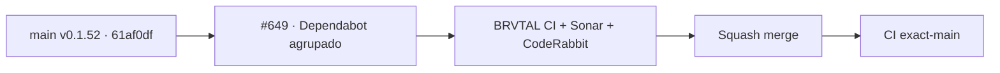

# BRVTAL — Último deploy

  
  
  

> Snapshot de **solo el deploy actual**: #649 recupera la configuración agrupada de Dependabot
> sobre `main` v0.1.52 `61af0df4ca4d6bdbe3dd7a04500fdf2278b2105b`. Es mantenimiento
> de repositorio: no cambia runtime ni incrementa la versión de producto.

## Progress convention

- ✅ ~~Struck through~~ = completed and verified through the required delivery gates.
- 🚧 Normal text = pending or currently in progress.

## Estado del deploy

| Señal | Estado | Evidencia |
| --- | --- | --- |
| Work line | 🚧 **#649 · grouped Dependabot** | `work/issue-649`; reserva `1ba2e6a3-8658-4061-ab01-d88d20ef2bab` |
| Base exacta | ✅ ~~main v0.1.52~~ | `61af0df4ca4d6bdbe3dd7a04500fdf2278b2105b` |
| Versión producto | ✅ ~~v0.1.52 sin cambio~~ | mantenimiento de repositorio; no deploy-bound |
| CI/Sonar/CodeRabbit | 🚧 pendiente | revalidar HEAD final |
| Producción | ✅ ~~sin cambio de runtime~~ | no modifica superficie productiva |

## Huella del cambio

<!-- brvtal:git-delta -->

| Archivos | Inserciones | Eliminaciones | Neto |
| ---: | ---: | ---: | ---: |
| **2** | **+59** | **−54** | **+5** |

## Calidad y entrega

<!-- brvtal:gate-plan -->

| Control | Estado / contrato |
| --- | --- |
| Gates esperados | **preflight · coordination · fast[PHP+JS]** |
| PR + snapshot exacto | Issue #649 · reserva `1ba2e6a3-8658-4061-ab01-d88d20ef2bab` |
| CodeRabbit / Sonar | 🚧 revisión del HEAD estable |
| CI del SHA exacto de main | 🚧 después del merge |

## Flujo de entrega

## Qué se hizo

- Programa actualizaciones semanales para npm y GitHub Actions.
- Agrupa actualizaciones minor/patch y limita a tres PR abiertos por ecosistema.
- Aplica etiquetas canónicas de tipo, prioridad y revisión a los PR de Dependabot.
- Deja listo el canal para futuras propuestas de versiones `pl0n3r/factory@vN` una vez aparezcan referencias consumidas.
- No cambia código de aplicación, base de datos, secretos, permisos ni versión de producto.

## Archivos modificados en este deploy

- `.github/dependabot.yml`
- `README.md`

## Validación

- 🚧 BRVTAL CI debe validar coordinación, contratos rápidos y snapshot exacto.
- 🚧 Sonar y CodeRabbit deben terminar sobre el HEAD estable antes del merge.
- El cambio no requiere escritura productiva ni migración.

## Qué sigue

| Lane | Trabajo |
| --- | --- |
| **NOW** | 🚧 [#649](https://github.com/pl0n3r/brvtal/issues/649): integrar Dependabot agrupado. |
| **NEXT** | 🚧 [#630](https://github.com/pl0n3r/brvtal/issues/630): iniciar TANDA 2 del kit Factory. |
| **LATER** | 🚧 [#533](https://github.com/pl0n3r/brvtal/issues/533): continuar roadmap canónico. |
| **BLOCKED / EXTERNAL** | 🚧 Factory v1.0.1 permanece owner-gated y separado de este PR. |

## Panorama general pendiente

- 🚧 **NOW**: cerrar #649 con gates verdes.
- 🚧 **NEXT**: reservar el primer slice de #630 cuando este PR libere el repo.
- 🚧 **LATER**: continuar #533 sin duplicar trabajo de otros agentes.
- 🚧 **BLOCKED / EXTERNAL**: publicación Factory v1.0.1 requiere la puerta humana #108.
