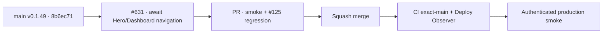

# BRVTAL — Último deploy

  
  
  

> **Production incident #631** · snapshot de **solo el deploy actual**: v0.1.49 exact `main` `8b6ec71679099f533cbcf4be12bf9870121d58fc` tiene CI exact-main y Deploy Observer verdes. Smoke #35953832015 confirmó Events + Sets y llegó por primera vez a Hero Slider: intento 1 PASS, intento 2 falló porque el smoke inició transiciones Dashboard/Banners asíncronas sin esperar sus Promises. El mismo run registró un `/api/index.php/health` 503 transitorio que sigue siendo bloqueante si reaparece. **Engineering roles:** SRE / production incident responder, QA automation engineer.

## Progress convention

- ✅ ~~Struck through~~ = completed and verified through the required delivery gates.
- 🚧 Normal text = pending or currently in progress.

## Estado del deploy

| Señal | Estado | Evidencia |
| --- | --- | --- |
| Work line | 🚧 **#631 · await repeated Hero navigation** | `work/issue-631`; reserva `c4ed4f0e-6528-4c18-93cd-3ade9ac6028a` |
| Base exacta | ✅ ~~main v0.1.49~~ | `8b6ec71679099f533cbcf4be12bf9870121d58fc` |
| Versión | ✅ ~~v0.1.49 sin incremento~~ | cambio exclusivo de tests/diagnóstico |
| CI exact-main base | ✅ ~~success~~ | [#35953782418](https://github.com/pl0n3r/brvtal/actions/runs/35953782418) |
| Deploy Observer base | ✅ ~~success~~ | [#35953782401](https://github.com/pl0n3r/brvtal/actions/runs/35953782401) |
| Smoke base | ⛔ **failure / Hero attempt 2** | [#35953832015](https://github.com/pl0n3r/brvtal/actions/runs/35953832015) · `hero-slider-ready-2` |
| Entrega candidata | 🚧 esperar Promises reales Dashboard/Banners | regresión de 3 ciclos Hero |

## Huella del cambio

<!-- brvtal:git-delta -->

| Archivos | Inserciones | Eliminaciones | Neto |
| ---: | ---: | ---: | ---: |
| **4** | **+81** | **−44** | **+37** |

## Calidad y entrega

<!-- brvtal:gate-plan -->

| Control | Estado / contrato |
| --- | --- |
| Gates esperados | **preflight · coordination · fast[PHP+JS] · chromium** |
| PR + snapshot exacto | Issue #631 · reserva `c4ed4f0e-6528-4c18-93cd-3ade9ac6028a` |
| CodeRabbit / Sonar | 🚧 HEAD estable; máximo 3 rondas automáticas |
| CI del SHA exacto de main | 🚧 después del merge |
| Producción | 🚧 smoke nuevo debe completar Hero 3/3 y terminar con cero 5xx |

## Flujo de entrega

## Qué se hizo

- Smoke #35953832015 observó v0.1.49 / `8b6ec716…` exactos.
- Health canónico **200**, DB **connected**, Home **200**, DISCADMIN **200**, dashboard visible en **436 ms** y versión Admin exacta.
- Events workspace y Event #6 date pasaron.
- Sets quedó completamente acreditado: API paginado **200 en 33 ms**, browser **200 en 54 ms**, relaciones Artist/Event presentes.
- Hero Slider intento 1 pasó; el intento 2 falló esperando `#hero-slider-root` tras un ciclo Dashboard→Banners.
- El smoke usaba `window.go(...); return true`, por lo que no esperaba la navegación asíncrona final de DISCADMIN antes de iniciar la siguiente aserción.
- La candidata espera el resultado real de `window.go('hero-slider')` y `window.go('dashboard')`, exige commit `true` y confirma Dashboard activo antes del siguiente intento.
- La suite regular añade una regresión de tres aperturas de Banners con dos ciclos por Dashboard para #125.
- El run también observó un `/api/index.php/health` **503** posterior al chequeo inicial; no se ignora ni se whitelist-ea. Un smoke GREEN debe terminar con cero 5xx.
- Sin cambios de runtime, versión, SQL ni datos productivos.

## Archivos modificados en este deploy

- `README.md` — snapshot exacto del incidente y gates.
- `tests/e2e/production-authenticated-smoke.mjs` — navegación Hero/Dashboard causal y acotada.
- `tests/production-smoke-contract.php` — contrato que exige esperar ambas Promises.
- `tests/e2e/hero-slider-v2.spec.mjs` — regresión de reapertura repetida Dashboard↔Banners.

## Validación

- ✅ ~~Base v0.1.49: CI #35953782418 y Deploy Observer #35953782401 verdes.~~
- ✅ ~~Smoke #35953832015 acreditó release/health/Home/Admin/Events/date/Sets y Hero intento 1.~~
- ✅ ~~La causa del fallo Hero actual está en la orquestación no esperada del smoke; no requiere cambio runtime para esta candidata.~~
- 🚧 PR CI/revisión, merge y smoke final pendientes; **no declarar PRODUCTION GREEN** antes.
- 🚧 El siguiente smoke debe tener **cero 5xx**, incluido `/api/index.php/health`.

## Qué sigue

| Lane | Trabajo |
| --- | --- |
| **NOW** | 🚧 [#631](https://github.com/pl0n3r/brvtal/issues/631): validar navegación Hero repetida, mergear y repetir smoke real. |
| **NEXT** | 🚧 [#533](https://github.com/pl0n3r/brvtal/issues/533): publicar `🟢 PRODUCTION GREEN` solo con las cinco evidencias. |
| **LATER** | 🚧 detener BRVTAL después de GREEN mientras Tanda 1 global siga abierta. |
| **BLOCKED / EXTERNAL** | 🚧 Condor/GrindFlow sin GREEN y factory `v1.0.0` ausente; no iniciar Tanda 2. |

## Panorama general pendiente

- 🚧 **NOW**: cerrar #631 con smoke completo Hero 3/3 y cero 5xx.
- 🚧 **NEXT**: verificar incidentes/`[AUTO]` y registrar GREEN en #533.
- 🚧 **LATER**: esperar la barrera global.
- 🚧 **BLOCKED / EXTERNAL**: no adoptar todavía el kit factory.
