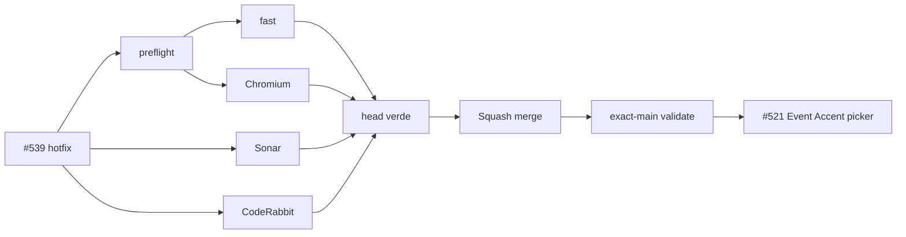

# BRVTAL — Último deploy

  
  
  

> **Development dashboard** · snapshot profesional de **solo el deploy actual**.

## Estado del deploy

| Señal | Estado actual | Evidencia |
| --- | --- | --- |
| Work line | 🛠️ **#539 exact-main stabilization** | Content Health conserva destino aunque `data-health-open` esté vacío |
| Base exacta | ⚠️ **MAIN REGRESSION DETECTED** | `main` `29df36344f3f3dbdb39665c821e18f2b7efd8df9` · fast + real-stack + Sonar verdes; Chromium/validate rojos por #539 |
| Fase | ⚡ **Stabilize before #521** | no abrir trabajo dependiente hasta recuperar exact-main verde |
| Lead time CI | 📉 **123 s → 84 s** | mejora de ~31.7% tras [#535](https://github.com/pl0n3r/brvtal/pull/535) |
| Producción | ⛔ **BLOCKED / EXTERNAL** | Hostinger marker sigue separado en [#534](https://github.com/pl0n3r/brvtal/issues/534) |

## Huella del cambio

<!-- brvtal:git-delta -->

| Archivos | Inserciones | Eliminaciones | Neto |
| ---: | ---: | ---: | ---: |
| **2** | **+39** | **−48** | **-9** |

## Calidad y entrega

<!-- brvtal:gate-plan -->

| Control | Estado / contrato |
| --- | --- |
| Gates seleccionados | **preflight · fast[JS] · chromium** |
| Regresión dirigida | `discadmin-content-health-navigation.spec.mjs` permanece intacta |
| Sonar | Clean-as-You-Code en paralelo |
| CodeRabbit | full review del head estable en paralelo con CI/Sonar |
| Exact-main | obligatorio después del squash merge |
| Producción | deploy marker ≠ validación funcional |

## Flujo de entrega

## Qué se hizo

- Mantiene el fallback canónico de Content Health cuando `data-health-open` existe pero queda vacío.
- El destino se deriva de `data-health-type` en vez de llamar `window.go('')`.
- No se debilita ni modifica la regresión que detectó el fallo.

## Archivos modificados en este deploy

**DISCADMIN**
- `discadmin/content-health.js` — fallback seguro para el destino del botón OPEN.

**Handoff**
- `README.md` — snapshot exacto del hotfix #539.

## Validación

- La regresión existente debe volver a navegar a `events` y abrir el registro 7 cuando el hint explícito está vacío.
- No cambia la semántica normal cuando `data-health-open` ya contiene un destino.
- Tras merge, `main` debe recuperar Chromium + `validate` verdes antes de empezar #521.

## Qué sigue

| Lane | Trabajo |
| --- | --- |
| **NOW** | Cerrar [#539](https://github.com/pl0n3r/brvtal/issues/539) y recuperar exact-main verde. |
| **NEXT** | [#521](https://github.com/pl0n3r/brvtal/issues/521) Event Accent picker → [#526](https://github.com/pl0n3r/brvtal/issues/526) Blog taxonomy → [#522](https://github.com/pl0n3r/brvtal/issues/522) Media navigation/UI. |
| **BLOCKED / EXTERNAL** | [#534](https://github.com/pl0n3r/brvtal/issues/534) · revisar Hostinger auto-deploy/hPanel sin frenar producto. |
| **LATER** | Continuar [#533](https://github.com/pl0n3r/brvtal/issues/533). |

## Panorama general pendiente

| Lane | Frente | Issues |
| --- | --- | --- |
| **NOW** | Main stability | [#539](https://github.com/pl0n3r/brvtal/issues/539) |
| **NEXT** | Admin friction | [#521](https://github.com/pl0n3r/brvtal/issues/521), [#526](https://github.com/pl0n3r/brvtal/issues/526), [#522](https://github.com/pl0n3r/brvtal/issues/522), [#479](https://github.com/pl0n3r/brvtal/issues/479), [#517](https://github.com/pl0n3r/brvtal/issues/517), [#221](https://github.com/pl0n3r/brvtal/issues/221) |
| **BLOCKED / EXTERNAL** | Deploy Hostinger | [#534](https://github.com/pl0n3r/brvtal/issues/534) |
| **LATER** | Shell / apariencia | [#348](https://github.com/pl0n3r/brvtal/issues/348), [#149](https://github.com/pl0n3r/brvtal/issues/149), [#514](https://github.com/pl0n3r/brvtal/issues/514) |
| **LATER** | Editorial / dashboards | [#518](https://github.com/pl0n3r/brvtal/issues/518), [#519](https://github.com/pl0n3r/brvtal/issues/519), [#513](https://github.com/pl0n3r/brvtal/issues/513), [#515](https://github.com/pl0n3r/brvtal/issues/515) |
