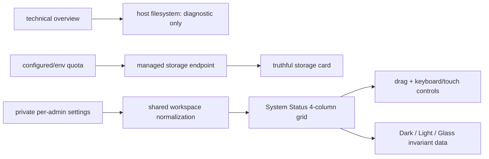

# BRVTAL — Último deploy

> Snapshot de **solo el deploy actual** para #515: System Status confiable y configurable por administrador. No declara producción GREEN.

## Progress convention
- ✅ ~~Struck through~~ = completed and verified through required gates.
- 🚧 Normal text = pending/in progress.
- 🚧 = active production blocker.

## Estado del deploy
| Señal | Estado | Evidencia |
| --- | --- | --- |
| Work line | 🚧 **#515 · trustworthy configurable System Status** | `work/issue-515` · reserva `a76f7def-8b57-4098-a4d5-f9f2a4306597` |
| Base exacta | ✅ **main** | `506e5bf63045cbd9970bf90394bbd49d896f9450` |
| Versión de producto | 🚧 **v0.1.65** | `config/version.php` + `package.json` |
| Producción | 🚧 **NO GREEN · #681** | recovery de migration registry sigue bloqueado por autoridad/transporte |
| Factory Labels | 🚧 **#694** | Factory `@v1` todavía falla por alias/canónica |
| PR | 🚧 **#706** | exact-head gates obligatorios |

## Huella del cambio
<!-- brvtal:git-delta -->
| Archivos | Inserciones | Eliminaciones | Neto |
| ---: | ---: | ---: | ---: |
| **13** | **+633** | **−105** | **+528** |

## Calidad y entrega
<!-- brvtal:gate-plan -->
| Control | Estado / contrato |
| --- | --- |
| Gates esperados | **preflight · coordination · fast[PHP+JS] · database · chromium · real-stack · webkit** |
| PR + snapshot exacto | **#706 · #515 System Status reliable/configurable** |
| Roles | **Software Engineering · Frontend · UX · QA · Security · SRE** |
| Review | BRVTAL CI + Factory Policy/Privacy + Sonar/CodeRabbit |
| CI del SHA exacto de main | 🚧 obligatorio después del merge |
| Production GREEN | 🚧 fuera de alcance mientras #681 siga abierto |

## Flujo de entrega

## Qué se hizo
- Eliminada la doble fuente visual de storage: `technical.php` ya no presenta el filesystem del host como cuota de aplicación.
- El filesystem del host permanece visible únicamente como diagnóstico raw, marcado `diagnostic_only`.
- `storage-metrics.php` acepta cuota solo desde configuración o `BRVTAL_STORAGE_QUOTA_BYTES`; sin fuente verificable responde **STORAGE_QUOTA_NOT_CONFIGURED**.
- Eliminado el fallback hardcodeado de 25 GB: **Unavailable** es preferible a una capacidad inventada.
- Dashboard y System Status comparten el mismo contrato server-side de orden, visibilidad, spans y aislamiento por administrador.
- System Status persiste en `admin.dashboard.<admin_id>.system_status_layout`, protegido por el namespace privado existente.
- Ocho módulos configurables: services, storage, database, repository, editorial, runtime, attention y activity.
- Reordenamiento por drag-and-drop con fallback de botones para teclado/touch.
- Resize en spans validados 1–4 × 1–2, hide/show y **Reset to default**.
- Layout responsive 4/2/1 columnas y controles táctiles de al menos 44 px en móvil.
- Cambiar Dark/Light/Glass no altera la fuente ni los valores de storage.
- Contratos negativos cubren spans/visibilidad inválidos, catálogo desconocido y al menos un módulo visible.
- E2E cubre persistencia, resize, hide/show/reset, invariancia de apariencia y ausencia de valores TB del host en la cuota administrada.

## Archivos modificados en este deploy
- `api/admin-dashboard-preferences.php`
- `config/admin_dashboard.php`
- `config/version.php`
- `discadmin/storage-metrics.php`
- `discadmin/system-status-v2.css`
- `discadmin/system-status-v2.js`
- `discadmin/technical.php`
- `package.json`
- `tests/dashboard-v2-contract.php`
- `tests/e2e/discadmin-system-status-v2.spec.mjs`
- `tests/system-status-contract.php`
- `tests/system-status-preferences-contract.php`
- `README.md`

## Validación
- 🚧 BRVTAL CI sobre HEAD exacto del PR #706.
- 🚧 Factory Policy/Privacy y Sonar/CodeRabbit terminales antes de merge.
- 🚧 Validación exact-main obligatoria tras integración.
- Host filesystem no se usa como cuota administrada ni afecta la semántica operativa de storage.
- No se amplían permisos, no hay migración de DB y no se ejecutan writes productivos desde este PR.

## Qué sigue
| Lane | Trabajo |
| --- | --- |
| **NOW** | 🚧 [#515](https://github.com/pl0n3r/brvtal/issues/515): cerrar gates del System Status confiable/configurable. |
| **NEXT** | 🚧 [#528](https://github.com/pl0n3r/brvtal/issues/528): autosave y drafts/versiones recuperables, si sigue disponible al redespachar. |
| **LATER** | 🚧 [#533](https://github.com/pl0n3r/brvtal/issues/533): roadmap canónico. |
| **BLOCKED / EXTERNAL** | 🚧 [#681](https://github.com/pl0n3r/brvtal/issues/681): producción no GREEN. |
| **BLOCKED / FACTORY** | 🚧 [#694](https://github.com/pl0n3r/brvtal/issues/694): Factory Labels `@v1`. |

## Panorama general pendiente
- 🚧 **NOW**: [#515](https://github.com/pl0n3r/brvtal/issues/515) cerrar System Status confiable/configurable y gates exact-head.
- 🚧 **NEXT**: [#528](https://github.com/pl0n3r/brvtal/issues/528) si continúa libre después del merge.
- 🚧 **LATER**: [#533](https://github.com/pl0n3r/brvtal/issues/533) continuar el roadmap.
- 🚧 **BLOCKED / EXTERNAL**: [#681](https://github.com/pl0n3r/brvtal/issues/681) mantiene producción NO GREEN.
