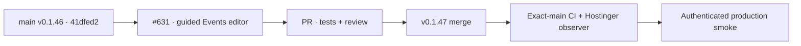

# BRVTAL — Último deploy

  
  
  

> **Development dashboard** · snapshot de **solo el deploy actual** para incidente #631. **Engineering roles:** SRE, frontend/PHP backend, QA.

## Progress convention

- ✅ ~~Struck through~~ = completed and verified through the required delivery gates.
- 🚧 Normal text = pending or currently in progress.

## Estado del deploy

| Señal | Estado | Evidencia |
| --- | --- | --- |
| Work line | 🚧 **#631 · Events EDIT / production smoke** | `work/issue-631` · nueva reserva `5ae2fbce-4d98-48bf-921a-f118cc6d6bda` |
| Base exacta | ✅ ~~main v0.1.46~~ | `41dfed2886c2c668a6bbe26aa648a5ee7352f288` |
| Versión | 🚧 **v0.1.47 candidate** | runtime Events editor + smoke |
| Producción | 🚧 validar después del merge | smoke #35930077218 falla en selector legacy |

## Huella del cambio

<!-- brvtal:git-delta -->

| Archivos | Inserciones | Eliminaciones | Neto |
| ---: | ---: | ---: | ---: |
| **7** | **+82** | **−46** | **+36** |

## Calidad y entrega

<!-- brvtal:gate-plan -->

| Control | Estado / contrato |
| --- | --- |
| Gates | **preflight · coordination · fast[PHP+JS] · database · chromium · real-stack · webkit** |
| PR + snapshot exacto | Issue #631 · reserva `5ae2fbce-4d98-48bf-921a-f118cc6d6bda` |
| CodeRabbit / Sonar | 🚧 revisión y Quality Gate sobre HEAD final |
| CI del SHA exacto de main | 🚧 después de merge |
| Producción | 🚧 health/DB/SHA, Home/Admin/Dashboard, Events EDIT, Sets/Hero |

## Flujo de entrega

## Qué se hizo

- La navegación Events deja de remontar el Content Core al pulsar EDIT sobre la grilla ya montada, evitando que un registro existente se abra como NEW EVENT.
- La carga inicial de Content Core es esperada por el cargador del módulo; auth reutiliza el límite compartido en vez de emitir otro GET de sesión.
- El smoke comprueba el editor real `#eventModal`, su título EDIT EVENT, la fecha `#e_event_date`, compara datos de grilla/API y cierra sin escribir.
- Regresión de navegador asegura que el EDIT nativo reutiliza el workflow montado sin navegar ni duplicar carga.
- No hay migraciones, SQL destructivo ni ediciones de registros de clientes.

## Archivos modificados en este deploy

- `README.md` — snapshot exacto del incidente.
- `config/version.php` — versión 0.1.47.
- `discadmin/admin-information-architecture.js` — editor Events sin remontaje.
- `discadmin/content-core.js` — carga inicial awaited y auth compartida.
- `package.json` — versión 0.1.47.
- `tests/e2e/discadmin-information-architecture.spec.mjs` — regresión de EDIT montado.
- `tests/e2e/production-authenticated-smoke.mjs` — modal guiado canónico.

## Validación

- ✅ ~~Smoke anterior #35930077218 verifica health 200/DB connected/SHA exacto, home 200, Admin 200 y Dashboard 484 ms sin HTTP 5xx.~~
- 🚧 El smoke anterior falla esperando `#modal`; la arquitectura real abre `#eventModal` y necesita hidratar Content Core antes de EDIT.
- 🚧 Gates de PR, deploy, CI exacto y nuevo smoke pendientes; **no declarar PRODUCTION GREEN** antes de evidencia efectiva.

## Qué sigue

| Lane | Trabajo |
| --- | --- |
| **NOW** | 🚧 [#631](https://github.com/pl0n3r/brvtal/issues/631) · corregir editor y completar smoke productivo. |
| **NEXT** | 🚧 [#533](https://github.com/pl0n3r/brvtal/issues/533) · registrar GREEN con 5 evidencias exactas. |
| **LATER** | 🚧 [#528](https://github.com/pl0n3r/brvtal/issues/528) · retomar backlog tras GREEN. |
| **BLOCKED / EXTERNAL** | 🚧 entrega productiva hasta prueba autenticada completa. |

## Panorama general pendiente

- 🚧 **NOW**: completar recuperación #631 sin perder datos.
- 🚧 **NEXT**: cerrar incidente solo con prueba real aprobada.
- 🚧 **LATER**: roadmap de producto después de GREEN.
- 🚧 **BLOCKED / EXTERNAL**: ninguno adicional identificado.
