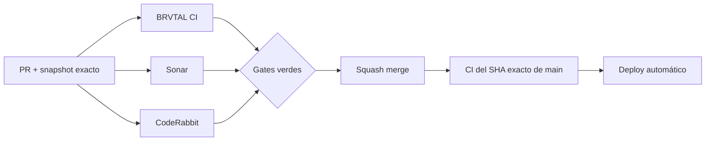

  

# BRVTAL — Último deploy

  <strong>Sonar quality burn-down · Hero Slider bindings</strong>

  

> Snapshot exclusivo de este deploy. Se reemplaza en el siguiente PR; no es un changelog acumulativo.

## Estado del deploy

| Señal | Estado | Evidencia |
| --- | --- | --- |
| Base exacta | ✅ **VALIDATED IN CODE** | `main` `ec1a4c0a35a35718245cfdc28150d31d5e101a5d` · BRVTAL CI #1035 |
| Hero Slider `bind()` | 📉 **Simplificado** | heurística local ~32 → 1 |
| Bindings extraídos | 🧩 **4 grupos** | slides · layers · editor · global |
| Regresión | 🧪 **Ampliada** | preview móvil · config · save · delete layer/slide |
| Producción | ⚪ **No validada por este PR** | CI verde no equivale a producción |

## Flujo de entrega

## Qué se hizo

- Se reduce el bloque de alta complejidad de `discadmin/hero-slider.js::bind()` sin cambiar rendering, persistencia ni estructura de datos.
- Las acciones de slides y layers pasan a funciones explícitas: seleccionar, añadir, duplicar y eliminar.
- Los listeners quedan agrupados en `bindSlideControls`, `bindLayerControls`, `bindEditorControls` y `bindGlobalControls`.
- Media picker, config, preview y save conservan los mismos selectores y eventos.
- La prueba real del manager ahora valida preview móvil, publicación/autoplay/intervalo, payload de save y eliminación de layer/slide.
- Se mantienen los tests de UID con Web Crypto y fallback contador introducidos previamente.

## Archivos modificados en este deploy

- `README.md` — snapshot visual exacto del deploy.
- `discadmin/hero-slider.js` — extrae acciones y grupos de bindings del manager.
- `tests/e2e/hero-slider-v2.spec.mjs` — amplía regresión del admin sobre los bindings refactorizados.

## Validación

- Base exacta: `main` `ec1a4c0a35a35718245cfdc28150d31d5e101a5d`.
- Esa base pasó **BRVTAL CI #1035** y queda **VALIDATED IN CODE**.
- El PR debe pasar BRVTAL CI, SonarQube Cloud y CodeRabbit sobre su SHA exacto.
- El job `fast` debe validar también este README visual y la lista exacta de archivos.
- Tras squash merge se verificará BRVTAL CI sobre el SHA exacto resultante de `main`.
- Production Performance se interpreta por separado: un deploy marker no observado no equivale a regresión de código.

## Qué sigue

1. Tachar el P2 de complejidad del Hero Slider en #451 solo tras merge + exact-main CI verde.
2. Revalidar los siguientes P2 actuales: Dashboard, Archive, public `app.js` y Theme runtime.
3. Mantener #479, #480 y #481 como frentes independientes.
4. Reconciliar PR #434 / Memories contra el `main` actual sin migraciones automáticas de producción.
5. Continuar verificando Production Performance únicamente cuando el marker del SHA exacto llegue a Hostinger.

## Panorama general pendiente

| Frente | Estado / siguiente foco |
| --- | --- |
| 🧪 **Sonar / calidad** | #451 — Hero Slider en este PR; después Dashboard / Archive / public app / Theme runtime |
| ⚡ **Performance** | Último run de producción puede quedar inconcluso si Hostinger no expone el marker exacto dentro de la ventana |
| 🎛️ **Apariencia** | #149 — completar Light en módulos modernos |
| 🖼️ **Hero Slider** | #221 integridad editorial de media · #480 regresión visual desktop |
| 🔐 **Seguridad editorial** | #257, #216, #174, #193 |
| 🔎 **SEO / entrega pública** | #182, #214, #204, #272 → #390 · #479 alt · #481 IndexNow |
| ✍️ **Content / edición** | #224, #252 |
| 🧾 **Activity / operaciones** | #232, #195 |
| 📚 **Bulk Actions** | #275 — catálogos >500 sin truncado silencioso |
| 🧭 **Dashboard / Theme** | #348, #351 |
| 🗃️ **Archivo cultural** | #398, #403 |
| 🧠 **Memories** | #415 / PR #434 pendiente; sin migración automática |
| 🌐 **Idioma** | #212 — español canónico + inglés automático por fases |
| 💾 **Backups** | #389 — scheduling seguro + Drive opcional |

---

BRVTAL · Rave till Grave · snapshot operativo, no historial acumulativo

