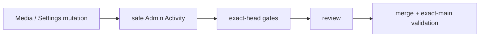

# BRVTAL — Último deploy

> Snapshot de **solo el deploy actual** para #195: cobertura segura de Admin Activity en Media Library y Settings/Theme. No declara producción GREEN.

## Progress convention
- ✅ ~~Struck through~~ = completed and verified through required gates.
- 🚧 Normal text = pending/in progress.
- ⛔ = active production blocker.

## Estado del deploy
| Señal | Estado | Evidencia |
| --- | --- | --- |
| Work line | 🚧 **#195 · Admin Activity coverage** | `work/issue-195` · reserva `98c351ec-12b7-493e-a3ee-df3c1d8be2f6` |
| Base exacta | ✅ **main** | `a22388e321a969d18f6ae6059628236c86b311af` |
| Versión de producto | 🚧 **v0.1.61** | `config/version.php` + `package.json` |
| Producción | ⛔ **NO GREEN · #681** | recuperación de migraciones pendiente |
| PR | 🚧 **#701 draft** | 10 commits · branch mergeable |

## Huella del cambio
<!-- brvtal:git-delta -->
| Archivos | Inserciones | Eliminaciones | Neto |
| ---: | ---: | ---: | ---: |
| **11** | **+563** | **−96** | **+467** |

## Calidad y entrega
<!-- brvtal:gate-plan -->
| Control | Estado / contrato |
| --- | --- |
| Gates esperados | **preflight · coordination · fast[PHP+JS] · database · chromium · real-stack · webkit** |
| PR + snapshot exacto | **#195 · Admin Activity Media/Settings/Theme** |
| Roles | **Software Engineering · Security · QA** |
| Review | BRVTAL CI + Factory Policy/Privacy + Sonar/CodeRabbit |
| CI del SHA exacto de main | 🚧 obligatorio después del merge |
| Production GREEN | ⛔ fuera de alcance mientras #681 siga abierto |

## Flujo de entrega

## Qué se hizo
- Media Library registra upload/register/update/transform/delete con identidad y metadatos permitidos.
- Snapshots de Media excluyen contenido y `content_hash`.
- Settings/Theme registran solo `setting_key`, `is_json` y metadatos booleanos seguros.
- Claves sensibles quedan fuera mediante filtro + allowlist explícita.
- Theme save/activation/delete queda atribuible por el mismo path de Settings.
- Se añadieron regresiones de integración y contrato AC-01..AC-04.

## Archivos modificados en este deploy
- `README.md`
- `api/index.php`
- `api/media-library.php`
- `config/admin_activity.php`
- `config/media_integrity.php`
- `config/version.php`
- `package.json`
- `tests/admin-activity-contract.php`
- `tests/integration/admin-activity.php`
- `tests/media-dedup-contract.php`
- `tests/test_admin_activity_audit_coverage.py`

## Validación
- 🚧 BRVTAL CI sobre el HEAD estable de PR #701.
- 🚧 Sonar/CodeRabbit terminales requeridos antes de merge.
- 🚧 Validación exact-main obligatoria tras integración.

## Qué sigue
| Lane | Trabajo |
| --- | --- |
| **NOW** | 🚧 [#195](https://github.com/pl0n3r/brvtal/issues/195): cerrar CI y revisión de Admin Activity. |
| **NEXT** | 🚧 [#232](https://github.com/pl0n3r/brvtal/issues/232): paginación de Admin Activity / Version History cuando #195 cierre; #212 sigue documentado pero no autorizado para implementación. |
| **LATER** | 🚧 [#533](https://github.com/pl0n3r/brvtal/issues/533): continuar roadmap canónico. |
| **BLOCKED / EXTERNAL** | 🚧 [#681](https://github.com/pl0n3r/brvtal/issues/681): producción no GREEN por registry de migraciones. |

## Panorama general pendiente
- 🚧 **NOW:** #195 Admin Activity Media/Settings/Theme.
- 🚧 **NEXT:** #232 paginación de Admin Activity / Version History.
- 🚧 **LATER:** #533 roadmap canónico.
- 🚧 **BLOCKED / EXTERNAL:** #681 producción.
