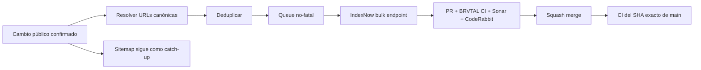

  

# BRVTAL — Último deploy

<strong>SEO · IndexNow event-driven publishing</strong>

  

> Este README representa **solo el deploy actual**. Se reemplaza en el siguiente deploy y no funciona como changelog acumulativo.

## Estado del deploy

| Señal | Estado | Evidencia |
| --- | --- | --- |
| Base exacta | ✅ **VALIDATED IN CODE** | `main` `99d1266647823697eec344c51b6dfa09d58ea0ce` · BRVTAL CI #1108 |
| Alcance | 🔎 **#481** | IndexNow para cambios públicos reales |
| Configuración | 🎛️ **DISCADMIN → Settings → SEO** | Enabled + Key + Key Location + endpoint oficial |
| Publicación | ⚡ **EVENT-DRIVEN** | create/update/unpublish/delete/slug/SEO + Home cuando aplica |
| Seguridad | 🔐 **Sin key en Git** | verificación dinámica en `/indexnow-key.txt` |
| Producción | ⚪ **No validada** | CI no equivale a validación de producción |

## Flujo de entrega

## Qué se hizo

- Añade una integración central de **IndexNow** para BRVTAL sin introducir un segundo sistema SEO.
- La configuración vive en **DISCADMIN → Settings → SEO** con controles independientes para Enabled, Key, Key Location y endpoint oficial.
- La key se valida tanto en frontend como en backend: 8–128 caracteres, únicamente letras, números y guiones.
- La verificación se expone dinámicamente en el Key Location configurado (por defecto `/indexnow-key.txt`); la key no se hardcodea ni se versiona.
- Se notifican únicamente URLs canónicas públicas afectadas después de commits editoriales exitosos.
- Cambios de slug envían la URL anterior y la nueva; despublicaciones y eliminaciones notifican la URL que deja de estar disponible.
- Events, Artists, Sets, Pages, Ticket Types, Blog, Releases, lineup y SEO metadata quedan conectados al flujo.
- Cambios de Home como Theme/Site/Social/SEO, Hero Slider y Memories notifican `/` en vez de reenviar indiscriminadamente todo el sitio.
- El endpoint se selecciona desde una allowlist de participantes oficiales (Global, Amazon, Bing, Naver, Seznam.cz, Yandex o Yep); una URL arbitraria no puede guardarse desde Settings.
- `host` y `urlList` no son editables: se derivan del origen canónico y del cambio público real.
- Las URLs se deduplican por request; el sitemap sigue siendo la señal de cobertura completa.
- Los fallos de IndexNow son no-fatales para el guardado editorial y usan timeouts estrictos.
- No se programa un envío periódico masivo de todas las URLs.
- El real-stack usa un receptor IndexNow local y el usuario E2E aislado; CI nunca llama al endpoint real de IndexNow.

## Archivos modificados en este deploy

- `.htaccess` — ruta pública de verificación `/indexnow-key.txt`.
- `AGENTS.md` — política durable event-driven y configuración desde Settings.
- `README.md` — snapshot exacto del deploy #481.
- `api/blog.php` — notificaciones para Blog publicado.
- `api/event-workflow.php` — notificación tras workflow atómico de Event.
- `api/index.php` — validación de setting y hooks para CRUD/lineup/Settings.
- `api/memories.php` — notificación de Home cuando Memories público cambia.
- `api/releases.php` — notificaciones para Releases.
- `api/seo-metadata.php` — notificación al modificar metadata SEO de entidades públicas.
- `config/indexnow.php` — núcleo de configuración, URL allowlist, queue y envío.
- `discadmin/settings-v2.css` — estilos para controles IndexNow.
- `discadmin/settings-v2.js` — UI y persistencia de IndexNow dentro de Settings → SEO.
- `indexnow-key.php` — renderer dinámico de la key de verificación.
- `tests/e2e/indexnow-real-stack.spec.mjs` — prueba autenticada con usuario E2E.
- `tests/e2e/indexnow-receiver.mjs` — receptor local para verificar payloads sin red externa.
- `tests/e2e/run-content-core-real-stack.sh` — arranque/cleanup del receptor y ejecución del spec.
- `tests/indexnow-contract.php` — contratos de key, visibilidad, URLs y wiring.

## Operación en producción

1. Verificar `https://www.brvtal.com.co` en Bing Webmaster Tools.
2. Abrir **DISCADMIN → Settings → SEO → IndexNow**.
3. Definir una Key válida, un `Key Location` raíz con formato `/indexnow-*.txt`, seleccionar un endpoint oficial y activar **Enabled**.
4. Confirmar que la URL de verificación responde con la misma key configurada.
5. Publicar o actualizar una URL pública de prueba y revisar **Bing Webmaster Tools → IndexNow** para comprobar que aparece entre las URLs recibidas.
6. Mantener `/sitemap.xml` activo: IndexNow acelera la notificación de cambios, pero no sustituye la cobertura completa del sitemap ni garantiza indexación.

Referencias operativas oficiales:
- https://www.bing.com/indexnow/getstarted
- https://www.bing.com/webmasters/help/indexnow-0z209wby

## Validación

- La base exacta `99d1266647823697eec344c51b6dfa09d58ea0ce` pasó BRVTAL CI #1108.
- Este branch debe pasar contratos PHP 8.5, MariaDB cuando aplique, real-stack con el usuario E2E, Sonar y CodeRabbit.
- El real-stack apunta a un receptor local; ninguna prueba envía datos a IndexNow real.
- Tras squash merge se verificará BRVTAL CI sobre el SHA exacto resultante de `main`.
- No se declara **VALIDATED IN PRODUCTION** desde CI.

## Qué sigue

1. Cerrar #481 con gates verdes y exact-main CI.
2. Retomar #398 para profundizar el archivo cultural y la navegación relacional.
3. Ejecutar los smokes de producción existentes cuando haya credenciales/entorno autorizados.

## Panorama general pendiente

| Frente | Estado / siguiente foco |
| --- | --- |
| 🗃️ **Archivo cultural** | #398 · profundizar navegación relacional |
| 🎛️ **Apariencia** | #149 · completar Light en módulos modernos |
| 🖼️ **Hero Slider** | #221 integridad editorial · #480 regresión visual desktop |
| 🔐 **Seguridad editorial** | #257, #216, #174, #193 |
| 📈 **Analytics** | #427 · completar eventos `brvtal_*` en GTM/GA4 |
| ✍️ **Content / edición** | #224, #252 |
| 🧾 **Activity / operaciones** | #232, #195 |
| 📚 **Bulk Actions** | #275 · registros >500 sin falsa exhaustividad |
| 🌐 **Idioma** | #212 · español canónico + inglés automático por fases |
| 💾 **Backups** | #389 · scheduling seguro + Drive opcional |

---

BRVTAL · Rave till Grave · deploy snapshot

