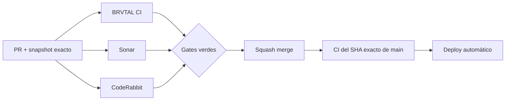

  

# BRVTAL — Último deploy

  <strong>Quality burn-down · Dashboard NEXT EVENT</strong>

  

> Este README representa **solo el deploy actual**. Se reemplaza en el siguiente deploy y no funciona como changelog acumulativo.

## Estado del deploy

| Señal | Estado | Evidencia |
| --- | --- | --- |
| Base exacta | ✅ **VALIDATED IN CODE** | `main` `d2e5ccf9422f96514e4b0fa6edf672316d52cbdc` · BRVTAL CI #1040 |
| Dashboard hotspot | 🧩 **Refactor acotado** | `nextEventPanel()` pasa de ~22 decisiones locales a ~8 |
| Estados NEXT EVENT | 🧪 **Cubiertos** | UNAVAILABLE · NONE · CHECK · READY / SOLD OUT |
| Runtime / API | 🟢 **Sin cambios de contrato** | Se preservan endpoints, rutas y payloads |
| Producción | ⚪ **No validada por este PR** | CI verde no equivale a validación de producción |

## Flujo de entrega

## Qué se hizo

- Continúa #451 con un bloque P2 pequeño en `discadmin/dashboard-v2.js`.
- `nextEventPanel()` deja de concentrar cálculo de warnings, ticket state, fecha/localización y estados vacíos/error.
- Se extraen helpers explícitos para `UNAVAILABLE`, `NONE`, warnings editoriales, ticket state y metadata temporal.
- Se preservan los estados visibles `UNAVAILABLE / NONE / CHECK / READY`, los textos existentes, el CTA `OPEN EVENTS` y la navegación canónica.
- La prueba E2E cubre fuente Overview caída, ausencia de próximo evento, evento con warnings y evento `sold_out` listo sin URL de tickets.
- No cambia API, base de datos, permisos, rutas, persistencia ni lifecycle público.

## Archivos modificados en este deploy

- `README.md` — snapshot visual exacto del deploy.
- `discadmin/dashboard-v2.js` — composición más simple del panel NEXT EVENT.
- `tests/e2e/discadmin-dashboard-v2-authority.spec.mjs` — cobertura de los cuatro estados del panel y navegación a Events.

## Validación

- Base exacta: `main` `d2e5ccf9422f96514e4b0fa6edf672316d52cbdc`.
- Esa base pasó **BRVTAL CI #1040** y queda **VALIDATED IN CODE**.
- El PR debe pasar BRVTAL CI, SonarQube Cloud y CodeRabbit sobre su SHA exacto.
- El job `fast` debe confirmar además el contrato visual del README y la lista exacta de 3 archivos.
- Tras el squash merge se verificará BRVTAL CI sobre el SHA exacto resultante de `main`.
- Ningún gate de CI implica por sí solo **VALIDATED IN PRODUCTION**.

## Qué sigue

1. Tachar Dashboard en #451 solo después de merge + exact-main CI verde.
2. Continuar con el siguiente P2 que todavía reproduzca en el código actual: public `app.js`, Archive o Theme runtime.
3. Mantener #479, #480 y #481 como frentes separados del burn-down.
4. Reconciliar PR #434 / Memories sin ejecutar migraciones de producción automáticamente.

## Panorama general pendiente

| Frente | Estado / siguiente foco |
| --- | --- |
| 🧪 **Sonar / calidad** | #451 — Dashboard en este PR; luego public app / Archive / Theme runtime |
| 🎛️ **Apariencia** | #149 — completar Light en módulos modernos |
| 🖼️ **Hero Slider** | #221 integridad editorial de media · #480 regresión visual desktop |
| 🔐 **Seguridad editorial** | #257, #216, #174, #193 |
| 🔎 **SEO / entrega pública** | #182, #214, #204, #272 → #390 · #479 alt · #481 IndexNow |
| ✍️ **Content / edición** | #224, #252 |
| 🧾 **Activity / operaciones** | #232, #195 |
| 📚 **Bulk Actions** | #275 — catálogos >500 sin truncado silencioso |
| 🧭 **Dashboard / Theme** | #348, #351 |
| 🗃️ **Archivo cultural** | #398, #403 |
| 🧠 **Memories** | #415 / PR #434 pendiente; sin migración automática |
| 🌐 **Idioma** | #212 — español canónico + inglés automático por fases |
| 💾 **Backups** | #389 — scheduling seguro + Drive opcional |

---

BRVTAL · Rave till Grave · snapshot operativo, no historial acumulativo

