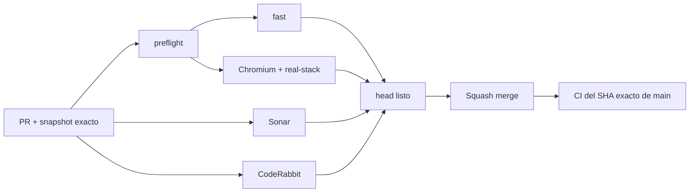

# BRVTAL — Último deploy

  
  
  

> **Development dashboard** · snapshot profesional de **solo el deploy actual**.

## Estado del deploy

| Señal | Estado | Evidencia |
| --- | --- | --- |
| Work line | 🖼️ **#522 Media navigation/UI** | una ruta canónica de readiness + retiro de External Registry |
| Base exacta | ✅ **VALIDATED IN CODE** | `main` `33f8b2f35ceb9904f13515629c7778071e618f17` · exact-main `validate` verde |
| Fase | ⚡ **Phase 1 / quick wins** | [#533](https://github.com/pl0n3r/brvtal/issues/533) |
| Producción | ⛔ **BLOCKED / EXTERNAL** | Hostinger marker en [#534](https://github.com/pl0n3r/brvtal/issues/534) |

## Huella del cambio

<!-- brvtal:git-delta -->

| Archivos | Inserciones | Eliminaciones | Neto |
| ---: | ---: | ---: | ---: |
| **10** | **+243** | **−123** | **+120** |

## Calidad y entrega

<!-- brvtal:gate-plan -->

| Control | Estado / contrato |
| --- | --- |
| Gates seleccionados | **preflight · fast[PHP+JS] · chromium · real-stack** |
| Browser | Dashboard → Media no depende de un evento `load` tardío; fallo real muestra ERROR + RETRY |
| Real-stack | Dashboard → Media · Sets → Media · deep-link Media |
| UI | `REGISTER EXTERNAL` no se renderiza |
| Sonar | Clean-as-You-Code en paralelo |
| CodeRabbit | full review del head estable en paralelo |
| Exact-main | obligatorio después del squash merge |

## Flujo de entrega

## Qué se hizo

- Media, Releases y Blog comparten una única frontera de readiness y navegación administrada por `BRVTALAdminModules.navigate()`.
- La capa de información/navegación ya no instala listeners duplicados ni deja que Media/Releases/Blog caigan al CRUD legado; delega esos destinos al navegador dinámico canónico.
- Los fallos de readiness se resuelven dentro del loader canónico y reutilizan su estado ERROR / RETRY; RETRY invalida promesas rechazadas y vuelve a crear dependencias de script fallidas.
- Media abre por la misma ruta desde Dashboard, Sets/sidebar y `?module=media`.
- Se retira `REGISTER EXTERNAL` de la experiencia normal de Media Library; el backend compatible no se elimina.
- Se añade cobertura de navegador y real-stack autenticada con el usuario E2E.

## Archivos modificados en este deploy

- `discadmin/admin-modules.js` — dueño único de readiness de módulos dinámicos.
- `discadmin/admin-information-architecture.js` — delega readiness al loader canónico.
- `discadmin/media-library.php` — elimina External Registry de la toolbar.
- `discadmin/media-library.js` — elimina modal/binding de registro externo.
- `tests/e2e/discadmin-initial-media.spec.mjs` — regresión del evento `load` ya ocurrido y recuperación real tras un fallo transitorio mediante RETRY.
- `tests/e2e/discadmin-information-architecture.spec.mjs` — latest-navigation-wins usa el owner canónico de readiness.
- `tests/e2e/discadmin-keyboard-modal-quick-wins.spec.mjs` — accesibilidad queda enfocada en el picker Media vigente.
- `tests/e2e/content-core-real-stack.spec.mjs` — navegación Media autenticada en stack real.
- `AGENTS.md` — persiste la frontera canónica de readiness.
- `README.md` — dashboard exacto de #522.

## Validación

- Dashboard → Media monta el módulo sin depender del orden previo de navegación.
- Sets → Media vuelve a montar correctamente el mismo workspace.
- `?module=media` funciona en sesión autenticada.
- External Registry no aparece en la UI normal.
- La protección de referencias, upload, picker y Media Engine permanecen sin cambios funcionales.

## Qué sigue

| Lane | Trabajo |
| --- | --- |
| **NOW** | Cerrar [#522](https://github.com/pl0n3r/brvtal/issues/522). |
| **NEXT** | [#479](https://github.com/pl0n3r/brvtal/issues/479) · alt attributes públicos. |
| **BLOCKED / EXTERNAL** | [#534](https://github.com/pl0n3r/brvtal/issues/534) · Hostinger Git auto-deploy/hPanel. |
| **LATER** | [#517](https://github.com/pl0n3r/brvtal/issues/517), [#221](https://github.com/pl0n3r/brvtal/issues/221), luego Phase 2. |

## Panorama general pendiente

| Lane | Frente | Issues |
| --- | --- | --- |
| **NOW** | Media friction | [#522](https://github.com/pl0n3r/brvtal/issues/522) |
| **NEXT** | Accessibility / SEO | [#479](https://github.com/pl0n3r/brvtal/issues/479) |
| **BLOCKED / EXTERNAL** | Deploy | [#534](https://github.com/pl0n3r/brvtal/issues/534) |
| **LATER** | Quick wins | [#517](https://github.com/pl0n3r/brvtal/issues/517), [#221](https://github.com/pl0n3r/brvtal/issues/221) |
| **LATER** | Admin foundation | [#348](https://github.com/pl0n3r/brvtal/issues/348), [#149](https://github.com/pl0n3r/brvtal/issues/149), [#514](https://github.com/pl0n3r/brvtal/issues/514) |
